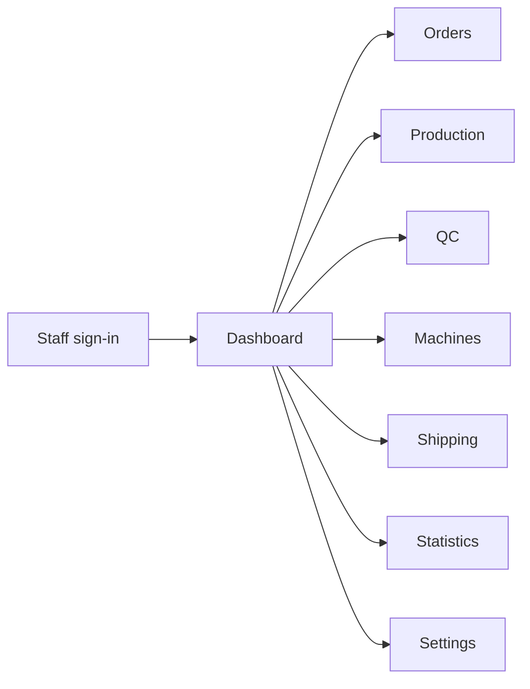
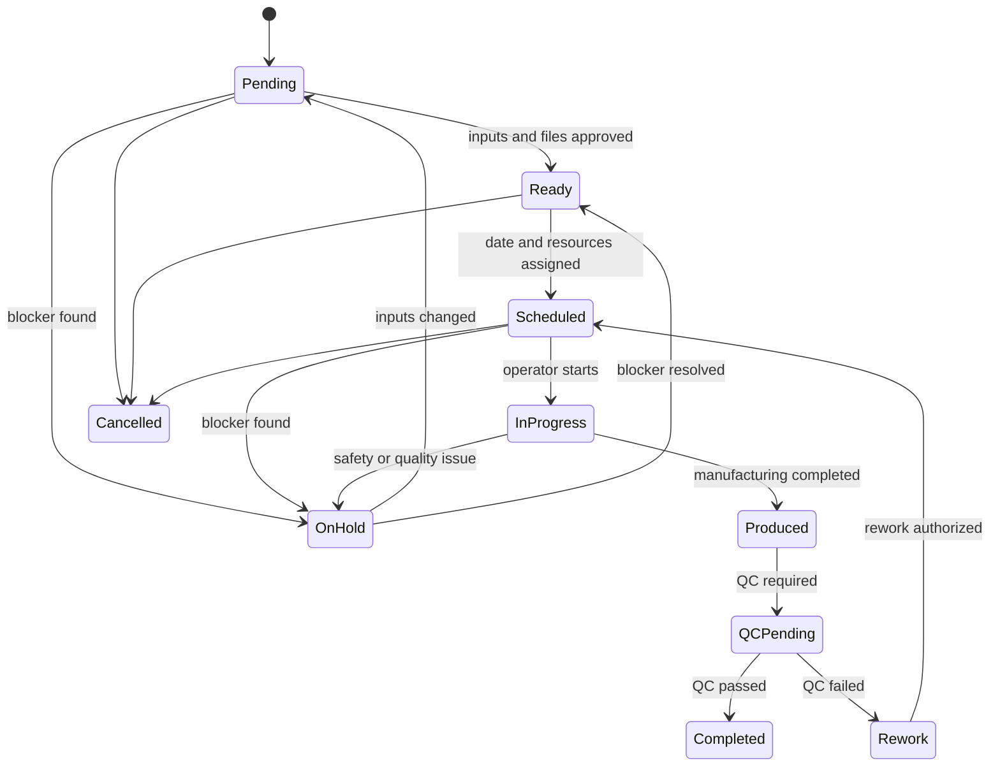
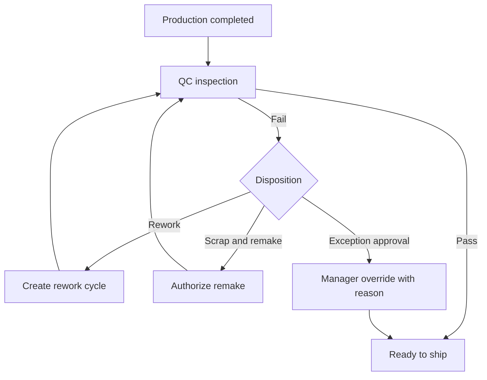
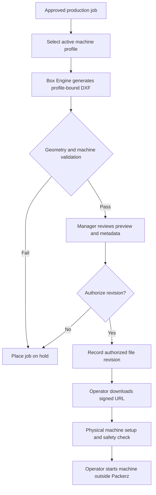
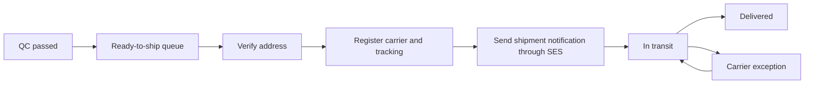
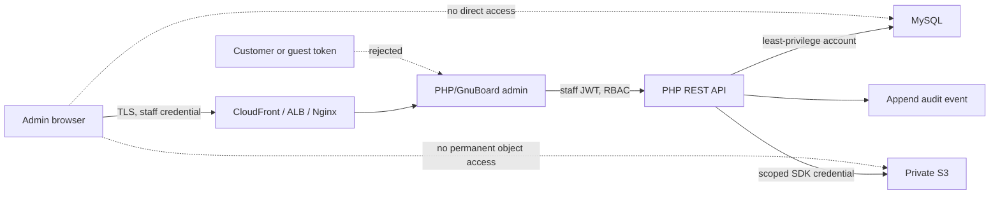
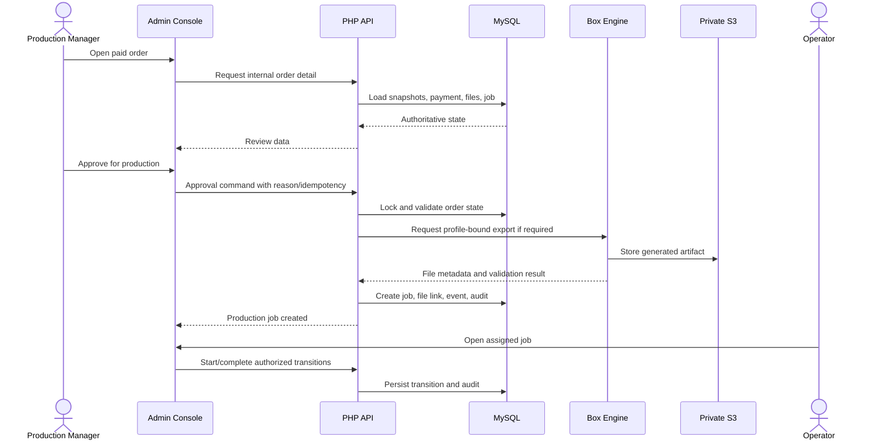

# Packerz Admin and Operations Console

**Document status:** Draft for MVP implementation approval  
**Product:** Packerz AI Packaging Manufacturing Platform  
**Admin domain:** `admin.packerz.co.kr`  
**Primary runtime:** PHP 8.3, GnuBoard5, Nginx, PHP-FPM  
**Related documents:** `PRD.md`, `IA.md`, `SCREENS.md`, `DATABASE.md`, `API.md`, `BOX_ENGINE.md`, `ARCHITECTURE.md`

---

## 1. Purpose

This document defines the product and technical requirements for the Packerz
administration and manufacturing operations console.

The console coordinates an order after checkout:

1. verify the paid order and manufacturing inputs;
2. approve or hold the order;
3. prepare the generated dieline and CNC export;
4. schedule and execute production;
5. record quality control;
6. register shipment;
7. provide operational reporting and configuration.

The console is for packaging manufacturing only. It does not include sticker
printing, artwork preflight, ink management, print proofing, or print production.

---

## 2. MVP Boundaries

### 2.1 Included

- Unprinted custom boxes
- Sample, mockup, and low-volume production
- One approved box structure
- One approved glue method
- One material/board catalog managed by staff
- Automatically generated dielines
- SVG and PDF viewing/export
- Approved DXF export for CNC preparation
- Paid-order review
- Production job management
- Quality control
- Shipment registration and tracking
- Staff authentication and role-based authorization
- Audit logging for sensitive operations
- Basic operational statistics

### 2.2 Excluded

- Sticker or label products
- Printed packaging workflows
- Artwork upload and print preflight
- Color, ink, plate, and print-machine management
- Multiple plant routing
- Automated procurement or inventory planning
- Warehouse management
- Full ERP, MES, or CRM replacement
- Automated machine control
- Arbitrary CAD editing in the browser
- Customer access to internal production screens

### 2.3 Safety constraint

The admin console may prepare and authorize a CNC file, but it must not send a
machine-start command. A trained operator remains responsible for machine setup,
material loading, safety checks, and execution.

---

## 3. Runtime Ownership

### 3.1 Admin application

`admin.packerz.co.kr` is served by Nginx and PHP 8.3/PHP-FPM using GnuBoard5 for
staff identity, session integration, and the administration shell.

The admin application owns:

- staff sign-in and authorization;
- internal order, production, QC, machine, and shipment views;
- configuration and catalog management;
- internal API requests;
- protected operational commands;
- audit inspection.

### 3.2 API

The authoritative REST API is served from `api.packerz.co.kr/api/v1` by
PHP/GnuBoard5. The admin console must not connect directly to MySQL from browser
code.

### 3.3 Next.js boundary

Next.js owns the customer-facing experience at `packerz.co.kr`. It is not the
source of truth for admin authorization, payments, orders, or manufacturing
state.

### 3.4 Box Engine boundary

The Box Engine performs deterministic validation and geometry/export generation.
The admin console submits approved inputs and displays results; it must not
reimplement the geometry formulas.

---

## 4. Users and Roles

The MVP uses the roles already defined by the `admin_users.role` database field.

| Role | Primary responsibility | Default landing page |
|---|---|---|
| `admin` | Platform configuration, staff access, commercial rules, oversight | Dashboard |
| `production_manager` | Order approval, scheduling, assignment, holds, CNC authorization | Production |
| `operator` | Job execution, machine checks, progress updates, production notes | Production |
| `support` | Customer/order assistance and shipment visibility | Orders |

### 4.1 Permission principles

- Deny by default.
- Verify permissions in the PHP API, not only in the UI.
- Hide unavailable actions for usability, but never treat hiding as security.
- Sensitive mutations require a reason and an audit record.
- A staff member must not approve a transition that their role cannot perform.
- Authentication does not imply access to every order field.
- Personal and payment data is disclosed only as needed for the task.

### 4.2 Permission matrix

Legend: `V` view, `E` execute/update, `M` manage, `—` denied.

| Capability | Admin | Production manager | Operator | Support |
|---|---:|---:|---:|---:|
| Dashboard | V | V | V | V |
| View orders | V | V | Assigned/production fields | V |
| Edit customer/shipping data | E | Limited | — | Limited |
| Approve order for production | E | E | — | — |
| Place/release production hold | E | E | Request only | — |
| Schedule and assign jobs | E | E | — | — |
| Update job execution status | E | E | Assigned jobs | — |
| Download SVG/PDF | V | V | Assigned jobs | Limited |
| Authorize production DXF | E | E | Download authorized file | — |
| Manage machines/profiles | M | M | V | — |
| Submit QC results | E | E | E when assigned | — |
| Override QC failure | E | E with reason | — | — |
| Register shipment | E | E | Limited | E |
| View statistics | V | V | Limited | Limited |
| Manage catalog/rules | M | Limited | — | — |
| Manage staff/roles | M | — | — | — |
| View audit logs | V | Limited operational logs | Own activity | — |
| Manage system settings | M | — | — | — |

Exact permission codes should be introduced before implementation, for example
`orders.read`, `production.assign`, `qc.submit`, and `machines.manage`. Role
names alone should not be scattered through route handlers.

---

## 5. Global Information Architecture

```text
/admin
├── /login
├── /dashboard
├── /orders
│   └── /{orderId}
├── /production
│   ├── /queue
│   ├── /schedule
│   └── /jobs/{jobId}
├── /qc
│   ├── /queue
│   └── /checks/{qualityCheckId}
├── /machines
│   ├── /{machineId}
│   └── /{machineId}/maintenance
├── /shipping
│   ├── /ready
│   └── /shipments/{shipmentId}
├── /statistics
│   ├── /orders
│   ├── /production
│   ├── /quality
│   └── /shipping
└── /settings
    ├── /box-templates
    ├── /board-types
    ├── /materials
    ├── /glue-types
    ├── /manufacturing-rules
    ├── /pricing
    ├── /lead-times
    ├── /staff
    │   └── /{adminUserId}
    ├── /audit-logs
    └── /system
```

### 5.1 Canonical primary navigation

The primary navigation order is fixed for the MVP:

1. Dashboard
2. Orders
3. Production
4. QC
5. Machines
6. Shipping
7. Statistics
8. Settings

Role filtering may hide modules, but it must not change their order.



### 5.2 Shared shell

Every authenticated page includes:

- primary navigation;
- environment indicator;
- page title and breadcrumb;
- global order/job search;
- alert center;
- current user and role;
- session expiration warning;
- contextual help;
- logout.

Production must never display a non-production environment as if it were live.
A visible `Development` or `Staging` banner is required outside production.

---

## 6. Dashboard

### 6.1 Purpose

Provide a concise operational summary and direct attention to work that is late,
blocked, failed, or ready for the next step.

### 6.2 Main components

- Paid orders awaiting review
- Orders on hold
- Production jobs by status
- Jobs due today or overdue
- Dieline/export failures
- QC queue and failed checks
- Ready-to-ship orders
- Shipping exceptions
- Machine availability
- Recent operational events
- Quick links filtered to the current staff role

### 6.3 KPI definitions

| KPI | Definition |
|---|---|
| Awaiting review | Paid orders without production approval |
| Ready for production | Approved jobs with valid manufacturing export |
| Work in progress | Jobs in an active manufacturing state |
| Overdue | Jobs past planned completion and not completed/cancelled |
| QC pending | Completed manufacturing awaiting a required QC decision |
| QC failure rate | Failed QC checks divided by completed checks in period |
| Ready to ship | QC-passed items without a registered shipment |
| Lead time | Paid timestamp to shipment timestamp |

KPI time zones use `Asia/Seoul` for display and UTC for persisted timestamps.

### 6.4 Dashboard behavior

- Cards link to a pre-filtered list, not to an opaque aggregate.
- Counts display the last calculated time.
- Failed metric queries must not block operational queues.
- Auto-refresh must be modest on the single `t3.small` host.
- The default refresh interval should be at least 60 seconds.

---

## 7. Orders

### 7.1 Order list

#### Purpose

Find, triage, and open customer orders.

#### Main UI

- Search by order number, customer name, email, phone, or tracking number
- Filters for payment, order, production, QC, and shipping status
- Date range
- Hold and exception indicators
- Quantity, amount, due date, and owner columns
- Saved operational views
- Pagination
- CSV export for explicitly authorized roles

#### Default views

- Awaiting payment confirmation
- Paid and awaiting review
- On hold
- In production
- QC required
- Ready to ship
- Shipped
- Cancelled/refunded

### 7.2 Order detail

The order detail is the operational record linking commerce to manufacturing.

#### Sections

- Order summary
- Customer and guest identity
- Shipping address and contact
- Payment summary
- Order items
- Box dimensions and configuration snapshot
- Material, board, thickness, glue, and quantity
- Price and lead-time snapshot
- SVG/PDF/DXF export status
- Production jobs and status history
- QC results
- Shipments and tracking
- Notes
- Audit history

#### Rules

- Historical order-item snapshots are immutable.
- Catalog changes do not rewrite paid orders.
- Address changes after payment require permission, reason, and audit.
- Manufacturing inputs cannot be silently changed after approval.
- A correction creates a new version or controlled override record.
- Raw payment credentials are never displayed or stored.

### 7.3 Order review

Before production approval, staff confirms:

- payment is confirmed by verified server-side state;
- quantity is within MVP limits;
- dimensions are within template and machine constraints;
- board/material and thickness are active and compatible;
- the one supported glue method is selected;
- generated geometry passes validation;
- required SVG/PDF files are available;
- the production DXF is generated for an approved machine profile;
- the delivery address is serviceable;
- the promised date is feasible.

### 7.4 Order actions

| Action | Preconditions | Result |
|---|---|---|
| Approve for production | Paid, valid inputs, valid export | Create/activate production job |
| Place on hold | Active order, reason supplied | Block downstream start |
| Release hold | Hold cause resolved, permission | Return to prior valid queue |
| Correct address | Not shipped, permission, reason | Update address and audit |
| Cancel | State and payment rules allow | Cancel order/job and initiate payment policy |
| Refund | Confirmed captured payment | Payment provider workflow; no client-side success |
| Resend notification | Valid customer contact | Queue an SES notification |

Cancellation and refund are separate state transitions. A cancelled order is not
proof that a refund succeeded.

---

## 8. Production

### 8.1 Production queue

The queue organizes approved jobs by urgency and readiness.

#### Queue columns

- Job number
- Order number
- Product/box summary
- Dimensions
- Material and thickness
- Quantity
- Due date
- Readiness
- Assigned operator
- Assigned machine/profile
- Current status
- Hold reason
- Last update

#### Readiness blockers

- missing or failed dieline;
- invalid DXF;
- unapproved machine profile;
- material mismatch;
- QC rework requirement;
- payment or order hold;
- missing operator/machine assignment;
- obsolete input/export version.

### 8.2 Schedule

The schedule provides a lightweight planning view for MVP:

- unscheduled queue;
- planned date;
- operator assignment;
- machine assignment;
- estimated duration;
- conflict warning;
- overdue indicator.

It is not a full capacity-planning engine. The manager remains responsible for
resolving conflicts.

### 8.3 Production job detail

The job detail is the operator's primary workspace.

#### Components

- immutable order-item manufacturing snapshot;
- dimensions and orientation diagram;
- material, board, thickness, glue, and quantity;
- dieline revision and validation summary;
- SVG/PDF preview;
- authorized DXF download;
- machine profile and setup notes;
- operator checklist;
- status controls;
- production notes;
- attachments;
- event timeline;
- QC handoff.

### 8.4 Production status model



Status names must be reconciled with the enum values in `DATABASE.md` and
`API.md` before migrations. UI labels may be friendly, but persisted values must
have one canonical definition.

### 8.5 Status transition requirements

Every transition records:

- production job ID;
- previous and next status;
- acting admin user;
- UTC timestamp;
- reason or note;
- request/correlation ID;
- relevant file/input version;
- client IP and user agent where appropriate.

The API rejects invalid transitions with `409 Conflict`.

### 8.6 Holds

A hold includes:

- category: order, payment, geometry, material, machine, schedule, QC, shipping,
  or other;
- human-readable reason;
- created by and created at;
- responsible owner;
- expected resolution;
- supporting attachment, if any;
- resolution note;
- released by and released at.

A hold must be visible on Dashboard, Orders, and Production.

---

## 9. Quality Control

### 9.1 QC queue

The queue shows produced items awaiting inspection and failed items awaiting
disposition.

### 9.2 Default MVP checklist

- Correct approved material/board
- Correct material thickness
- Length within tolerance
- Width within tolerance
- Height within tolerance
- Cut completeness
- Score-line placement
- Fold quality
- Glue-flap alignment
- Glue bond integrity
- Surface condition
- Quantity complete

Actual tolerances must come from an approved manufacturing rule or machine
profile, not from UI constants.

### 9.3 QC result

Each check records:

- checklist version;
- inspector;
- observed measurements;
- pass/fail per item;
- overall result;
- defect category;
- notes;
- evidence photos/files;
- timestamp.

### 9.4 Disposition



An override cannot delete or rewrite the failed result. It appends an authorized
disposition and audit event.

---

## 10. Machines

Machines are a newly identified administration domain. They are not fully
modeled in the current `DATABASE.md` or `API.md`, so implementation requires an
approved documentation and migration update.

### 10.1 Machine list

Display:

- machine code and name;
- machine type;
- operational status;
- approved profile revision;
- supported sheet size;
- supported board/thickness range;
- current assignment;
- maintenance status;
- last health/status update.

### 10.2 Machine statuses

- `available`
- `in_use`
- `maintenance`
- `out_of_service`
- `retired`

An informational UI status is not a hardware safety signal.

### 10.3 Machine profile

A versioned profile should contain:

- machine identity;
- manufacturer and model;
- maximum/minimum sheet dimensions;
- supported board types;
- minimum/maximum thickness;
- unit and coordinate origin;
- axis orientation;
- kerf or tool compensation policy;
- minimum segment length;
- minimum cut/score separation;
- cut and score layer mappings;
- DXF version;
- polyline/spline support;
- file naming convention;
- output validation rules;
- activation status;
- approval metadata.

### 10.4 CNC authorization workflow



If a box, material, thickness, glue rule, engine version, or machine profile
changes, the old authorization becomes stale and a new DXF must be generated and
approved.

### 10.5 Maintenance

MVP maintenance is a log, not a predictive system:

- planned/unplanned maintenance;
- start and end time;
- reason and notes;
- performed by;
- attachment;
- affected jobs;
- return-to-service approval.

---

## 11. Shipping

### 11.1 Ready-to-ship queue

An order item becomes eligible when:

- required production is complete;
- required QC passed or has an authorized exception;
- shipping address is valid;
- no blocking order or shipment hold exists.

### 11.2 Shipment registration

Required data:

- order and included order items;
- carrier;
- service level, when available;
- tracking number;
- package count;
- shipped quantity;
- shipped timestamp;
- optional label/document reference;
- staff actor.

### 11.3 Partial shipment

Partial shipment is allowed only when:

- item quantities are explicitly allocated;
- the remaining quantity stays visible;
- the order is not marked fully shipped prematurely;
- the customer notification describes the partial shipment.

### 11.4 Shipping flow



The carrier is authoritative for in-transit and delivered events. Manual
corrections require permission and audit.

---

## 12. Statistics

Statistics are operational aids, not an accounting ledger.

### 12.1 Views

#### Orders

- orders and revenue by day;
- average order value;
- paid-to-approved time;
- cancellation and refund counts;
- guest versus registered-customer share.

#### Production

- jobs by state;
- planned versus completed;
- average production lead time;
- hold count and duration by reason;
- rework count;
- operator and machine throughput, with appropriate access.

#### Quality

- pass/fail rate;
- defects by category;
- dimensional failures;
- rework and remake rates;
- failure trend by material/profile revision.

#### Shipping

- ready-to-ship backlog;
- shipment lead time;
- carrier distribution;
- exception count;
- partial shipment count.

### 12.2 Performance rules

On the MVP `t3.small`:

- every report requires a bounded date range;
- default range is 30 days;
- large exports run asynchronously;
- frequently used totals should use summary tables or scheduled aggregation;
- operational indexes defined in `DATABASE.md` must be used;
- dashboards must not issue unbounded joins across orders, events, QC, and audit;
- report failure must not impair order or production mutations.

### 12.3 Metric governance

Each metric needs:

- name;
- business definition;
- source tables/events;
- calculation;
- time zone;
- refresh cadence;
- permitted roles;
- treatment of cancellations, retries, and partial shipments.

---

## 13. Settings

### 13.1 Box templates

- Only one template is active for MVP.
- A template revision is immutable once used by a paid order.
- Activation requires validation against Box Engine test vectors.

### 13.2 Board types and materials

- Active/inactive state
- Thickness and manufacturing ranges
- Compatibility with the active template and glue type
- Human-readable name and manufacturing code
- Effective date and version history

### 13.3 Glue types

- One glue method is active in MVP.
- Additional records may exist only as inactive future configuration.
- Glue-flap and compatibility rules require versioning.

### 13.4 Manufacturing rules

- dimension limits;
- thickness limits;
- flap and score rules;
- tolerances;
- quantity limits;
- material compatibility;
- engine/profile version references.

Rules must be validated server-side and in the Box Engine. UI validation is only
early feedback.

### 13.5 Pricing and lead times

- price components;
- quantity tiers;
- material adjustments;
- sample/mockup/low-volume category;
- effective date;
- activation state;
- lead-time rule;
- change reason.

A quote and paid order retain their pricing and lead-time snapshots.

### 13.6 Staff and roles

- invite/create staff;
- assign one MVP role;
- activate/suspend account;
- reset/revoke sessions;
- require password reset;
- view last sign-in and security events.

An administrator must not suspend the final active administrator without a
controlled recovery path.

### 13.7 Audit logs

Audit logs are append-only from the application perspective. The interface
supports filter and export but not edit or delete.

### 13.8 System settings

Examples:

- notification sender configuration references;
- operational feature flags;
- allowed upload types and size;
- signed URL lifetime;
- payment/provider display settings;
- support contact;
- maintenance banner.

Secrets must not be shown or persisted as ordinary settings. Store secrets in an
approved secret store or protected environment configuration.

---

## 14. Admin Screen Inventory

| ID | Screen | Route | Purpose | Primary next screen |
|---|---|---|---|---|
| ADM-01 | Staff Sign-In | `/admin/login` | Authenticate staff | Role landing page |
| ADM-02 | Dashboard | `/admin/dashboard` | Operational overview | Filtered work queue |
| ADM-03 | Order List | `/admin/orders` | Search and triage orders | Order Detail |
| ADM-04 | Order Detail | `/admin/orders/{orderId}` | Review full order lifecycle | Production Job |
| ADM-05 | Production Queue | `/admin/production/queue` | Prioritize ready/blocked jobs | Job Detail |
| ADM-06 | Production Schedule | `/admin/production/schedule` | Plan date, operator, machine | Job Detail |
| ADM-07 | Production Job | `/admin/production/jobs/{jobId}` | Execute and track work | QC Check |
| ADM-08 | QC Queue | `/admin/qc/queue` | Find inspections and failures | QC Check |
| ADM-09 | QC Check | `/admin/qc/checks/{qualityCheckId}` | Record inspection/disposition | Shipment or rework |
| ADM-10 | Machine List | `/admin/machines` | See machine availability | Machine Detail |
| ADM-11 | Machine Detail | `/admin/machines/{machineId}` | Manage profile/status/history | Job or maintenance |
| ADM-12 | Machine Maintenance | `/admin/machines/{machineId}/maintenance` | Record maintenance | Machine Detail |
| ADM-13 | Ready to Ship | `/admin/shipping/ready` | Prepare eligible orders | Shipment Detail |
| ADM-14 | Shipment Detail | `/admin/shipping/shipments/{shipmentId}` | Track shipment | Order Detail |
| ADM-15 | Statistics Overview | `/admin/statistics` | Review operating metrics | Metric detail |
| ADM-16 | Order Statistics | `/admin/statistics/orders` | Analyze commerce flow | Order List |
| ADM-17 | Production Statistics | `/admin/statistics/production` | Analyze manufacturing flow | Production Queue |
| ADM-18 | Quality Statistics | `/admin/statistics/quality` | Analyze defects/rework | QC Queue |
| ADM-19 | Shipping Statistics | `/admin/statistics/shipping` | Analyze dispatch flow | Shipping Queue |
| ADM-20 | Box Templates | `/admin/settings/box-templates` | Manage template revisions | Template Detail |
| ADM-21 | Board Types | `/admin/settings/board-types` | Manage board catalog | Board Detail |
| ADM-22 | Materials | `/admin/settings/materials` | Manage material catalog | Material Detail |
| ADM-23 | Glue Types | `/admin/settings/glue-types` | Manage glue configuration | Glue Detail |
| ADM-24 | Manufacturing Rules | `/admin/settings/manufacturing-rules` | Manage constraints/tolerances | Rule Detail |
| ADM-25 | Pricing | `/admin/settings/pricing` | Manage pricing revisions | Pricing Detail |
| ADM-26 | Lead Times | `/admin/settings/lead-times` | Manage promise rules | Lead-time Detail |
| ADM-27 | Staff List | `/admin/settings/staff` | Manage staff access | Staff Detail |
| ADM-28 | Staff Detail | `/admin/settings/staff/{adminUserId}` | Role/security administration | Staff List |
| ADM-29 | Audit Logs | `/admin/settings/audit-logs` | Investigate sensitive activity | Related resource |
| ADM-30 | System Settings | `/admin/settings/system` | Manage safe platform settings | Settings |

`SCREENS.md` should be updated during the planned full-document review so these
canonical routes and the original screen inventory use the same names.

---

## 15. API Integration

### 15.1 Existing documented endpoints

The admin console uses the contracts in `API.md`, including:

- `GET /api/v1/admin/orders`
- `GET /api/v1/admin/orders/{orderId}`
- `GET /api/v1/admin/production-jobs`
- `GET /api/v1/admin/production-jobs/{jobId}`
- production assignment, status, and note mutations;
- quality-check creation and updates;
- shipment creation and updates;
- material and manufacturing-rule administration;
- staff and audit endpoints.

The exact contract in `API.md` remains authoritative until the planned
cross-document review changes it.

### 15.2 Required API additions

Machines and statistics were added after the initial API design. Before
implementation, add approved versioned contracts for:

```text
GET    /api/v1/admin/dashboard
GET    /api/v1/admin/machines
POST   /api/v1/admin/machines
GET    /api/v1/admin/machines/{machineId}
PATCH  /api/v1/admin/machines/{machineId}
POST   /api/v1/admin/machines/{machineId}/profiles
POST   /api/v1/admin/machines/{machineId}/maintenance
PATCH  /api/v1/admin/production-jobs/{jobId}/machine
POST   /api/v1/admin/production-jobs/{jobId}/cnc-authorizations
GET    /api/v1/admin/statistics/orders
GET    /api/v1/admin/statistics/production
GET    /api/v1/admin/statistics/quality
GET    /api/v1/admin/statistics/shipping
```

These are proposals, not implemented endpoints.

### 15.3 Mutation contract

Every admin mutation should include:

- a valid admin access token;
- request/correlation ID;
- idempotency key where retry could duplicate an operation;
- resource version for optimistic concurrency where appropriate;
- explicit reason for sensitive actions;
- structured request validation.

Successful HTTP transport alone is not proof of a valid business transition.

### 15.4 Error behavior

| HTTP status | Admin behavior |
|---|---|
| `400` | Show malformed request guidance |
| `401` | Clear auth state and return to sign-in |
| `403` | Show permission denial without leaking data |
| `404` | Show not-found state and preserve navigation |
| `409` | Reload state and explain transition/version conflict |
| `422` | Map validation errors to fields and business rules |
| `429` | Back off; show retry guidance |
| `500` | Show correlation ID and preserve unsent form input |
| `503` | Show service unavailable and safe retry behavior |

---

## 16. Data Model Additions Requiring Approval

The current database draft does not fully represent Machines. The following
tables are candidates for a future `DATABASE.md` revision:

| Proposed table | Responsibility |
|---|---|
| `machines` | Stable machine identity and operational status |
| `machine_profiles` | Versioned CNC capabilities and DXF rules |
| `machine_profile_board_types` | Supported board-type relationship |
| `machine_status_events` | Append-only status history |
| `machine_maintenance_records` | Planned/unplanned maintenance |
| `production_job_machine_assignments` | Job-to-machine/profile revision history |
| `cnc_export_authorizations` | Authorized DXF revision and actor |

For statistics, prefer derived queries initially and add bounded daily summary
tables only after measuring production load. Do not add an analytics subsystem
to the MVP without evidence.

No schema change is authorized by this document.

---

## 17. Authentication and Session Security

### 17.1 Staff authentication

- Use a staff-specific JWT audience.
- Do not accept customer or guest tokens for admin routes.
- Prefer short-lived access tokens and revocable refresh/session records.
- Deliver browser credentials in `HttpOnly`, `Secure`, appropriately scoped
  cookies.
- Apply `SameSite` policy compatible with the exact domain flow.
- Rotate credentials after sign-in and privilege changes.
- Revoke active sessions when a staff account is suspended.

### 17.2 Additional controls

- Rate-limit sign-in and recovery.
- Require strong passwords.
- Require MFA before production launch for administrators and production
  managers; it is strongly recommended for all staff.
- Require recent authentication for staff/role changes, refunds, QC overrides,
  and CNC authorization.
- Protect cookie-authenticated mutations against CSRF.
- Validate `Origin`/`Host` on sensitive browser requests.
- Prevent framing with CSP/frame-ancestors.
- Set a restrictive Content Security Policy.
- Never render raw customer HTML.

### 17.3 Authorization boundary



---

## 18. Audit Requirements

Audit at minimum:

- sign-in success/failure and logout;
- password/MFA/session changes;
- staff creation, role change, suspension;
- customer or address changes;
- order approval, hold, release, cancellation;
- refund initiation and result;
- production assignment and every status transition;
- machine/profile create, update, activation, and retirement;
- CNC export generation, authorization, and download;
- QC result and override;
- shipment create/update;
- catalog, manufacturing, pricing, and lead-time changes;
- sensitive export or bulk download;
- system setting changes.

An audit event includes:

- actor type and ID;
- action;
- target type and ID;
- timestamp;
- request ID;
- source IP/user agent when appropriate;
- before/after summary with secrets and unnecessary PII redacted;
- reason;
- result.

Audit writes must occur in the same logical transaction as the protected
mutation where practical. Failure to persist a required audit event must fail
the sensitive mutation.

---

## 19. Files and Attachments

### 19.1 Storage

Admin-generated and uploaded files use private S3 objects:

- dielines and exports;
- QC evidence;
- production attachments;
- shipping documents;
- approved administrative exports.

### 19.2 Upload rules

- Request upload authorization from the PHP API.
- Use a restricted object prefix.
- Validate extension, MIME type, size, and checksum.
- Upload using a short-lived pre-signed URL.
- Confirm upload with the API.
- Treat the object as unavailable until validation completes.
- Record actor, purpose, and related resource.

### 19.3 Download rules

- Reauthorize every download.
- Return a short-lived signed URL.
- Use `Content-Disposition` with a safe filename.
- Log sensitive manufacturing exports.
- Never expose an S3 bucket as public.

---

## 20. Notifications

SES sends transactional messages after authoritative server-side events:

- order received;
- payment confirmed;
- order requires customer correction;
- production delay, when policy allows;
- shipment registered;
- refund completed.

Admin screens display notification status and retry eligibility but must not
pretend an email was sent before SES accepts the request.

Notification retries need idempotency and an event/outbox strategy so an API
transaction and an email request cannot silently diverge.

---

## 21. Shared UI Behavior

### 21.1 Page states

Every data screen defines:

- initial loading;
- empty;
- filtered empty;
- permission denied;
- recoverable error;
- service unavailable;
- stale/conflicting update;
- success confirmation.

### 21.2 Tables

- Server-side pagination and filtering
- Stable sorting
- Sticky identifiers where helpful
- Keyboard-accessible row actions
- Explicit selected count for bulk actions
- No destructive bulk action without review
- Persistent filters only when they cannot conceal urgent work unexpectedly

### 21.3 Forms

- Client feedback plus authoritative server validation
- Unsaved-change warning
- Clear required fields and units
- UTC persistence and Korean local-time display
- Optimistic concurrency on sensitive records
- Confirmation for irreversible or high-impact actions

### 21.4 Accessibility

- Keyboard access for all actions
- Visible focus
- Semantic headings, labels, tables, and status text
- Status is not conveyed by color alone
- Accessible error summary and field association
- Reduced-motion behavior
- Sufficient contrast

Visual tokens and component behavior will be defined in `UI_SYSTEM.md`.

---

## 22. Reliability and Performance

### 22.1 Single-host MVP

The initial architecture runs core services on one EC2 `t3.small`. Therefore:

- keep dashboard queries bounded;
- paginate all queues;
- avoid polling faster than operationally necessary;
- run generation and report exports as background work;
- set process memory limits;
- monitor Node, PHP-FPM, MySQL, disk, and swap pressure;
- prioritize payment/order/production mutations over statistics;
- fail noncritical panels independently.

### 22.2 Concurrency

Use transactions and row/version checks for:

- two managers assigning the same job;
- simultaneous status transitions;
- QC result and production update races;
- shipment allocation of the same quantity;
- profile activation while an export is generated.

### 22.3 Idempotency

Require idempotency for:

- order approval that creates a job;
- status commands retried by the UI;
- shipment creation;
- notification retry;
- DXF generation/authorization commands;
- refund commands.

---

## 23. Observability

CloudWatch must support:

- structured application logs;
- correlation from admin browser request through PHP API and Box Engine;
- sign-in and authorization failure metrics;
- admin API latency/error rate;
- job transition failures;
- dieline/DXF generation failure;
- QC backlog and failures;
- shipment registration errors;
- SES failures;
- CPU, memory, disk, MySQL, PHP-FPM, and PM2 health.

Alerts should point to a runbook and must not expose customer or payment data.

---

## 24. Admin Operational Flow



---

## 25. Definition of Done

The admin MVP is ready for production only when:

- all eight navigation modules have approved scope;
- roles and permission codes are implemented server-side;
- customer/guest tokens cannot access admin routes;
- paid order data and manufacturing snapshots are immutable where required;
- valid state machines reject illegal transitions;
- one supported template and glue method are enforced;
- SVG/PDF/DXF revisions are traceable to inputs and engine/profile versions;
- CNC authorization never initiates the machine;
- production holds block downstream work;
- QC results and overrides are append-only and auditable;
- shipment quantity allocation is consistent;
- sensitive actions create audit logs;
- private files use short-lived authorized access;
- critical admin flows have integration and authorization tests;
- backup restoration and operational rollback are rehearsed;
- CloudWatch alarms and runbooks are active;
- accessibility checks cover core queues and forms.

---

## 26. Open Decisions

The following need approval before implementation:

1. Exact role-to-permission mapping
2. MFA provider and enforcement date
3. Canonical production status enum
4. Order hold and release policy
5. Refund authority and limits
6. Initial machine model and machine profile
7. CNC DXF dialect, units, layers, origin, and tolerance
8. Whether operators may submit final QC
9. QC tolerance and manager-override policy
10. Supported shipping carrier and tracking integration
11. Partial shipment policy
12. Metrics required for the first release
13. Retention period for audit logs and manufacturing files
14. Which machine/statistics schema and API additions enter the MVP

---

## 27. Documentation Impact

During the planned full-document review:

- align `IA.md` and `SCREENS.md` with the canonical admin routes;
- add Machines and Statistics to `API.md`;
- add the approved machine model to `DATABASE.md`;
- reconcile production and QC statuses across all documents;
- confirm `BOX_ENGINE.md` machine-profile and DXF terminology;
- retain the runtime ownership and security boundaries in
  `ARCHITECTURE.md`.

This document defines requirements only. It authorizes no application, database,
infrastructure, or deployment changes.
