# Packerz Production Architecture

**Status:** Draft production baseline  
**Scope:** MVP custom unprinted packaging  
**Infrastructure target:** AWS EC2 `t3.small`  
**Primary domains:** `packerz.co.kr`, `api.packerz.co.kr`, `admin.packerz.co.kr`  
**Sources:** All documents in `/docs`

## 1. Executive Summary

Packerz is an AI Packaging Manufacturing Platform. It is not a sticker-printing website.

The MVP supports:

- One custom box structure
- One fixed glue method
- No printing or artwork production
- Sample, mockup, and low-volume manufacturing
- Customer dimensions and material selection
- Manufacturability validation
- Automatic dieline generation
- SVG, PDF, and DXF export
- Cart, checkout, payment, production, QC, and shipping

The production baseline is a deliberately small architecture:

```text
CloudFront
    ↓
ALB
    ↓
Nginx on one EC2 t3.small
    ├── Next.js frontend (PM2)
    ├── PHP 8.3 / GnuBoard5 API and admin (PHP-FPM)
    ├── Box Engine worker (PM2)
    └── MySQL 8

Application services
    ├── S3
    ├── SES
    └── CloudWatch

MySQL, S3, EBS, and deployment configuration
    └── Off-host backup and tested recovery
```

S3, SES, CloudWatch, and Backup are supporting services. They are not sequential request hops.

### Key production decision

The canonical public API is hosted at `api.packerz.co.kr` and implemented by PHP 8.3/GnuBoard5 business modules behind Nginx/PHP-FPM.

The Next.js App Router application is the customer-facing presentation layer. It does not own authoritative cart, order, payment, production, or database transactions. Next.js Route Handlers may provide frontend-only utilities or same-origin adapters, but they must not become a second competing business API.

This decision clarifies the earlier API draft, which described Next.js as the public API edge. The external REST contract in `API.md` remains applicable, while the production runtime owner becomes PHP.

## 2. Architecture Goals

1. Keep customer, admin, and API concerns clearly separated by domain.
2. Maintain one authoritative transaction owner for MySQL business state.
3. Prevent invalid dielines from reaching cart, payment, or production.
4. Generate SVG, PDF, and DXF from one canonical geometry.
5. Support registered customers and guest checkout safely.
6. Keep the single EC2 deployment operable within `t3.small` constraints.
7. Preserve a clear path from single-host MVP to horizontally scalable services.
8. Store large/generated files outside MySQL.
9. Make payment, order, production, and shipment transitions idempotent and auditable.
10. Make restore testing part of production readiness.

## 3. Non-Goals

- Stickers
- Printing, ink, artwork, colors, coatings, or print preflight
- Multiple box structures in the initial MVP
- Multiple customer-selectable glue methods
- High-volume manufacturing
- Direct CNC-machine network control
- Arbitrary customer vector editing
- Public S3 buckets
- Client-authoritative price, payment, or production state
- Multi-region active-active operation in the MVP

## 4. Domain and Routing Model

| Domain | Audience | Primary runtime | Cache policy | Responsibility |
|---|---|---|---|---|
| `packerz.co.kr` | Public/customer | Next.js via PM2 | CloudFront caches static assets; dynamic pages controlled | Marketing, box configuration, dieline preview, cart, checkout, customer order tracking |
| `api.packerz.co.kr` | Browser/API clients/providers | PHP 8.3 via PHP-FPM | Transaction/auth responses `no-store`; limited catalog caching | REST API, JWT, guests, commerce, payment webhooks, production data, signed-file authorization |
| `admin.packerz.co.kr` | Staff | PHP/GnuBoard5 via PHP-FPM | No public caching | Dashboard, Orders, Production, QC, Machines, Shipping, Statistics, Settings |

### 4.1 CloudFront

Use separate CloudFront distributions or clearly separated cache behaviors for the three domains:

- Customer distribution:
  - Cache immutable Next.js static assets.
  - Forward dynamic requests to ALB.
  - Optionally serve approved public static assets.
- API distribution:
  - Disable caching for authentication, cart, checkout, orders, payments, production, and admin data.
  - Allow short cache lifetimes only for explicitly public catalog endpoints.
  - Forward authorization, cookies, idempotency, CSRF, and required origin headers.
- Admin distribution:
  - Disable content caching.
  - Apply the strictest access controls.

Private dieline and order documents are delivered through signed CloudFront or S3 URLs. CloudFront must never make the source bucket public.

### 4.2 ALB

The Application Load Balancer:

- Receives traffic only from approved edge paths.
- Preserves the `Host` header.
- Performs health checks.
- Forwards all three domains to the EC2 Nginx listener.
- Provides a future path to multiple EC2 targets without changing public DNS.

With one EC2 instance, ALB does not remove the single-host failure point; it provides routing, health detection, and future scale-out.

### 4.3 Nginx virtual hosts

```text
Host: packerz.co.kr
└── proxy_pass http://127.0.0.1:3000

Host: api.packerz.co.kr
└── PHP front controller via PHP 8.3-FPM socket

Host: admin.packerz.co.kr
└── GnuBoard5/admin PHP front controller via PHP 8.3-FPM socket

Internal worker endpoints
└── Loopback/private access only; never publicly routable
```

Nginx responsibilities:

- Host-based routing
- Request-size limits
- Basic rate limiting
- Security headers
- PHP front-controller rules
- Static-file headers where appropriate
- Upstream timeouts
- Request correlation IDs
- Denial of direct access to configuration, upload-temporary, backup, and source files

## 5. System Responsibilities

### 5.1 Next.js frontend

**Technology:** Next.js App Router, TypeScript, Tailwind CSS, PM2

Responsibilities:

- Public landing and support pages
- Customer box-configuration workflow
- Length × Width × Height input
- Material selection and fixed glue-method display
- Validation/quote presentation
- Dieline preview
- SVG/PDF/DXF download initiation
- Cart and Buy Now presentation
- Checkout and payment-provider launch
- Order confirmation and customer tracking
- Responsive and accessible UI
- Shared design system:
  - Radius
  - Spacing
  - Typography
  - Color
  - Animation
  - Button
  - Card
  - Input
  - Icon

Next.js may:

- Fetch public/API data from `api.packerz.co.kr`.
- Call an internal PHP service endpoint during SSR using a short-lived service JWT.
- Cache public catalog/content within approved policies.
- Render loading, error, empty, and success states.

Next.js must not:

- Connect directly to MySQL.
- Issue authoritative customer/admin JWTs.
- Calculate trusted prices or totals.
- Confirm payment from browser redirects.
- Mutate production state independently.
- Generate a second competing order or cart model.
- Accept arbitrary client-supplied S3 object keys.

### 5.2 PHP/GnuBoard API and admin

**Technology:** PHP 8.3, PHP-FPM, GnuBoard5, MySQL 8

Responsibilities:

- Public REST API at `api.packerz.co.kr/api/v1`
- Customer and admin identity integration
- JWT issuance, rotation, revocation, and role enforcement
- Guest-session creation and conversion
- User, box, quote, cart, checkout, order, and coupon state
- Server-side validation and pricing orchestration
- Payment request, confirmation, webhook, cancellation, and refund processing
- Production-job creation and lifecycle
- QC and shipment transactions
- Admin UI at `admin.packerz.co.kr`
- Audit logging
- S3 upload intents and signed-download authorization
- SES email orchestration
- Internal worker claim/completion APIs for the Box Engine

Canonical admin navigation:

1. Dashboard
2. Orders
3. Production
4. QC
5. Machines
6. Shipping
7. Statistics
8. Settings

Settings contains:

- Box templates
- Board types
- Materials
- Glue types
- Manufacturing rules
- Pricing and lead-time rules
- Staff and roles
- Audit logs
- Safe platform settings

PHP owns all multi-record business transactions. Other runtimes return work results to PHP; PHP validates and commits the authoritative state.

### 5.3 MySQL database

**Technology:** MySQL 8, InnoDB, UTC timestamps, `utf8mb4`

Responsibilities:

- Registered users and guest identities
- Admin users and roles
- Box templates, board types, materials, glue types
- Versioned boxes and dielines
- Quotes
- Carts, checkout sessions, orders, and order items
- Payments and provider events
- Production jobs and append-only job events
- QC records
- Shipments and item allocations
- Coupons and redemptions
- Audit logs
- File metadata, S3 keys, checksums, and immutable snapshot references

MySQL does not store:

- SVG/PDF/DXF file bodies
- Large preview files
- Raw card data
- Raw JWTs, refresh tokens, guest tokens, or order-lookup tokens
- Unredacted provider secrets

On the single-host MVP, MySQL listens only on loopback/private interfaces. Port `3306` is not exposed to the internet or ALB.

### 5.4 Box Engine

**Technology:** TypeScript/Node worker managed by PM2

Responsibilities:

- Load an authoritative generation package from PHP.
- Normalize Length × Width × Height.
- Resolve template, material thickness, fixed glue method, manufacturing rules, and machine profile.
- Calculate panels, allowances, glue flap, score lines, and cut paths.
- Validate topology and manufacturing constraints.
- Create deterministic canonical geometry.
- Calculate a geometry hash.
- Generate SVG, PDF, DXF, preview, and manifest.
- Upload immutable outputs to S3.
- Submit checksums/manifest to the PHP internal API.

The Box Engine:

- Runs outside the Next.js request process.
- Starts with concurrency `1` on `t3.small`.
- Does not accept direct public requests.
- Does not independently create orders or production jobs.
- Does not trust customer-supplied geometry.
- Must produce the same hash for the same normalized/versioned inputs.

### 5.5 SVG/PDF/DXF generation

All exports originate from the same canonical geometry:

```text
Canonical fixed-point geometry
├── SVG exporter
├── PDF exporter
└── DXF exporter
```

Requirements:

- Millimeters as the manufacturing unit
- Stable `CUT`, `SCORE`, `DIMENSION`, and `ANNOTATION` semantics
- Vector output
- PDF at physical 1:1 scale
- DXF version/layers validated against actual CNC/CAD software
- Per-format checksum
- Exporter version recorded
- Cross-format bounds verified against canonical geometry
- No SVG script/external content
- No PDF executable content
- Restricted DXF entity types

DXF is newer than the original SVG/PDF-only PRD. Architecture supports DXF, but database and API contracts must be migrated and approved before implementation.

### 5.6 S3 file storage

Responsibilities:

- Canonical geometry JSON
- SVG/PDF/DXF exports
- Dieline preview images
- Output manifests
- Approved customer reference/support attachments
- Shipping labels
- Encrypted database/binlog backup objects
- Deployment artifacts when used

Suggested prefixes:

```text
incoming/quarantine/
dielines/{designKey}/{boxId}/r{revision}/
orders/{orderId}/documents/
shipping/{shipmentId}/
backups/mysql/full/
backups/mysql/binlog/
```

Rules:

- Buckets are private.
- EC2 uses an instance role; no long-lived AWS keys in the repository.
- Browser access uses short-lived signed URLs.
- Approved/generated objects are immutable.
- S3 versioning is enabled.
- Lifecycle policies separate active outputs, old revisions, and backups.
- MySQL stores object keys and checksums, not object bodies.

### 5.7 Payment integration

The PHP API owns the payment integration.

Responsibilities:

- Create payment attempts using the server-side order amount.
- Require idempotency keys.
- Redirect/launch the payment provider.
- Receive and verify signed provider webhooks.
- Verify provider, payment ID, order, amount, currency, and current state.
- Persist every provider event idempotently.
- Mark orders paid only after authoritative verification.
- Create production jobs exactly once.
- Process cancellations/refunds with staff authorization and audit.

The browser redirect is never sufficient proof of payment.

Packerz stores provider references and redacted payloads, not card numbers or CVV.

### 5.8 Production management

The PHP/GnuBoard admin is the operational system of record.

Responsibilities:

- Paid-order intake
- Production review
- Dieline/specification approval
- Machine-profile selection
- Job assignment and scheduling
- On-hold/release workflow
- In-production progress
- QC attempts and rework
- Ready-to-ship handoff
- Shipment registration
- Customer-visible status timeline
- Internal notes and audit events

Supported lifecycle:

```text
Payment confirmed
→ Awaiting review
→ Design approved
→ Production queued
→ In production
→ Quality check
→ Ready to ship
→ Shipped
→ Completed
```

Exception states:

- On hold
- Cancelled
- Refund pending
- Refunded
- Rework required

Machines and Statistics are new domains relative to the current database/API drafts. They require approved schemas and contracts before implementation.

### 5.9 CNC export workflow

The MVP is a controlled download/import workflow. Packerz does not connect directly to CNC equipment.

Responsibilities:

1. Production manager opens an approved production job.
2. The system verifies the immutable order-item specification and dieline hash.
3. A compatible machine profile is selected.
4. The Box Engine verifies or regenerates the machine-specific DXF revision.
5. PHP authorizes a short-lived DXF download.
6. Operator downloads the DXF from private S3/CloudFront.
7. Operator imports it into approved CAD/CAM/CNC software.
8. Operator verifies:
   - Units are millimeters.
   - `CUT` and `SCORE` layers map correctly.
   - Reference dimension is correct.
   - Sheet bounds fit the machine.
9. Packerz records operator, machine, geometry hash, exporter version, and export time.
10. Production starts only after the operator’s verification.

Direct machine push, remote start, and machine telemetry control are future capabilities.

### 5.10 Authentication and guest checkout

PHP/GnuBoard is the identity authority.

Token types:

- Customer access JWT
- Guest access JWT
- Order-scoped JWT
- Admin access JWT
- Rotating refresh JWT
- Short-lived internal service JWT

Rules:

- Access JWTs are short-lived.
- Refresh tokens rotate and are revocable.
- Browser tokens use `Secure`, `HttpOnly`, host-scoped cookies.
- Customer/API and admin cookies/keys are separated.
- Admin tokens have a separate audience and role claims.
- Cookie-authenticated mutations require CSRF protection.
- CORS allows exact approved origins, not `*`.
- Guest access is tied to one `guests` record.
- Guest checkout can own boxes, cart, checkout, order, and payment attempts.
- Guest order lookup issues a short-lived JWT scoped to one verified order.
- Guest conversion transfers eligible resources transactionally.
- Passwords and raw tokens are never logged or stored in plaintext.

## 6. Source-of-Truth Matrix

| Data | Source of truth | Consumer |
|---|---|---|
| UI presentation | Next.js source/release | Customer browser |
| Member/admin identity | PHP/GnuBoard + MySQL | API and admin |
| JWT session state | PHP auth service + token/session records | Browser/API |
| Guest ownership | MySQL | API |
| Catalog/rules | MySQL | API and Box Engine |
| Box specification | Versioned MySQL box row | Quote, dieline, order |
| Canonical geometry | Immutable S3 object + MySQL hash/metadata | Exporters/production |
| SVG/PDF/DXF | Immutable S3 objects + MySQL checksums | Customer/admin/CNC |
| Price/order totals | PHP-calculated MySQL snapshots | Checkout/payment |
| Payment result | Verified provider event + MySQL | Order/production |
| Production/QC/shipping | MySQL append-only state/history | Admin/customer tracking |
| Email delivery request | MySQL event/outbox + SES result | Customer |
| Logs/metrics | CloudWatch | Operations |
| Recovery copies | S3/AWS Backup/EBS snapshots | Disaster recovery |

## 7. System Context Diagram

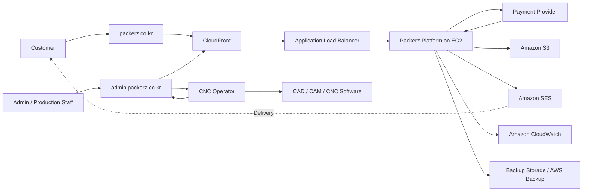

## 8. Container Diagram

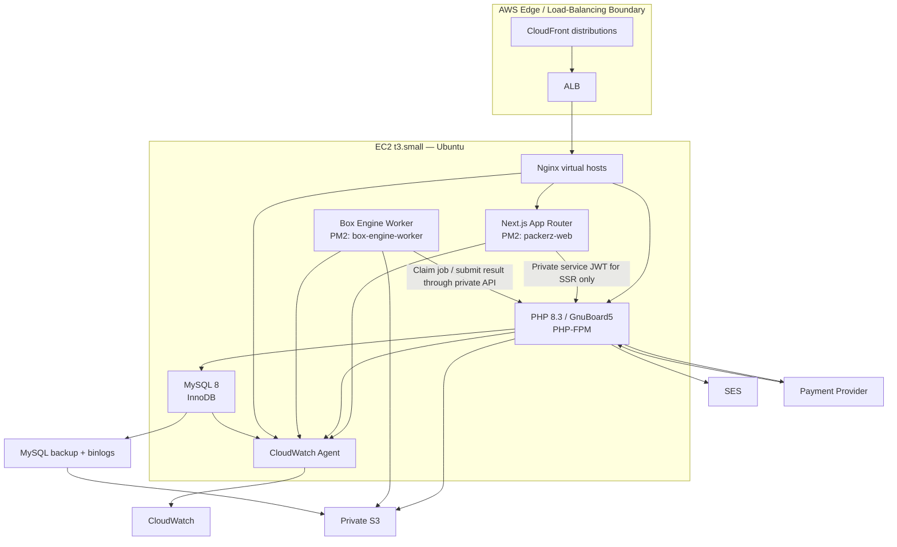

## 9. Request Flow

### 9.1 Customer page and API request

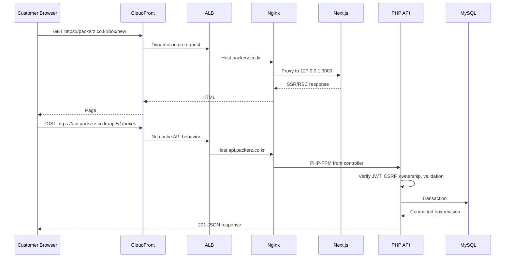

### 9.2 Admin request

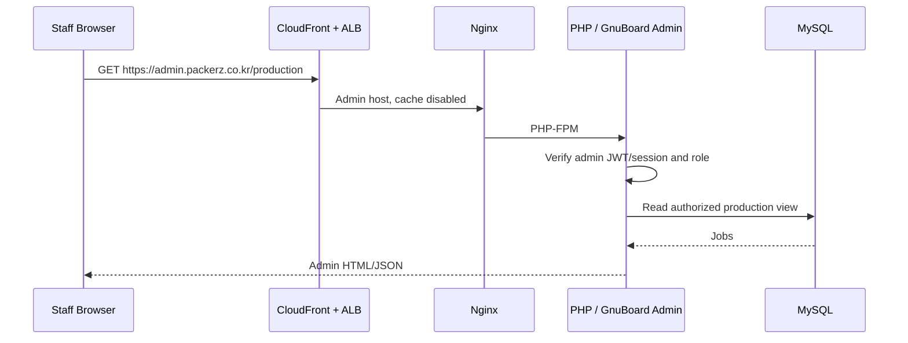

## 10. Order Flow

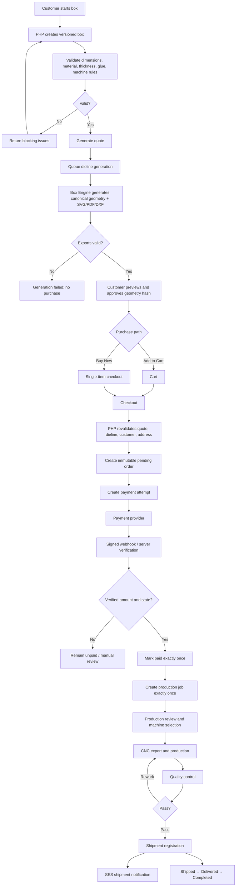

## 11. File Upload Flow

Packerz does not accept print artwork in the MVP.

Customer uploads, when enabled, are limited to approved reference/support attachments. Dielines are server-generated and follow the generation flow, not the untrusted upload flow.

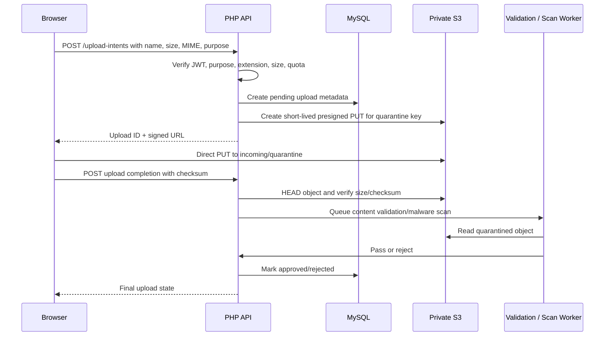

Upload rules:

- Presigned URL tied to one key, content length, content type, and short expiry.
- Server creates the object key.
- Uploaded content remains quarantined until validated.
- File extension, declared MIME, and detected MIME must agree with policy.
- Customer files never become manufacturing geometry automatically.
- Download authorization is separate from upload authorization.
- Rejected objects are isolated and removed through a retention process.

The exact malware-scanning implementation is an open infrastructure decision because no dedicated scanning service is currently in the approved stack.

## 12. Dieline Generation Flow

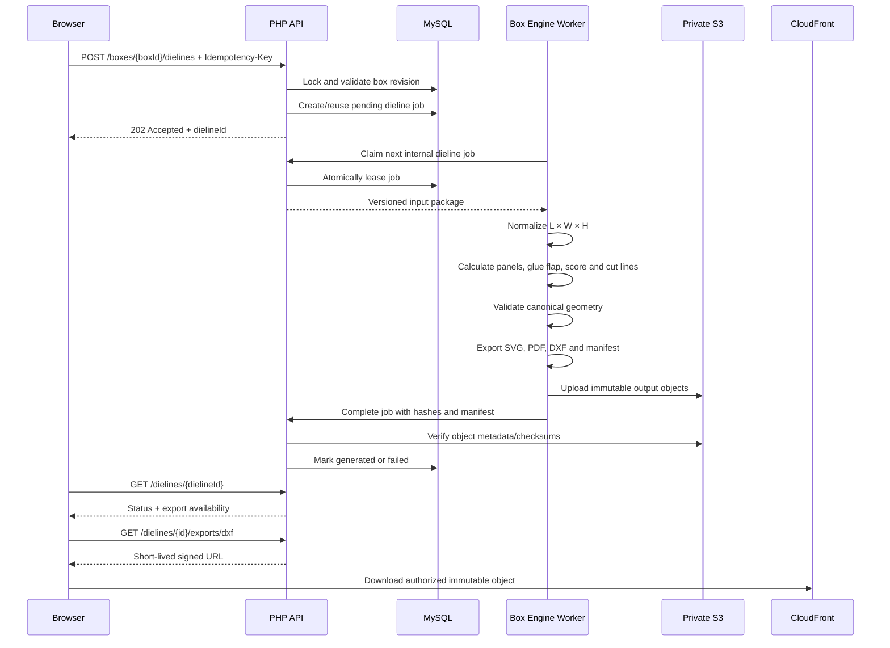

Failure rules:

- A partial output set is not considered complete when all three formats are required.
- A worker crash releases the lease after a bounded timeout.
- Idempotent retry reuses the same deterministic input identity.
- Changed template, material thickness, rules, machine profile, or generator creates a new revision/hash.
- Customer approval binds to the exact geometry hash.

## 13. Payment Flow

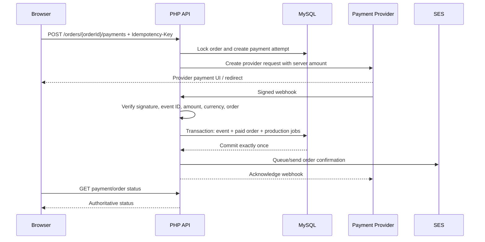

## 14. CNC Export Flow

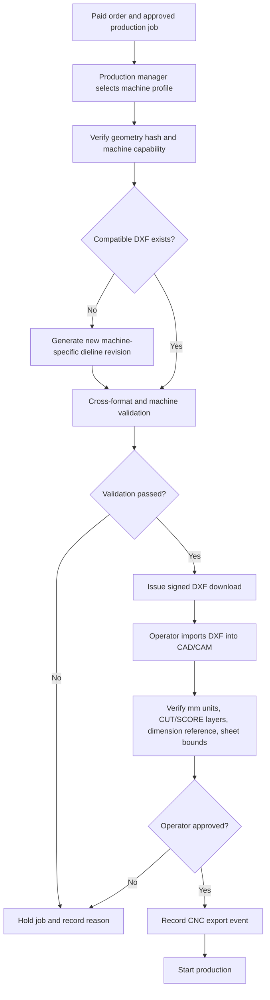

## 15. Deployment Structure

### 15.1 AWS topology

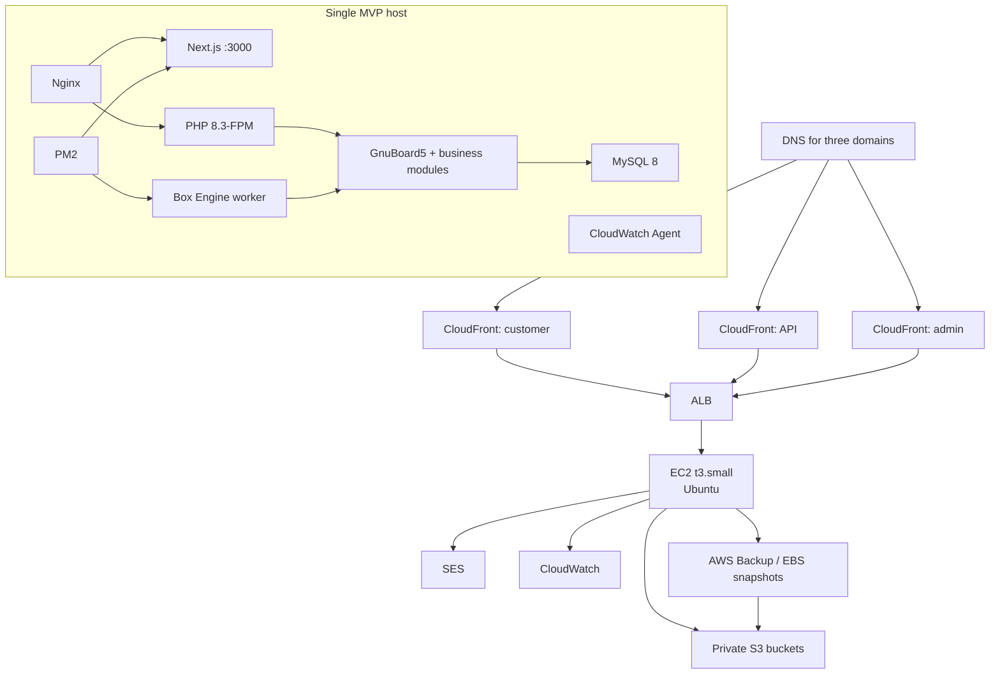

### 15.2 EC2 process ownership

| Process | Supervisor | Initial instances | Notes |
|---|---|---:|---|
| Nginx | `systemd` | 1 | Public reverse proxy only |
| Next.js | PM2 | 1 | No cluster mode on initial small host |
| Box Engine worker | PM2 | 1 | Generation concurrency starts at 1 |
| PHP 8.3-FPM | `systemd` | Tuned small pool | Limit children to available memory |
| MySQL 8 | `systemd` | 1 | Loopback/private only |
| CloudWatch Agent | `systemd` | 1 | Logs and host metrics |
| Backup/binlog shipper | `systemd` timer or cron | 1 | Off-host encrypted backups |

### 15.3 Suggested release layout

```text
/srv/packerz/
├── frontend/
│   ├── releases/{releaseId}/
│   └── current -> releases/{releaseId}
├── php/
│   ├── releases/{releaseId}/
│   └── current -> releases/{releaseId}
├── box-engine/
│   ├── releases/{releaseId}/
│   └── current -> releases/{releaseId}
└── shared/
    ├── runtime/
    └── non-secret configuration references
```

Database data, S3 files, secrets, and user uploads do not live inside application release directories.

### 15.4 Deployment rules

- Build Next.js artifacts outside the production `t3.small` host.
- Produce versioned, checksummed deployment artifacts.
- Run automated tests before deployment.
- Use backward-compatible expand/contract database migrations.
- Test Nginx and PHP configuration before reload.
- Switch release symlinks atomically.
- Use `pm2 reload`/controlled restart for Next.js.
- Restart the Box Engine worker only after compatible PHP/database changes are available.
- Reload PHP-FPM without deleting sessions/state.
- Run health checks after each component.
- Roll back application release independently from irreversible data migrations.

## 16. Security Boundaries

### 16.1 Boundary diagram

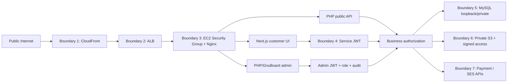

### 16.2 Network controls

- EC2 accepts web traffic only from ALB.
- Next.js port `3000`, PHP-FPM socket, MySQL `3306`, and worker control endpoints are not public.
- MySQL binds to loopback/private interface.
- SSH is disabled from the public internet or restricted to an approved management path.
- ALB origin access is protected so users cannot bypass CloudFront controls.
- Admin domain may add IP allowlisting/VPN and must support MFA before production-sensitive operations.

### 16.3 Application controls

- Strict host validation for all three domains.
- Exact-origin CORS for `packerz.co.kr`.
- CSRF protection for cookie-authenticated mutations.
- JWT issuer, audience, type, expiry, revocation, and role checks.
- Separate customer, guest, order, admin, and service token audiences.
- Idempotency keys for order, payment, refund, generation, QC, and shipment mutations.
- `If-Match`/version checks for mutable drafts/admin configuration.
- Parameterized SQL or trusted query builder.
- Server-authoritative price and quantity validation.
- Payment and carrier webhook signature verification.
- Rate limits for auth, guest creation, order lookup, generation, and webhooks.
- GnuBoard5/plugin hardening and prompt security patching.
- Security headers including CSP, HSTS, frame restrictions, and content-type protections.

### 16.4 Data and file controls

- Encrypted EBS and S3.
- TLS for all public and AWS service traffic.
- Private S3 with least-privilege IAM.
- Short-lived signed file access.
- Upload quarantine and content validation.
- Checksums for canonical geometry and every export.
- No public bucket ACLs.
- Secrets stored outside Git and readable only by required processes.
- Backups encrypted and access logged.
- Sensitive fields redacted from CloudWatch and audit payloads.

### 16.5 Payment boundary

Packerz remains outside direct card-data handling:

- Payment UI/tokenization belongs to the provider.
- Packerz stores provider references and redacted metadata.
- No PAN or CVV is stored or logged.
- Webhook verification is required before paid state.

## 17. Observability

### 17.1 CloudWatch inputs

- Nginx access/error logs
- Next.js stdout/stderr
- PHP-FPM/PHP application logs
- GnuBoard security/auth events
- Box Engine worker logs
- MySQL error/slow-query logs with safe configuration
- EC2 CPU, memory, disk, inode, and process health
- Dieline queue age and failure counts
- Payment webhook failures and amount mismatches
- Production/QC/shipping transition failures
- Backup age and restore-test results

### 17.2 Required alarms

- ALB unhealthy target
- Elevated 5xx response rate
- EC2 memory/disk pressure
- MySQL unavailable or storage threshold
- Box Engine queue age/failure rate
- Geometry/export hash mismatch
- Payment webhook failure or backlog
- SES send/bounce/complaint threshold
- Backup missing or stale
- S3 upload/checksum failure

### 17.3 Correlation

Every request and asynchronous job uses:

- Request ID
- Correlation ID
- Idempotency key where applicable
- Public resource IDs
- Safe actor type/ID

Never log:

- Passwords
- JWTs or refresh tokens
- Guest/order raw tokens
- Card data
- Full webhook secrets
- Unredacted provider payloads
- Unnecessary full addresses

## 18. SES Email Responsibilities

SES sends:

- Email verification
- Password reset
- Order confirmation
- Payment confirmation/failure requiring action
- Production hold requiring customer input
- Shipment/tracking notification
- Refund/cancellation confirmation

Email is triggered through a durable database event/outbox or equivalent retryable record. A successful order/payment transaction must not depend on synchronous email delivery.

Email links:

- Use short-lived or one-time tokens.
- Do not expose internal IDs or raw S3 keys.
- Route guest order access through verified order-scoped authentication.

## 19. Backup Strategy

The single EC2 host is a failure domain. Backups must be off-host.

### 19.1 MySQL

- Nightly encrypted full logical backup using a transaction-consistent method.
- MySQL binary logging enabled.
- Archive binary logs to private S3 at a short, defined interval.
- Record backup checksum, start/end time, source version, and encryption state.
- Retain a daily/weekly/monthly schedule approved by the business/legal policy.
- Test point-in-time recovery, not only full-backup extraction.
- Never place database credentials inside backup archives.

### 19.2 EBS/EC2

- Encrypted scheduled EBS snapshots through AWS Backup.
- Snapshot application/config volumes separately from transient release/cache data.
- Use snapshots as a recovery layer, not a replacement for consistent MySQL backups.
- Maintain a documented host rebuild procedure.

### 19.3 S3

- Enable versioning.
- Use lifecycle policies for old revisions and backups.
- Protect approved dielines and order documents from accidental overwrite/deletion.
- Consider retention lock and cross-region copy when business requirements justify them.
- Back up bucket policy, lifecycle configuration, and encryption configuration as infrastructure definitions.

### 19.4 Application and configuration

- Git is the source for application/documentation code.
- Deployment artifacts are versioned and checksummed.
- Nginx, PHP-FPM, PM2, CloudWatch, and backup configurations are version controlled without secrets.
- DNS, ALB, CloudFront, IAM, S3, and SES configuration should be captured as infrastructure definitions.
- Secrets require a separate encrypted recovery process.

### 19.5 Recovery targets

Proposed MVP targets:

| Data/service | RPO | RTO |
|---|---:|---:|
| Orders/payments/production MySQL | 15 minutes or less | 4 hours |
| Dieline/order files in S3 | Near-zero after successful upload/versioning | 2 hours |
| Customer frontend/API/admin host | Deployment artifact age | 4 hours |
| Logs | Best effort based on agent delivery | 8 hours |

Targets require an actual restore test before production approval. A backup that has never been restored is not considered verified.

### 19.6 Restore test

At least quarterly and after material backup changes:

1. Provision an isolated recovery environment.
2. Restore EC2/application configuration.
3. Restore full MySQL backup.
4. Apply archived binary logs to a selected recovery point.
5. Verify row counts and critical order/payment/production records.
6. Verify S3 object checksums for sampled approved dielines.
7. Start Next.js, PHP, Box Engine, and admin.
8. Execute a read-only order lookup and document download.
9. Record achieved RPO/RTO and corrective actions.

## 20. Scaling Strategy

### Stage 0 — Initial MVP

- One EC2 `t3.small`
- One Next.js PM2 process
- One Box Engine worker with concurrency `1`
- Small PHP-FPM pool
- Local MySQL 8
- CloudFront + ALB + private S3
- Bounded statistics queries and precomputed summaries

Operational constraints:

- Do not run production builds on the host during peak traffic.
- Avoid PM2 cluster mode on the initial memory-constrained host.
- Avoid unbounded PHP-FPM children.
- Avoid interactive full-table statistics queries.
- Apply disk/log rotation aggressively.
- Monitor burst CPU, memory, swap, and MySQL buffer usage.

### Stage 1 — Vertical stabilization

- Increase EC2 size when sustained CPU/memory pressure appears.
- Move MySQL data to a dedicated encrypted volume.
- Tune PHP-FPM, MySQL, and Node memory from observed metrics.
- Separate the Box Engine worker process limits from the frontend.

### Stage 2 — Separate the database

- Move MySQL to a managed or dedicated database host.
- Preserve MySQL 8 compatibility.
- Use private networking and TLS.
- Enable managed backups/point-in-time recovery.
- Remove database resource contention from the web host.

This is the highest-priority structural scale change because the initial single host combines web, worker, and database failure/resource domains.

### Stage 3 — Horizontal web/API scaling

- Add multiple stateless application EC2 instances behind ALB.
- Keep customer/guest/admin sessions JWT-based or in shared authoritative storage.
- Keep files in S3.
- Keep MySQL external/shared.
- Deploy identical versioned artifacts.
- Make health checks dependency-aware without exposing secrets.

### Stage 4 — Worker and queue scaling

- Introduce a durable managed queue for dieline/export jobs.
- Scale Box Engine workers independently.
- Preserve idempotency and deterministic generation.
- Assign machine/template-aware worker capabilities if needed.
- Add dead-letter and replay tooling.

### Stage 5 — Analytics separation

- Move Statistics reads to pre-aggregated tables, a read replica, or an analytics store.
- Keep operational MySQL protected from expensive reporting.
- Build production, QC, machine, shipping, and sales metrics from append-only events.

### Scaling invariants

- PHP remains the business transaction authority until an approved service split.
- Geometry hash and immutable exports remain stable.
- Browser never gains direct database access.
- Payment production creation stays exactly-once/idempotent.
- Admin authorization and audit cannot be weakened for throughput.

## 21. Failure Modes and Recovery

| Failure | Customer/staff behavior | Recovery |
|---|---|---|
| Next.js unavailable | Customer site unavailable; API may remain healthy | PM2 restart, rollback release, ALB health alarm |
| PHP-FPM/API unavailable | Transactions blocked; frontend shows recoverable error | Restart pool, rollback PHP release, inspect MySQL/dependencies |
| MySQL unavailable | All authoritative mutations stop | Fail closed, restore/recover database, do not use local fallback JSON |
| Box Engine worker unavailable | Dielines stay pending; commerce blocked for those items | PM2 restart, lease timeout, idempotent retry |
| SVG/PDF/DXF exporter failure | Dieline marked failed/partial; cannot purchase when outputs required | Fix/retry same inputs or publish new generator version |
| S3 unavailable | Upload/download/generation completion delayed | Retry with backoff; keep DB state pending |
| Payment provider unavailable | Order stays unpaid; no production job | Recoverable retry, reconcile provider state |
| Payment webhook delayed | UI shows pending | Poll authoritative provider/status; process webhook idempotently |
| SES unavailable | Core transaction succeeds; email queued | Retry durable email event |
| CloudWatch unavailable | Service continues with bounded local buffering | Rotate locally and forward when restored |
| EC2 lost | Entire MVP host unavailable | Rebuild from artifacts/config, restore MySQL, attach recovered state |
| Bad deployment | Health checks fail or errors rise | Atomic release rollback; database expand/contract compatibility |

## 22. Health Checks

### Public shallow checks

- `/health/live`
  - Process is running.
  - Does not expose dependency details.

### Internal readiness checks

- Next.js readiness
- PHP-FPM readiness
- MySQL connection and migration compatibility
- Required S3/SES configuration presence
- Box Engine worker heartbeat/queue age

ALB health checks should not require payment provider or SES availability; those dependencies are reported separately to prevent unnecessary host cycling.

## 23. Documentation Alignment Required Before Implementation

Architecture introduces or finalizes decisions that are not yet fully represented in every existing document:

1. **Public API runtime:** PHP/GnuBoard is the production owner; `API.md` currently describes Next.js as the public Route Handler edge.
2. **DXF:** `BOX_ENGINE.md` includes DXF, while the original PRD/database/API began with SVG/PDF.
3. **Machines:** Admin navigation and Box Engine require versioned machine profiles; `DATABASE.md` and `API.md` do not yet define machine tables/endpoints.
4. **Statistics:** Admin navigation includes Statistics; operational metric tables/endpoints are not yet defined.
5. **Dimension terminology:** Box Engine uses Length/Width/Height; older documents use Width/Depth/Height.
6. **ALB:** Included from the approved infrastructure direction although it was not present in the original technology list.
7. **File scanning:** Quarantine flow is defined, but the scanner runtime/service is not selected.
8. **Payment provider:** Contract is generic until a provider is approved.
9. **CNC/DXF profile:** Actual DXF version, layer mapping, and machine import behavior require physical acceptance testing.

These are documentation/architecture decisions only. Application implementation must wait for Project Manager approval and synchronized API/database migrations.

## 24. Production Readiness Checklist

### Product

- [ ] Confirm packaging-only MVP scope.
- [ ] Confirm one box structure.
- [ ] Confirm one fixed glue method.
- [ ] Confirm unprinted sample/mockup/low-volume quantities.
- [ ] Approve Length/Width/Height terminology.

### Application

- [ ] Next.js production build passes.
- [ ] PHP API contract tests pass.
- [ ] GnuBoard admin roles are verified.
- [ ] JWT/guest/order-scoped flows pass.
- [ ] Cart/order/payment idempotency passes.
- [ ] Production/QC/shipping state transitions pass.

### Box Engine

- [ ] Manufacturing formulas are signed off.
- [ ] Machine profile is modeled.
- [ ] SVG/PDF/DXF match one geometry hash.
- [ ] PDF is verified at 1:1 scale.
- [ ] DXF is tested in actual CNC/CAD software.
- [ ] Physical cut/score/glue samples pass.

### Infrastructure

- [ ] CloudFront/ALB/Nginx host routing tested.
- [ ] EC2 ports restricted.
- [ ] MySQL is not public.
- [ ] S3 is private and versioned.
- [ ] Instance role has least privilege.
- [ ] SES identity/domain and bounce handling verified.
- [ ] CloudWatch dashboards/alarms active.
- [ ] PM2 startup and restart behavior verified.
- [ ] Disk/log rotation verified.

### Security

- [ ] TLS on all public domains.
- [ ] Exact CORS and CSRF controls.
- [ ] Admin MFA/access policy.
- [ ] Webhook signatures verified.
- [ ] Secrets absent from Git/logs.
- [ ] Upload quarantine policy tested.
- [ ] Dependency/OS/GnuBoard patch process documented.

### Recovery

- [ ] Full MySQL backup completes and checksum verifies.
- [ ] Binary logs archive off-host.
- [ ] EBS snapshots active.
- [ ] S3 lifecycle/versioning confirmed.
- [ ] Restore drill meets approved RPO/RTO.
