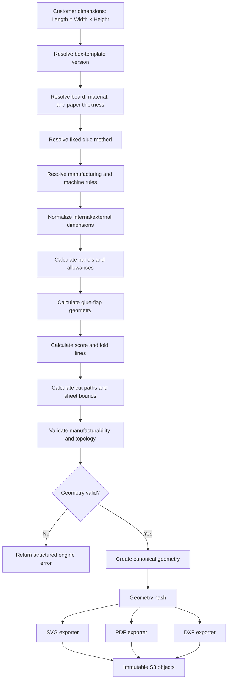
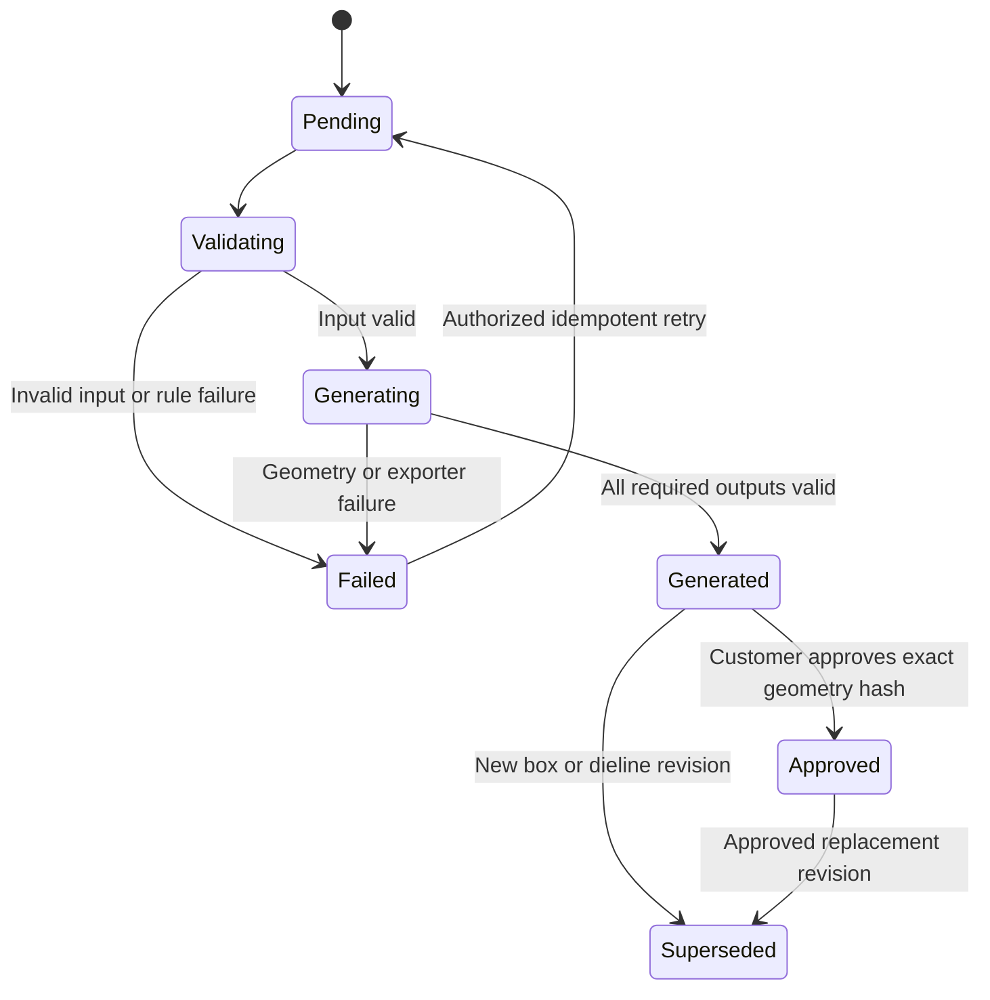

# Packerz Box Engine

**Status:** Draft  
**Purpose:** Define the deterministic geometry engine that converts customer dimensions into production-ready dielines  
**Outputs:** SVG, PDF, DXF  
**Sources:** [PRD.md](./PRD.md), [DATABASE.md](./DATABASE.md), [API.md](./API.md)

## 1. Product Role

The Box Engine is the manufacturing core of Packerz.

It converts a customer’s box dimensions and an approved manufacturing configuration into one canonical, versioned dieline geometry. SVG, PDF, and DXF are generated from that same geometry so every format represents the same physical box.

The engine is deterministic:

> Identical normalized inputs, template version, rule version, machine profile, and generator version must produce the same canonical geometry hash.

The engine does not:

- Generate sticker designs
- Add printing or artwork
- Edit arbitrary customer vectors
- Choose unsupported materials or glue methods
- Trust dimensions or geometry supplied by the browser
- Convert PDF into DXF or DXF into SVG
- Silently repair a manufacturing failure

## 2. Customer-to-Manufacturing Pipeline

### Customer-facing concept

```text
Customer
   ↓
Length
Width
Height
   ↓
Glue flap
   ↓
Paper thickness
   ↓
Score line
   ↓
SVG
   ↓
PDF
   ↓
DXF
```

### Engineering execution order

Paper thickness and manufacturing rules must be resolved before glue-flap and score-line geometry because they affect allowances and fold behavior.



SVG, PDF, and DXF are sibling exports. They are not a serial conversion chain.

## 3. Terminology

### Canonical dimensions

The Box Engine uses:

- **Length (`L`)** — primary horizontal box dimension
- **Width (`W`)** — secondary horizontal box dimension
- **Height (`H`)** — vertical box dimension

All engine measurements use millimeters.

### Existing documentation mismatch

The current API and database drafts use `width`, `depth`, and `height`. This document uses the newly supplied product terminology: `length`, `width`, and `height`.

Before implementation, the Project Manager must approve one canonical naming system. No implicit field mapping is allowed because an incorrect Length/Width mapping would create incorrect physical tooling.

If compatibility mapping is required, it must be explicit, versioned, and covered by fixtures:

```text
API field → Engine field → Manufacturing drawing label
```

### Dimension basis

- **Internal:** Customer values describe usable interior dimensions.
- **External:** Customer values describe finished outside dimensions.

The conversion between internal and external dimensions is template- and material-specific. It must not be implemented as a universal `± 2 × thickness` formula.

### Paper thickness

Material thickness is an authoritative catalog value in millimeters. It is resolved from the selected material revision, not accepted as a free customer input.

### Glue flap

The glue flap is the structural seam panel used by the one approved MVP glue method. Customers do not choose its width or geometry.

### Score line

A score line is a manufacturing crease path. It is distinct from:

- Cut line
- Annotation
- Dimension guide
- Sheet boundary

Score geometry must include material and machine allowances where applicable.

## 4. Engine Inputs

### 4.1 Required customer/configuration inputs

| Input | Type | Rule |
|---|---|---|
| `boxId` | ULID | Exact box-configuration revision |
| `templateId` | ULID | Active/versioned box template |
| `dimensionBasis` | Enum | `internal` or `external` |
| `lengthMm` | Decimal string | Positive and within rules |
| `widthMm` | Decimal string | Positive and within rules |
| `heightMm` | Decimal string | Positive and within rules |
| `materialId` | ULID | Active approved material |
| `glueTypeId` | ULID | Server-selected fixed MVP method |
| `quantity` | Integer | Used for production validation, not basic geometry |

### 4.2 Resolved server inputs

| Input | Source | Purpose |
|---|---|---|
| Template code/version | `box_templates` | Structural topology |
| Generator key/version | `box_templates` | Deterministic implementation |
| Material thickness | `materials` | Finished dimensions and score allowances |
| Board type | `board_types` | Material behavior and allowed processes |
| Glue rules | `glue_types` | Glue-flap and seam geometry |
| Manufacturing-rule version | Rule service | Dimension and topology limits |
| Machine profile | Machine configuration | Sheet, tool, crease, and precision limits |
| Unit/precision policy | Engine configuration | Canonical rounding behavior |

### 4.3 Logical request

```json
{
  "requestId": "req_dieline_01",
  "box": {
    "id": "01JBOX000000000000000000",
    "designKey": "01JDESIGN000000000000000",
    "revision": 2,
    "dimensionBasis": "internal",
    "lengthMm": "120.000",
    "widthMm": "80.000",
    "heightMm": "40.000",
    "quantity": 10
  },
  "template": {
    "id": "01JTEMPLATE00000000000000",
    "code": "CUSTOM_BOX",
    "version": 1,
    "generatorKey": "custom-box-v1"
  },
  "material": {
    "id": "01JMATERIAL00000000000000",
    "code": "SC350",
    "boardTypeCode": "PAPERBOARD",
    "thicknessMm": "0.450"
  },
  "glue": {
    "id": "01JGLUE00000000000000000",
    "code": "DEFAULT_GLUE"
  },
  "rules": {
    "manufacturingVersion": "mfg-2026-07-01",
    "machineProfileVersion": "machine-default-1"
  },
  "generatorVersion": "1.0.0"
}
```

### 4.4 Input ownership

- The browser submits only customer-selectable fields.
- The server reloads template, material, thickness, glue, rule, and machine data.
- The engine rejects a request when the supplied metadata does not match authoritative records.
- Ordered revisions use immutable snapshots, not the latest mutable catalog values.

## 5. Machine Profile

The engine must be able to validate geometry against the intended manufacturing process.

A logical machine profile includes:

| Field | Purpose |
|---|---|
| `machineCode` | Stable machine identifier |
| `profileVersion` | Immutable capability version |
| `maxSheetWidthMm` | Maximum usable sheet width |
| `maxSheetHeightMm` | Maximum usable sheet height |
| `minCutSegmentMm` | Minimum reliable cut segment |
| `minScoreSegmentMm` | Minimum reliable score segment |
| `minCutToScoreGapMm` | Tool/process clearance |
| `minScoreToScoreGapMm` | Crease clearance |
| `cutToleranceMm` | Allowed cut deviation |
| `scoreToleranceMm` | Allowed score deviation |
| `kerfMm` | Tool compensation where applicable |
| `supportedBoardTypes` | Allowed board constructions |
| `supportedThicknessRangeMm` | Material capability |
| `dxfProfile` | DXF layer/entity/version constraints |

Machines are a newly supplied admin domain and are not yet modeled in the current `DATABASE.md` or `API.md`. Engine implementation must wait for the machine schema and capability contract.

## 6. Canonical Geometry Model

### 6.1 Coordinate system

The canonical model uses:

- Unit: millimeter
- Origin: bottom-left of the flattened sheet boundary
- X-axis: positive to the right
- Y-axis: positive upward
- Angles: degrees counterclockwise
- Precision: decimal/fixed-point arithmetic; never binary floating-point for canonical values

SVG coordinates are transformed during export because SVG normally increases Y downward. PDF and DXF exporters apply their own coordinate/unit transforms from the canonical model.

### 6.2 Layers

| Layer | Manufacturing meaning | Required |
|---|---|---:|
| `CUT` | Through-cut geometry | Yes |
| `SCORE` | Crease/score geometry | Yes |
| `SHEET` | Flattened sheet boundary | Yes |
| `DIMENSION` | Dimension guides | Export-dependent |
| `ANNOTATION` | Labels and revision metadata | Export-dependent |
| `REFERENCE` | Non-manufacturing construction guides | Internal/preview only |

Layer names are semantic. Display colors must not be the only way manufacturing meaning is conveyed.

### 6.3 Primitive types

The canonical geometry supports:

- Point
- Line segment
- Polyline
- Closed polygon
- Arc
- Circle, only if a future template requires it
- Text annotation, excluded from manufacturing-only layers

Curves must not be approximated differently by each exporter. If an exporter lacks the required primitive, the canonical tessellation parameters are stored and reused.

### 6.4 Logical geometry document

```json
{
  "schemaVersion": "box-geometry-1",
  "units": "mm",
  "coordinateSystem": {
    "origin": "bottom-left",
    "xDirection": "right",
    "yDirection": "up"
  },
  "source": {
    "boxId": "01JBOX000000000000000000",
    "boxRevision": 2,
    "templateCode": "CUSTOM_BOX",
    "templateVersion": 1,
    "materialCode": "SC350",
    "materialThicknessMm": "0.450",
    "glueCode": "DEFAULT_GLUE",
    "manufacturingRuleVersion": "mfg-2026-07-01",
    "machineProfileVersion": "machine-default-1",
    "generatorVersion": "1.0.0"
  },
  "sheet": {
    "widthMm": "460.000",
    "heightMm": "250.000"
  },
  "layers": [
    {
      "name": "CUT",
      "entities": [
        {
          "type": "polyline",
          "closed": true,
          "points": [
            {"x": "0.000", "y": "0.000"},
            {"x": "460.000", "y": "0.000"}
          ]
        }
      ]
    },
    {
      "name": "SCORE",
      "entities": [
        {
          "type": "line",
          "start": {"x": "40.000", "y": "0.000"},
          "end": {"x": "40.000", "y": "250.000"}
        }
      ]
    }
  ],
  "geometryHash": "sha256-of-canonical-document"
}
```

The points above illustrate the schema only; they are not an approved box formula.

## 7. Calculation Stages

### 7.1 Normalize inputs

1. Parse decimal strings into fixed-point values.
2. Reject NaN, infinity, scientific notation when not explicitly allowed, negative values, and excess precision.
3. Normalize to millimeters.
4. Resolve dimension basis.
5. Apply the approved precision policy.

No rounding occurs at arbitrary intermediate steps. The engine carries sufficient precision and rounds only at defined boundaries.

### 7.2 Resolve finished dimensions

The engine calculates both:

- Finished internal Length × Width × Height
- Finished external Length × Width × Height

Inputs:

- Customer dimension basis
- Material thickness
- Template fold topology
- Score/crease allowance
- Glue/seam behavior

Output must record the input values and both derived dimension sets.

### 7.3 Construct structural panels

The template defines:

- Panel order
- Panel adjacency
- Fold direction
- Top/bottom flap topology
- Seam/glue location
- Required tabs
- Legal parameter ranges

The engine calculates panel rectangles/polygons from normalized finished dimensions and template allowances.

### 7.4 Calculate glue flap

Glue-flap geometry is derived from:

- Fixed glue type
- Material/board type
- Material thickness
- Adjacent panel height
- Template seam rules
- Machine minimum/maximum flap capability

Conceptual rule:

```text
glueFlapWidth =
  clamp(
    glueRuleBase
    + thicknessAllowance
    + seamAllowance,
    machineMinimum,
    templateMaximum
  )
```

This is an abstraction, not an approved manufacturing formula. Actual coefficients and limits must be supplied and signed off by manufacturing.

The engine validates:

- Positive usable glue area
- Flap does not cross adjacent cuts
- Flap fits within sheet/machine limits
- Correct connection to the seam panel
- Required taper/chamfer rules

### 7.5 Calculate score lines

Score lines are derived after panels and material behavior are known.

Inputs:

- Nominal fold axis
- Material thickness
- Board type
- Fold direction/angle
- Grain direction when applicable
- Score rule/profile
- Machine crease capability

The engine stores:

- Nominal fold axis
- Applied score offset/allowance
- Resulting manufacturing score path
- Rule/profile version

The exporter uses the resulting manufacturing score path, not a separate recalculation.

### 7.6 Calculate cut paths

Cut geometry includes:

- Outer contour
- Flap edges
- Tabs/notches required by the template
- Approved relief cuts

The engine must:

- Join coincident edges
- Remove duplicate segments
- Maintain closed outer contours
- Avoid zero-length segments
- Apply kerf/tool compensation only through a versioned machine rule

### 7.7 Calculate sheet boundary

The sheet boundary is the bounding rectangle plus approved margins.

Validation includes:

- Material maximum sheet size
- Machine maximum sheet size
- Required tool/safety margin
- Non-negative origin normalization
- Rotation policy, if rotation is permitted

Nesting multiple boxes on a sheet is not part of the initial single-dieline geometry unless separately approved.

## 8. Geometry Validation

### 8.1 Pre-generation validation

- Required identifiers and versions present
- Dimensions positive and within rule range
- Template/material/glue active and compatible
- Material thickness supported
- Machine supports board and thickness
- Quantity within production scope
- No print/artwork properties

### 8.2 Topology validation

- Outer cut contour is closed
- No self-intersecting cut contour
- No zero-length entities
- No unintended duplicate/overlapping cut segments
- Score lines do not extend beyond legal geometry unless explicitly required
- Glue flap connects to the correct panel
- Every required fold has one intended score path
- Every manufacturing entity belongs to exactly one semantic layer

### 8.3 Manufacturing validation

- Sheet fits material and machine limits
- Cut and score segments meet minimum length
- Cut-to-score and score-to-score gaps meet process limits
- Glue flap meets minimum usable area
- Tabs/flaps meet minimum dimensions
- Tolerances are achievable by the selected machine profile

### 8.4 Cross-format validation

After export:

- SVG, PDF, and DXF bounds match canonical bounds within exporter tolerance.
- Entity counts by manufacturing layer match expected mappings.
- Exported checksums are stored.
- Re-imported DXF/SVG test geometry matches the canonical path set within tolerance.
- PDF remains vector-based and preserves 1:1 scale.

## 9. Exporters

### 9.1 General rule

```text
Canonical Geometry
├── SVG Exporter
├── PDF Exporter
└── DXF Exporter
```

An exporter may transform coordinates and units but may not change manufacturing geometry.

Every export records:

- `geometryHash`
- `generatorVersion`
- `exporterVersion`
- `templateVersion`
- `manufacturingRuleVersion`
- `machineProfileVersion`
- Format checksum
- Creation time

### 9.2 SVG

Requirements:

- Vector-only
- Explicit width/height in `mm`
- `viewBox` consistent with sheet bounds
- Stable group IDs/layers: `CUT`, `SCORE`, `DIMENSION`, `ANNOTATION`
- No scripts, external references, foreign objects, or untrusted markup
- Cut/score semantics included as metadata or stable IDs, not colors alone
- Coordinate transform from canonical Y-up to SVG Y-down is deterministic

Example structure:

```xml
<svg xmlns="http://www.w3.org/2000/svg"
     width="460mm"
     height="250mm"
     viewBox="0 0 460 250">
  <g id="CUT" data-layer="CUT"></g>
  <g id="SCORE" data-layer="SCORE"></g>
  <g id="DIMENSION" data-layer="DIMENSION"></g>
</svg>
```

### 9.3 PDF

Requirements:

- Vector geometry, not a raster screenshot
- Physical 1:1 scale
- Page size derived from sheet size
- Deterministic conversion: `points = millimeters × 72 / 25.4`
- Embedded or outlined fonts for annotations
- Cut and score paths remain distinct
- Revision, dimensions, units, and “unprinted structural dieline” metadata
- No automatic page fitting or printer scaling

The production PDF should clearly state:

```text
Print/plot at 100% scale.
Do not fit to page.
Verify the dimension reference before use.
```

### 9.4 DXF

Requirements:

- Vector CAD output generated directly from canonical geometry
- Units declared as millimeters where the selected DXF version supports it
- Stable layers:
  - `CUT`
  - `SCORE`
  - `DIMENSION`
  - `ANNOTATION`
- Cut/score geometry uses approved DXF entity types
- Closed canonical polylines remain closed
- Text is excluded from manufacturing layers
- No spline approximation without versioned tessellation rules

DXF version is an open manufacturing decision.

Recommended starting option:

- ASCII DXF R12 for broad compatibility and simple line/polyline workflows

Alternative:

- A newer ASCII DXF version when machines require unit metadata, lightweight polylines, or richer entity support

The selected version must be tested against the actual downstream machine/CAD software before release.

## 10. Output Manifest

One successful generation produces a manifest:

```json
{
  "dielineId": "01JDIELINE00000000000000",
  "revision": 1,
  "status": "generated",
  "geometry": {
    "schemaVersion": "box-geometry-1",
    "hash": "52f2...9a1c",
    "sheetWidthMm": "460.000",
    "sheetHeightMm": "250.000"
  },
  "versions": {
    "template": 1,
    "generator": "1.0.0",
    "manufacturingRules": "mfg-2026-07-01",
    "machineProfile": "machine-default-1"
  },
  "exports": {
    "svg": {
      "sha256": "svg-sha256",
      "sizeBytes": 18240
    },
    "pdf": {
      "sha256": "pdf-sha256",
      "sizeBytes": 44120
    },
    "dxf": {
      "sha256": "dxf-sha256",
      "sizeBytes": 26310,
      "version": "R12"
    }
  }
}
```

Private S3 object keys are stored server-side and are not exposed in this public manifest.

## 11. Storage Layout

Suggested immutable S3 key layout:

```text
dielines/
└── {designKey}/
    └── {boxId}/
        └── r{dielineRevision}/
            ├── canonical.json
            ├── dieline.svg
            ├── dieline.pdf
            ├── dieline.dxf
            ├── preview.png
            └── manifest.json
```

Rules:

- Bucket is private.
- Object overwrite is not allowed for approved revisions.
- CloudFront or S3 signed URLs provide short-lived authorized downloads.
- Object metadata includes geometry and exporter versions.
- S3 versioning and backup/lifecycle policies protect manufacturing files.
- The database stores keys, checksums, sizes, and version metadata.

## 12. Generation Lifecycle



State rules:

- `generated` requires all required MVP outputs.
- Once DXF becomes a required output, SVG/PDF success with DXF failure does not produce a fully generated state.
- `approved` binds approval to the exact geometry hash.
- A configuration change creates a new box revision and supersedes the previous dieline.
- A generator/rule change creates a new dieline revision even when customer dimensions are unchanged.

## 13. Idempotency and Hashing

### Generation key

Canonical idempotency input:

```text
boxRevisionId
+ templateVersion
+ materialRevision/thickness
+ glueRuleVersion
+ manufacturingRuleVersion
+ machineProfileVersion
+ generatorVersion
```

### Geometry hash

1. Canonicalize JSON keys and entity ordering.
2. Serialize fixed-point decimal strings in the approved format.
3. Exclude timestamps, request IDs, signed URLs, and storage keys.
4. Calculate SHA-256.

The geometry hash proves that SVG, PDF, and DXF originated from the same geometry model.

### Retry

- Same key and same inputs returns the existing successful generation.
- Same key with a different request hash returns a conflict.
- A failed transient attempt may retry without incrementing the customer box revision.
- A changed deterministic input creates a new generation identity/revision.

## 14. API Integration

Current API endpoints:

| Endpoint | Engine use |
|---|---|
| `POST /api/v1/boxes/{boxId}/validate` | Pre-generation manufacturing validation |
| `POST /api/v1/boxes/{boxId}/dielines` | Start idempotent generation |
| `GET /api/v1/dielines/{dielineId}` | Poll lifecycle and output availability |
| `GET /api/v1/dielines/{dielineId}/preview` | Get signed preview |
| `GET /api/v1/dielines/{dielineId}/exports/{format}` | Get signed export |
| `POST /api/v1/dielines/{dielineId}/approve` | Approve exact geometry hash |

DXF can be added to the current `{format}` enum as an additive v1 capability only after:

- DXF is approved as MVP scope.
- Exporter/machine compatibility is verified.
- Database storage/checksum fields are migrated.
- API examples and error codes are updated.

Suggested DXF response:

```json
{
  "apiVersion": "v1",
  "data": {
    "dielineId": "01JDIELINE00000000000000",
    "format": "dxf",
    "dxfVersion": "R12",
    "units": "mm",
    "filename": "packerz-dieline-r1.dxf",
    "sha256": "dxf-sha256",
    "url": "https://cdn.example/signed-dxf",
    "expiresAt": "2026-07-24T09:25:00.000Z"
  }
}
```

## 15. Database Integration

The current `dielines` draft includes SVG/PDF and preview fields. DXF requires an approved database migration.

Candidate additions:

| Column | Type | Purpose |
|---|---|---|
| `canonical_storage_key` | `VARCHAR(1024)` | Canonical geometry JSON |
| `canonical_sha256` | `CHAR(64)` | Canonical document checksum |
| `dxf_storage_key` | `VARCHAR(1024)` | Private S3 DXF object key |
| `dxf_sha256` | `CHAR(64)` | DXF checksum |
| `dxf_version` | `VARCHAR(20)` | Exported DXF target |
| `export_manifest_json` | `JSON` | Exporter versions, sizes, validation |
| `machine_profile_version` | `VARCHAR(40)` | Capability snapshot |

Do not store full SVG, PDF, DXF, or canonical file content in MySQL.

## 16. Error Model

| Code | Stage | Meaning |
|---|---|---|
| `DIMENSION_NAME_MAPPING_UNRESOLVED` | Input | Length/Width/Height contract is not approved |
| `DIMENSION_INVALID` | Input | Missing, non-positive, or malformed dimension |
| `DIMENSION_OUT_OF_RANGE` | Validation | Dimension violates manufacturing rules |
| `DIMENSION_BASIS_UNSUPPORTED` | Input | Unsupported internal/external basis |
| `TEMPLATE_NOT_FOUND` | Resolution | Template/version unavailable |
| `TEMPLATE_PARAMETER_INVALID` | Validation | Dimensions cannot satisfy template topology |
| `MATERIAL_NOT_FOUND` | Resolution | Material unavailable |
| `MATERIAL_THICKNESS_INVALID` | Validation | Missing/unsupported thickness |
| `MATERIAL_TEMPLATE_INCOMPATIBLE` | Validation | Material cannot use template |
| `GLUE_METHOD_INVALID` | Validation | Fixed glue rule unavailable/incompatible |
| `GLUE_FLAP_TOO_SMALL` | Geometry | Calculated glue area below limit |
| `GLUE_FLAP_INTERSECTION` | Geometry | Glue flap intersects illegal geometry |
| `SCORE_ALLOWANCE_UNAVAILABLE` | Geometry | Material/machine score rule missing |
| `SCORE_LINE_INVALID` | Geometry | Score topology invalid |
| `CUT_CONTOUR_OPEN` | Topology | Outer contour is not closed |
| `CUT_CONTOUR_SELF_INTERSECTION` | Topology | Outer contour intersects itself |
| `GEOMETRY_ENTITY_DUPLICATE` | Topology | Duplicate manufacturing entity |
| `SHEET_SIZE_EXCEEDED` | Manufacturing | Flattened dieline exceeds limits |
| `MACHINE_PROFILE_UNAVAILABLE` | Resolution | No approved machine capability |
| `MACHINE_CAPABILITY_MISMATCH` | Manufacturing | Machine cannot produce geometry/material |
| `SVG_EXPORT_FAILED` | Export | SVG exporter/validation failed |
| `PDF_EXPORT_FAILED` | Export | PDF exporter/validation failed |
| `DXF_EXPORT_FAILED` | Export | DXF exporter/validation failed |
| `EXPORT_GEOMETRY_MISMATCH` | Export QA | Output does not match canonical geometry |
| `GENERATOR_VERSION_MISMATCH` | Resolution | Requested/template generator versions differ |
| `GEOMETRY_HASH_MISMATCH` | Approval | Approval/export hash does not match |

Errors include:

- Stable machine-readable code
- Customer-safe message
- Internal diagnostic ID
- Affected field/entity where relevant
- Retryability
- Generator/rule versions

## 17. Security

- Engine inputs are loaded from authorized server records.
- Never accept customer-supplied SVG, PDF, DXF, S3 keys, layer definitions, or geometry as trusted engine input.
- SVG output contains no script, external URL, embedded HTML, or event handlers.
- PDF output contains no embedded executable content or external launch action.
- DXF output restricts entity types, layers, text length, and metadata.
- Signed URLs are short-lived and scoped to one immutable object.
- Public errors do not expose bucket names, private keys, internal file paths, machine secrets, or stack traces.
- Generation workers use least-privilege S3 and service credentials.

## 18. Performance and Reliability

Initial service objectives:

- Validation: target p95 under 500 ms
- Canonical geometry generation: target p95 under 2 seconds for the MVP template
- All three exports: target p95 under 5 seconds
- Asynchronous path when the synchronous budget is exceeded
- Idempotent retries after worker/network failure

Reliability requirements:

- Generation request saved before work dispatch
- Worker lease/heartbeat for asynchronous jobs
- Bounded retry with dead-letter handling
- No duplicate approved revisions from retries
- Export checksums verified after S3 upload
- Metrics and structured logs sent to CloudWatch
- Alarm on generation failure rate, queue age, hash mismatch, and S3 upload failure

## 19. Testing Strategy

### Unit tests

- Fixed-point parsing and rounding
- Internal/external dimension conversion
- Panel calculations
- Glue-flap rules
- Score allowances
- Cut topology
- Bounding boxes
- Export coordinate transforms

### Golden fixtures

Each approved fixture contains:

- Input JSON
- Template/material/glue/machine/rule versions
- Canonical geometry JSON
- Geometry hash
- SVG
- PDF
- DXF
- Expected validation results

Golden files change only through reviewed manufacturing sign-off.

### Property-based tests

Generate legal dimension combinations and verify:

- No zero/negative panel
- Closed cut contours
- No forbidden intersections
- Score topology remains valid
- Sheet bounds contain all entities
- Determinism across repeated runs

### Cross-format tests

- Parse SVG paths back to geometry.
- Parse DXF entities back to geometry.
- Inspect PDF vector paths/bounds.
- Compare against canonical entities within exporter tolerance.
- Verify physical dimension reference at 1:1 scale.

### Manufacturing acceptance

Before production release:

1. Generate approved test matrix.
2. Open DXF in actual CAD/machine software.
3. Plot/print PDF at 100%.
4. Measure dimension references.
5. Cut/score physical samples.
6. Assemble and measure finished internal/external dimensions.
7. Verify glue seam and score behavior for every active material thickness.
8. Sign off template, machine profile, and generator version.

## 20. Required Admin Data

The engine depends on controlled admin data:

- Box templates
- Board types
- Materials
- Paper thickness
- Glue types
- Manufacturing rules
- Machine profiles
- Generator/exporter versions

Required governance:

- Version every geometry-affecting record.
- Do not edit active historical geometry rules in place.
- Effective-date rule changes.
- Record the admin actor and audit event.
- Prevent deactivation while a new generation relies on the record.
- Preserve every version referenced by an order.

## 21. Open Decisions

The following must be approved before implementation:

1. Canonical dimension vocabulary and exact Length/Width/Height mapping.
2. Exact MVP box-template topology.
3. Internal-to-external dimension formulas by template/material.
4. Approved glue-flap formula, minimum, maximum, taper, and seam allowance.
5. Score allowance/offset rules by material thickness and board type.
6. Grain-direction requirements.
7. Cut kerf and tool compensation rules.
8. Manufacturing tolerances.
9. Default machine and complete machine capability schema.
10. Whether sheet rotation is permitted.
11. Whether one-up only or multi-up nesting is required.
12. DXF target version and allowed entity types.
13. Required layer names/colors/line types for actual machines.
14. PDF annotation and production-title-block requirements.
15. When DXF becomes a required MVP output versus a later capability.
16. Generator runtime ownership, queue, and worker deployment.

## 22. Definition of Done

The Box Engine is ready for MVP production only when:

- Canonical dimension terminology is approved.
- Manufacturing formulas are signed off.
- Machine capability is modeled and versioned.
- One box template works across every active material.
- Glue flap and score lines pass physical manufacturing tests.
- SVG, PDF, and DXF match the same geometry hash.
- Cross-format bounds and measurements pass tolerance checks.
- Exports are immutable and recoverable from S3/backup.
- Approval binds to the exact geometry revision.
- Orders and production jobs reference immutable geometry snapshots.
- Failure paths prevent invalid geometry from entering cart, payment, or production.

