# Packerz Database Design

**Status:** Draft  
**Database:** MySQL 8.0+ / InnoDB  
**Sources:** [PRD.md](./PRD.md), [IA.md](./IA.md), [USER_FLOW.md](./USER_FLOW.md), [SCREENS.md](./SCREENS.md)  
**Scope:** Custom unprinted boxes, dielines, commerce, payment, production, QC, and shipping

## 1. Design Principles

- MySQL stores transactional records, relationships, monetary snapshots, and S3 object keys.
- SVG, PDF, preview, shipping-label, and other large files are stored in S3, not in MySQL.
- A box, dieline, quote, cart item, order item, and production job are linked by immutable revision identifiers.
- Paid-order snapshots are never recalculated from mutable catalog data.
- Customer, delivery, material, glue, and pricing data required to reproduce an order are copied into order snapshots.
- Guest checkout is a first-class flow. Raw guest tokens and order-lookup secrets are never stored.
- Payment webhooks, payment confirmation, order creation, and production-job creation are idempotent.
- Operational records are soft-deleted or status-transitioned. Orders, payments, production history, QC, shipping, coupon redemptions, and audit logs are not hard-deleted through normal application flows.
- The MVP exposes one active box template and one fixed glue method, while the schema supports controlled expansion.
- Coupons are included in this schema as requested but may remain disabled for the initial MVP.

## 2. MySQL Conventions

| Concern | Convention |
|---|---|
| Storage engine | `InnoDB` |
| Character set | `utf8mb4` |
| Default collation | `utf8mb4_0900_ai_ci` |
| Internal primary key | `BIGINT UNSIGNED AUTO_INCREMENT` |
| Public identifier | `CHAR(26) CHARACTER SET ascii COLLATE ascii_bin` ULID |
| Time | `DATETIME(6)` stored in UTC |
| Money | `DECIMAL(15,2)` plus `CHAR(3)` currency |
| Dimensions | `DECIMAL(10,3)` millimeters |
| Quantities | `INT UNSIGNED` |
| Boolean | `TINYINT(1)` |
| Status | `VARCHAR(32)` with application enum and database `CHECK` where practical |
| JSON | MySQL `JSON`, limited to variable rule/snapshot metadata |
| IP address | `VARBINARY(16)` for IPv4 or IPv6 |
| Tokens | Store a SHA-256 or stronger keyed hash, never the raw token |
| Updates | `updated_at` is application-managed or uses `ON UPDATE CURRENT_TIMESTAMP(6)` consistently |

### Naming

- Tables use plural `snake_case`.
- Foreign keys use `<referenced_entity>_id`.
- Unique keys use `uq_<table>_<columns>`.
- Secondary indexes use `idx_<table>_<columns>`.
- Foreign-key constraints use `fk_<table>_<referenced_table>`.
- Check constraints use `chk_<table>_<rule>`.

### Delete behavior

- Catalog records use `is_active` and remain referenced.
- Customer identity deletion is handled by anonymization/soft deletion.
- Business-history foreign keys normally use `RESTRICT`.
- Ephemeral child rows such as cart items may use `CASCADE` only when the parent cart is physically purged by an approved retention job.
- Optional staff assignments use `SET NULL` so historical work survives staff deactivation.

## 3. Table Inventory

### Identity

1. `users`
2. `guests`
3. `admin_users`

### Box catalog and design

4. `board_types`
5. `glue_types`
6. `materials`
7. `box_templates`
8. `boxes`
9. `dielines`
10. `price_quotes`

### Cart, checkout, and orders

11. `carts`
12. `cart_items`
13. `coupons`
14. `cart_coupons`
15. `checkout_sessions`
16. `orders`
17. `order_items`
18. `coupon_redemptions`

### Payment

19. `payments`
20. `payment_events`

### Production and QC

21. `production_jobs`
22. `production_job_events`
23. `quality_checks`
24. `quality_check_items`

### Shipping

25. `shipments`
26. `shipment_items`

### Governance

27. `audit_logs`

## 4. Identity Tables

### 4.1 Table: `users`

Registered customer identity. A user can own box designs, carts, and orders.

#### Columns

| Column | MySQL type | Null | Default | Description |
|---|---|---:|---|---|
| `id` | `BIGINT UNSIGNED` | No | Auto increment | Internal primary key |
| `public_id` | `CHAR(26)` ASCII binary | No | — | Public ULID |
| `gnu_member_id` | `VARCHAR(64)` | Yes | `NULL` | GnuBoard member identifier when integrated |
| `email` | `VARCHAR(254)` | No | — | Normalized lowercase email |
| `phone_e164` | `VARCHAR(20)` | Yes | `NULL` | Normalized international phone |
| `name` | `VARCHAR(100)` | No | — | Customer display/legal name |
| `password_hash` | `VARCHAR(255)` | Yes | `NULL` | Local hash when authentication is not delegated |
| `status` | `VARCHAR(20)` | No | `'active'` | `pending`, `active`, `suspended`, `deleted` |
| `email_verified_at` | `DATETIME(6)` | Yes | `NULL` | Email verification time |
| `phone_verified_at` | `DATETIME(6)` | Yes | `NULL` | Phone verification time |
| `last_login_at` | `DATETIME(6)` | Yes | `NULL` | Last successful login |
| `marketing_consent_at` | `DATETIME(6)` | Yes | `NULL` | Optional marketing consent |
| `created_at` | `DATETIME(6)` | No | Current UTC time | Creation time |
| `updated_at` | `DATETIME(6)` | No | Current UTC time | Last update |
| `deleted_at` | `DATETIME(6)` | Yes | `NULL` | Soft-deletion/anonymization time |

#### Keys and indexes

- **Primary key:** `PRIMARY KEY (id)`
- **Unique keys:**
  - `uq_users_public_id (public_id)`
  - `uq_users_email (email)`
  - `uq_users_gnu_member_id (gnu_member_id)`
- **Indexes:**
  - `idx_users_phone (phone_e164)`
  - `idx_users_status_created (status, created_at)`

#### Relationships

- One user has many `boxes`, `carts`, `checkout_sessions`, `orders`, and `coupon_redemptions`.
- A guest may be converted to one user through `guests.converted_user_id`.
- User deletion does not delete commercial history; identifying fields are anonymized under the retention policy.

### 4.2 Table: `guests`

Anonymous browser/customer identity used before registration and during guest checkout.

#### Columns

| Column | MySQL type | Null | Default | Description |
|---|---|---:|---|---|
| `id` | `BIGINT UNSIGNED` | No | Auto increment | Internal primary key |
| `public_id` | `CHAR(26)` ASCII binary | No | — | Public ULID |
| `session_token_hash` | `BINARY(32)` | No | — | Hash of the guest session token |
| `email` | `VARCHAR(254)` | Yes | `NULL` | Email captured during checkout |
| `phone_e164` | `VARCHAR(20)` | Yes | `NULL` | Phone captured during checkout |
| `converted_user_id` | `BIGINT UNSIGNED` | Yes | `NULL` | Registered user created/linked later |
| `status` | `VARCHAR(20)` | No | `'active'` | `active`, `converted`, `expired`, `blocked` |
| `last_seen_at` | `DATETIME(6)` | No | Current UTC time | Last session activity |
| `expires_at` | `DATETIME(6)` | No | — | Session expiry |
| `created_at` | `DATETIME(6)` | No | Current UTC time | Creation time |
| `updated_at` | `DATETIME(6)` | No | Current UTC time | Last update |

#### Keys and indexes

- **Primary key:** `PRIMARY KEY (id)`
- **Foreign key:** `fk_guests_converted_user` → `users(id)` with `ON DELETE SET NULL`
- **Unique keys:**
  - `uq_guests_public_id (public_id)`
  - `uq_guests_session_token_hash (session_token_hash)`
- **Indexes:**
  - `idx_guests_expiry (status, expires_at)`
  - `idx_guests_email (email)`
  - `idx_guests_phone (phone_e164)`

#### Relationships

- One guest has many `boxes`, `carts`, `checkout_sessions`, `orders`, and `coupon_redemptions`.
- A guest may later map to one registered user.
- Guest records referenced by orders are retained or pseudonymized, not deleted when the browser session expires.

### 4.3 Table: `admin_users`

Staff identity for administrators, production managers, operators, and support.

#### Columns

| Column | MySQL type | Null | Default | Description |
|---|---|---:|---|---|
| `id` | `BIGINT UNSIGNED` | No | Auto increment | Internal primary key |
| `public_id` | `CHAR(26)` ASCII binary | No | — | Public ULID |
| `gnu_member_id` | `VARCHAR(64)` | Yes | `NULL` | GnuBoard/external staff identity |
| `email` | `VARCHAR(254)` | No | — | Normalized staff email |
| `name` | `VARCHAR(100)` | No | — | Staff name |
| `password_hash` | `VARCHAR(255)` | Yes | `NULL` | Local credential hash if used |
| `role` | `VARCHAR(32)` | No | — | `admin`, `production_manager`, `operator`, `support` |
| `status` | `VARCHAR(20)` | No | `'active'` | `invited`, `active`, `suspended`, `disabled` |
| `created_by_admin_id` | `BIGINT UNSIGNED` | Yes | `NULL` | Inviting/creating administrator |
| `last_login_at` | `DATETIME(6)` | Yes | `NULL` | Last successful login |
| `created_at` | `DATETIME(6)` | No | Current UTC time | Creation time |
| `updated_at` | `DATETIME(6)` | No | Current UTC time | Last update |
| `disabled_at` | `DATETIME(6)` | Yes | `NULL` | Deactivation time |

#### Keys and indexes

- **Primary key:** `PRIMARY KEY (id)`
- **Foreign key:** `fk_admin_users_creator` → `admin_users(id)` with `ON DELETE SET NULL`
- **Unique keys:**
  - `uq_admin_users_public_id (public_id)`
  - `uq_admin_users_email (email)`
  - `uq_admin_users_gnu_member_id (gnu_member_id)`
- **Indexes:**
  - `idx_admin_users_role_status (role, status)`

#### Relationships

- Admin users create catalog data and coupons.
- Admin users are assigned to production jobs and perform QC.
- Admin users produce production events and audit-log entries.
- Deactivation preserves all historical relationships.

## 5. Box Catalog and Design Tables

### 5.1 Table: `board_types`

High-level board construction, such as paperboard or a future corrugated class. It is separate from a purchasable material grade.

#### Columns

| Column | MySQL type | Null | Default | Description |
|---|---|---:|---|---|
| `id` | `BIGINT UNSIGNED` | No | Auto increment | Internal primary key |
| `public_id` | `CHAR(26)` ASCII binary | No | — | Public ULID |
| `code` | `VARCHAR(40)` | No | — | Stable machine code |
| `name` | `VARCHAR(100)` | No | — | Customer/staff name |
| `construction` | `VARCHAR(40)` | No | — | Board construction category |
| `description` | `TEXT` | Yes | `NULL` | Customer-safe description |
| `properties_json` | `JSON` | Yes | `NULL` | Variable structural properties |
| `is_active` | `TINYINT(1)` | No | `1` | Catalog availability |
| `sort_order` | `INT` | No | `0` | Display order |
| `created_by_admin_id` | `BIGINT UNSIGNED` | Yes | `NULL` | Creating administrator |
| `created_at` | `DATETIME(6)` | No | Current UTC time | Creation time |
| `updated_at` | `DATETIME(6)` | No | Current UTC time | Last update |

#### Keys and indexes

- **Primary key:** `PRIMARY KEY (id)`
- **Foreign key:** `fk_board_types_admin` → `admin_users(id)` with `ON DELETE SET NULL`
- **Unique keys:**
  - `uq_board_types_public_id (public_id)`
  - `uq_board_types_code (code)`
- **Indexes:**
  - `idx_board_types_active_sort (is_active, sort_order)`

#### Relationships

- One board type has many `materials`.
- Ordered board data is copied into `order_items` so later catalog edits do not change history.

### 5.2 Table: `glue_types`

Approved manufacturing glue/seam methods. The MVP has one active, non-customer-selectable method.

#### Columns

| Column | MySQL type | Null | Default | Description |
|---|---|---:|---|---|
| `id` | `BIGINT UNSIGNED` | No | Auto increment | Internal primary key |
| `public_id` | `CHAR(26)` ASCII binary | No | — | Public ULID |
| `code` | `VARCHAR(40)` | No | — | Stable method code |
| `name` | `VARCHAR(100)` | No | — | Display name |
| `adhesive_family` | `VARCHAR(80)` | Yes | `NULL` | Internal adhesive classification |
| `seam_description` | `VARCHAR(255)` | Yes | `NULL` | Seam/process description |
| `process_settings_json` | `JSON` | Yes | `NULL` | Machine/process defaults |
| `is_customer_selectable` | `TINYINT(1)` | No | `0` | Must remain false for MVP |
| `is_default` | `TINYINT(1)` | No | `0` | System default flag |
| `is_active` | `TINYINT(1)` | No | `1` | Availability |
| `created_by_admin_id` | `BIGINT UNSIGNED` | Yes | `NULL` | Creating administrator |
| `created_at` | `DATETIME(6)` | No | Current UTC time | Creation time |
| `updated_at` | `DATETIME(6)` | No | Current UTC time | Last update |

#### Keys and indexes

- **Primary key:** `PRIMARY KEY (id)`
- **Foreign key:** `fk_glue_types_admin` → `admin_users(id)` with `ON DELETE SET NULL`
- **Unique keys:**
  - `uq_glue_types_public_id (public_id)`
  - `uq_glue_types_code (code)`
- **Indexes:**
  - `idx_glue_types_active_default (is_active, is_default)`

#### Relationships

- One glue type can be the default for many `box_templates`.
- One glue type can be referenced by many `boxes`.
- Application validation enforces exactly one effective default for the MVP; MySQL has no simple partial unique index for this condition.

### 5.3 Table: `materials`

Purchasable board grade/stock used to manufacture a box.

#### Columns

| Column | MySQL type | Null | Default | Description |
|---|---|---:|---|---|
| `id` | `BIGINT UNSIGNED` | No | Auto increment | Internal primary key |
| `public_id` | `CHAR(26)` ASCII binary | No | — | Public ULID |
| `board_type_id` | `BIGINT UNSIGNED` | No | — | Parent board type |
| `code` | `VARCHAR(40)` | No | — | Stable material code |
| `name` | `VARCHAR(120)` | No | — | Display name |
| `grade` | `VARCHAR(80)` | Yes | `NULL` | Supplier/industry grade |
| `basis_weight_gsm` | `DECIMAL(10,2)` | Yes | `NULL` | Basis weight |
| `thickness_mm` | `DECIMAL(8,3)` | No | — | Material thickness |
| `color` | `VARCHAR(50)` | Yes | `NULL` | Natural material color; not printing |
| `max_sheet_width_mm` | `DECIMAL(10,3)` | Yes | `NULL` | Manufacturing sheet limit |
| `max_sheet_height_mm` | `DECIMAL(10,3)` | Yes | `NULL` | Manufacturing sheet limit |
| `description` | `TEXT` | Yes | `NULL` | Customer-safe description |
| `properties_json` | `JSON` | Yes | `NULL` | Additional material properties |
| `is_active` | `TINYINT(1)` | No | `1` | Customer availability |
| `sort_order` | `INT` | No | `0` | Display order |
| `created_by_admin_id` | `BIGINT UNSIGNED` | Yes | `NULL` | Creating administrator |
| `created_at` | `DATETIME(6)` | No | Current UTC time | Creation time |
| `updated_at` | `DATETIME(6)` | No | Current UTC time | Last update |

#### Keys and indexes

- **Primary key:** `PRIMARY KEY (id)`
- **Foreign keys:**
  - `fk_materials_board_type` → `board_types(id)` with `ON DELETE RESTRICT`
  - `fk_materials_admin` → `admin_users(id)` with `ON DELETE SET NULL`
- **Unique keys:**
  - `uq_materials_public_id (public_id)`
  - `uq_materials_code (code)`
- **Indexes:**
  - `idx_materials_board_active (board_type_id, is_active, sort_order)`
  - `idx_materials_active_sort (is_active, sort_order)`

#### Relationships

- Many materials belong to one board type.
- One material is referenced by many `boxes`.
- Historical order items retain material and board snapshots.

### 5.4 Table: `box_templates`

Versioned structural box definitions used by the dieline generator. The MVP exposes one active template.

#### Columns

| Column | MySQL type | Null | Default | Description |
|---|---|---:|---|---|
| `id` | `BIGINT UNSIGNED` | No | Auto increment | Internal primary key |
| `public_id` | `CHAR(26)` ASCII binary | No | — | Public ULID |
| `code` | `VARCHAR(40)` | No | — | Stable template family code |
| `version` | `SMALLINT UNSIGNED` | No | `1` | Template version |
| `name` | `VARCHAR(120)` | No | — | Display name |
| `description` | `TEXT` | Yes | `NULL` | Structure description |
| `default_glue_type_id` | `BIGINT UNSIGNED` | No | — | Fixed/default glue method |
| `generator_key` | `VARCHAR(100)` | No | — | Dieline generator implementation key |
| `generator_version` | `VARCHAR(40)` | No | — | Compatible generator version |
| `parameter_schema_json` | `JSON` | No | — | Allowed structural parameters |
| `constraint_rules_json` | `JSON` | No | — | Template-specific constraints |
| `is_customer_visible` | `TINYINT(1)` | No | `1` | Visible in customer configuration |
| `is_active` | `TINYINT(1)` | No | `1` | Available for new designs |
| `created_by_admin_id` | `BIGINT UNSIGNED` | Yes | `NULL` | Creating administrator |
| `created_at` | `DATETIME(6)` | No | Current UTC time | Creation time |
| `updated_at` | `DATETIME(6)` | No | Current UTC time | Last update |

#### Keys and indexes

- **Primary key:** `PRIMARY KEY (id)`
- **Foreign keys:**
  - `fk_box_templates_glue` → `glue_types(id)` with `ON DELETE RESTRICT`
  - `fk_box_templates_admin` → `admin_users(id)` with `ON DELETE SET NULL`
- **Unique keys:**
  - `uq_box_templates_public_id (public_id)`
  - `uq_box_templates_code_version (code, version)`
- **Indexes:**
  - `idx_box_templates_active_visible (is_active, is_customer_visible)`

#### Relationships

- One box template has many box revisions.
- One glue type may be the default for many templates.
- A template version cannot be mutated in a way that changes existing geometry; publish a new version instead.

### 5.5 Table: `boxes`

Customer-owned, versioned box design/configuration. `design_key` groups revisions of the same logical project.

#### Columns

| Column | MySQL type | Null | Default | Description |
|---|---|---:|---|---|
| `id` | `BIGINT UNSIGNED` | No | Auto increment | Internal primary key |
| `public_id` | `CHAR(26)` ASCII binary | No | — | Public revision ULID |
| `design_key` | `CHAR(26)` ASCII binary | No | — | Stable logical-design ULID |
| `revision_no` | `SMALLINT UNSIGNED` | No | `1` | Revision within the design |
| `supersedes_box_id` | `BIGINT UNSIGNED` | Yes | `NULL` | Previous revision |
| `user_id` | `BIGINT UNSIGNED` | Yes | `NULL` | Registered owner |
| `guest_id` | `BIGINT UNSIGNED` | Yes | `NULL` | Guest owner |
| `box_template_id` | `BIGINT UNSIGNED` | No | — | Structural template version |
| `material_id` | `BIGINT UNSIGNED` | No | — | Selected material |
| `glue_type_id` | `BIGINT UNSIGNED` | No | — | Fixed/approved glue method |
| `name` | `VARCHAR(160)` | No | — | Customer project/design name |
| `purpose` | `VARCHAR(20)` | No | — | `sample`, `mockup`, `low_volume` |
| `dimension_basis` | `VARCHAR(16)` | No | — | `internal` or `external` |
| `input_width_mm` | `DECIMAL(10,3)` | No | — | Customer-entered width |
| `input_depth_mm` | `DECIMAL(10,3)` | No | — | Customer-entered depth |
| `input_height_mm` | `DECIMAL(10,3)` | No | — | Customer-entered height |
| `internal_width_mm` | `DECIMAL(10,3)` | No | — | Calculated internal width |
| `internal_depth_mm` | `DECIMAL(10,3)` | No | — | Calculated internal depth |
| `internal_height_mm` | `DECIMAL(10,3)` | No | — | Calculated internal height |
| `external_width_mm` | `DECIMAL(10,3)` | No | — | Calculated external width |
| `external_depth_mm` | `DECIMAL(10,3)` | No | — | Calculated external depth |
| `external_height_mm` | `DECIMAL(10,3)` | No | — | Calculated external height |
| `requested_quantity` | `INT UNSIGNED` | No | — | Quantity used for validation/quote |
| `status` | `VARCHAR(24)` | No | `'draft'` | `draft`, `validated`, `in_cart`, `ordered`, `superseded`, `archived` |
| `validation_status` | `VARCHAR(20)` | No | `'pending'` | `pending`, `valid`, `invalid`, `error` |
| `validation_rule_version` | `VARCHAR(40)` | Yes | `NULL` | Rule-set version |
| `validation_result_json` | `JSON` | Yes | `NULL` | Issues, warnings, and calculations |
| `ai_recommendation_json` | `JSON` | Yes | `NULL` | Recommendation and explanation |
| `validated_at` | `DATETIME(6)` | Yes | `NULL` | Successful validation time |
| `locked_at` | `DATETIME(6)` | Yes | `NULL` | Immutable once commercially referenced |
| `created_at` | `DATETIME(6)` | No | Current UTC time | Creation time |
| `updated_at` | `DATETIME(6)` | No | Current UTC time | Last update |

#### Keys and indexes

- **Primary key:** `PRIMARY KEY (id)`
- **Foreign keys:**
  - `fk_boxes_supersedes` → `boxes(id)` with `ON DELETE RESTRICT`
  - `fk_boxes_user` → `users(id)` with `ON DELETE RESTRICT`
  - `fk_boxes_guest` → `guests(id)` with `ON DELETE RESTRICT`
  - `fk_boxes_template` → `box_templates(id)` with `ON DELETE RESTRICT`
  - `fk_boxes_material` → `materials(id)` with `ON DELETE RESTRICT`
  - `fk_boxes_glue` → `glue_types(id)` with `ON DELETE RESTRICT`
- **Unique keys:**
  - `uq_boxes_public_id (public_id)`
  - `uq_boxes_design_revision (design_key, revision_no)`
  - `uq_boxes_supersedes (supersedes_box_id)`
- **Indexes:**
  - `idx_boxes_user_status_updated (user_id, status, updated_at)`
  - `idx_boxes_guest_status_updated (guest_id, status, updated_at)`
  - `idx_boxes_template_material (box_template_id, material_id)`
  - `idx_boxes_validation_status (validation_status, created_at)`
- **Checks:**
  - Exactly one of `user_id` and `guest_id` is non-null.
  - All dimensions and `requested_quantity` are greater than zero.

#### Relationships

- One logical box design has one or more immutable box revisions.
- One box revision belongs to one user or one guest.
- One box revision uses one template, material, and glue type.
- One box revision has many dieline revisions and price quotes.
- Cart and order items reference exact box revisions.

### 5.6 Table: `dielines`

Versioned production geometry generated from one box revision.

#### Columns

| Column | MySQL type | Null | Default | Description |
|---|---|---:|---|---|
| `id` | `BIGINT UNSIGNED` | No | Auto increment | Internal primary key |
| `public_id` | `CHAR(26)` ASCII binary | No | — | Public ULID |
| `box_id` | `BIGINT UNSIGNED` | No | — | Source box revision |
| `revision_no` | `SMALLINT UNSIGNED` | No | `1` | Dieline revision |
| `generator_key` | `VARCHAR(100)` | No | — | Generator implementation |
| `generator_version` | `VARCHAR(40)` | No | — | Generator version |
| `geometry_hash` | `CHAR(64)` ASCII binary | No | — | SHA-256 of canonical geometry |
| `status` | `VARCHAR(24)` | No | `'pending'` | `pending`, `generating`, `generated`, `failed`, `approved`, `superseded` |
| `sheet_width_mm` | `DECIMAL(10,3)` | Yes | `NULL` | Flattened dieline width |
| `sheet_height_mm` | `DECIMAL(10,3)` | Yes | `NULL` | Flattened dieline height |
| `svg_storage_key` | `VARCHAR(1024)` | Yes | `NULL` | Private S3 object key |
| `svg_sha256` | `CHAR(64)` ASCII binary | Yes | `NULL` | SVG checksum |
| `pdf_storage_key` | `VARCHAR(1024)` | Yes | `NULL` | Private S3 object key |
| `pdf_sha256` | `CHAR(64)` ASCII binary | Yes | `NULL` | PDF checksum |
| `preview_storage_key` | `VARCHAR(1024)` | Yes | `NULL` | Preview image/object key |
| `error_code` | `VARCHAR(80)` | Yes | `NULL` | Safe generation error code |
| `error_message` | `VARCHAR(500)` | Yes | `NULL` | Internal generation detail |
| `customer_approved_at` | `DATETIME(6)` | Yes | `NULL` | Customer approval time |
| `production_approved_by_admin_id` | `BIGINT UNSIGNED` | Yes | `NULL` | Production reviewer |
| `production_approved_at` | `DATETIME(6)` | Yes | `NULL` | Production approval time |
| `generated_at` | `DATETIME(6)` | Yes | `NULL` | Successful generation time |
| `created_at` | `DATETIME(6)` | No | Current UTC time | Creation time |
| `updated_at` | `DATETIME(6)` | No | Current UTC time | Last update |

#### Keys and indexes

- **Primary key:** `PRIMARY KEY (id)`
- **Foreign keys:**
  - `fk_dielines_box` → `boxes(id)` with `ON DELETE RESTRICT`
  - `fk_dielines_approver` → `admin_users(id)` with `ON DELETE SET NULL`
- **Unique keys:**
  - `uq_dielines_public_id (public_id)`
  - `uq_dielines_box_revision (box_id, revision_no)`
  - `uq_dielines_box_geometry_generator (box_id, geometry_hash, generator_version)`
- **Indexes:**
  - `idx_dielines_box_status (box_id, status)`
  - `idx_dielines_status_created (status, created_at)`

#### Relationships

- Many dieline revisions belong to one box revision.
- Cart and order items reference one exact dieline.
- Production approval does not overwrite customer approval.
- S3 objects are immutable; a changed file creates a new dieline revision.

### 5.7 Table: `price_quotes`

Expiring server-side price and lead-time calculation for an exact box/dieline/quantity.

#### Columns

| Column | MySQL type | Null | Default | Description |
|---|---|---:|---|---|
| `id` | `BIGINT UNSIGNED` | No | Auto increment | Internal primary key |
| `public_id` | `CHAR(26)` ASCII binary | No | — | Public ULID |
| `box_id` | `BIGINT UNSIGNED` | No | — | Exact box revision |
| `dieline_id` | `BIGINT UNSIGNED` | Yes | `NULL` | Exact dieline when generated |
| `quantity` | `INT UNSIGNED` | No | — | Quoted quantity |
| `currency` | `CHAR(3)` ASCII | No | `'KRW'` | ISO currency |
| `unit_price` | `DECIMAL(15,2)` | No | — | Unit price |
| `subtotal` | `DECIMAL(15,2)` | No | — | Quantity subtotal |
| `tax_amount_estimate` | `DECIMAL(15,2)` | No | `0.00` | Tax estimate |
| `shipping_amount_estimate` | `DECIMAL(15,2)` | No | `0.00` | Shipping estimate |
| `total_amount_estimate` | `DECIMAL(15,2)` | No | — | Estimated total |
| `lead_time_days` | `SMALLINT UNSIGNED` | No | — | Estimated production lead time |
| `pricing_rule_version` | `VARCHAR(40)` | No | — | Applied pricing rules |
| `calculation_json` | `JSON` | No | — | Auditable calculation inputs/outputs |
| `status` | `VARCHAR(16)` | No | `'active'` | `active`, `expired`, `superseded`, `consumed` |
| `expires_at` | `DATETIME(6)` | No | — | Quote expiration |
| `created_at` | `DATETIME(6)` | No | Current UTC time | Creation time |

#### Keys and indexes

- **Primary key:** `PRIMARY KEY (id)`
- **Foreign keys:**
  - `fk_price_quotes_box` → `boxes(id)` with `ON DELETE RESTRICT`
  - `fk_price_quotes_dieline` → `dielines(id)` with `ON DELETE RESTRICT`
- **Unique key:** `uq_price_quotes_public_id (public_id)`
- **Indexes:**
  - `idx_price_quotes_box_status_expiry (box_id, status, expires_at)`
  - `idx_price_quotes_expiry (status, expires_at)`

#### Relationships

- One box revision has many quotes over time.
- One cart item references one quote.
- Order items copy quote values so expiry does not affect paid orders.

## 6. Cart, Checkout, and Order Tables

### 6.1 Table: `carts`

Active or historical customer basket. `source` distinguishes standard Cart from Buy Now.

#### Columns

| Column | MySQL type | Null | Default | Description |
|---|---|---:|---|---|
| `id` | `BIGINT UNSIGNED` | No | Auto increment | Internal primary key |
| `public_id` | `CHAR(26)` ASCII binary | No | — | Public ULID |
| `user_id` | `BIGINT UNSIGNED` | Yes | `NULL` | Registered owner |
| `guest_id` | `BIGINT UNSIGNED` | Yes | `NULL` | Guest owner |
| `source` | `VARCHAR(16)` | No | `'cart'` | `cart` or `buy_now` |
| `status` | `VARCHAR(20)` | No | `'active'` | `active`, `checkout`, `converted`, `abandoned`, `expired` |
| `currency` | `CHAR(3)` ASCII | No | `'KRW'` | Cart currency |
| `subtotal` | `DECIMAL(15,2)` | No | `0.00` | Cached item subtotal |
| `discount_amount` | `DECIMAL(15,2)` | No | `0.00` | Cached coupon discount |
| `tax_amount` | `DECIMAL(15,2)` | No | `0.00` | Cached tax |
| `shipping_amount` | `DECIMAL(15,2)` | No | `0.00` | Cached shipping |
| `total_amount` | `DECIMAL(15,2)` | No | `0.00` | Cached total |
| `expires_at` | `DATETIME(6)` | Yes | `NULL` | Cart/session expiry |
| `created_at` | `DATETIME(6)` | No | Current UTC time | Creation time |
| `updated_at` | `DATETIME(6)` | No | Current UTC time | Last update |

#### Keys and indexes

- **Primary key:** `PRIMARY KEY (id)`
- **Foreign keys:**
  - `fk_carts_user` → `users(id)` with `ON DELETE RESTRICT`
  - `fk_carts_guest` → `guests(id)` with `ON DELETE RESTRICT`
- **Unique key:** `uq_carts_public_id (public_id)`
- **Indexes:**
  - `idx_carts_user_status_updated (user_id, status, updated_at)`
  - `idx_carts_guest_status_updated (guest_id, status, updated_at)`
  - `idx_carts_status_expiry (status, expires_at)`
- **Checks:**
  - Exactly one of `user_id` and `guest_id` is non-null.
  - All monetary totals are non-negative.

#### Relationships

- One user or guest has many carts over time.
- One cart has many items and zero or one active coupon association.
- One cart may create many checkout attempts but at most one successfully converted order.
- “One active cart per owner/source” is enforced transactionally because MySQL lacks a native partial unique index.

### 6.2 Table: `cart_items`

One exact validated box revision, dieline revision, and quote in a cart.

#### Columns

| Column | MySQL type | Null | Default | Description |
|---|---|---:|---|---|
| `id` | `BIGINT UNSIGNED` | No | Auto increment | Internal primary key |
| `public_id` | `CHAR(26)` ASCII binary | No | — | Public ULID |
| `cart_id` | `BIGINT UNSIGNED` | No | — | Parent cart |
| `box_id` | `BIGINT UNSIGNED` | No | — | Exact box revision |
| `dieline_id` | `BIGINT UNSIGNED` | No | — | Exact approved/generated dieline |
| `price_quote_id` | `BIGINT UNSIGNED` | No | — | Exact quote |
| `quantity` | `INT UNSIGNED` | No | — | Purchase quantity |
| `currency` | `CHAR(3)` ASCII | No | `'KRW'` | Item currency |
| `unit_price` | `DECIMAL(15,2)` | No | — | Quote snapshot |
| `subtotal` | `DECIMAL(15,2)` | No | — | Before item discount/tax |
| `discount_amount` | `DECIMAL(15,2)` | No | `0.00` | Allocated discount |
| `tax_amount` | `DECIMAL(15,2)` | No | `0.00` | Allocated tax |
| `line_total` | `DECIMAL(15,2)` | No | — | Final line total |
| `lead_time_days` | `SMALLINT UNSIGNED` | No | — | Quote lead time snapshot |
| `status` | `VARCHAR(16)` | No | `'active'` | `active`, `invalid`, `removed` |
| `position` | `SMALLINT UNSIGNED` | No | `0` | Display order |
| `removed_at` | `DATETIME(6)` | Yes | `NULL` | Soft removal time |
| `created_at` | `DATETIME(6)` | No | Current UTC time | Creation time |
| `updated_at` | `DATETIME(6)` | No | Current UTC time | Last update |

#### Keys and indexes

- **Primary key:** `PRIMARY KEY (id)`
- **Foreign keys:**
  - `fk_cart_items_cart` → `carts(id)` with `ON DELETE CASCADE`
  - `fk_cart_items_box` → `boxes(id)` with `ON DELETE RESTRICT`
  - `fk_cart_items_dieline` → `dielines(id)` with `ON DELETE RESTRICT`
  - `fk_cart_items_quote` → `price_quotes(id)` with `ON DELETE RESTRICT`
- **Unique key:** `uq_cart_items_public_id (public_id)`
- **Indexes:**
  - `idx_cart_items_cart_status_position (cart_id, status, position)`
  - `idx_cart_items_box (box_id)`
  - `idx_cart_items_quote (price_quote_id)`
- **Checks:**
  - Quantity and monetary values are non-negative; quantity is greater than zero.

#### Relationships

- Many cart items belong to one cart.
- Each item references one box, one dieline, and one quote revision.
- Checkout copies active cart items into immutable order items.

### 6.3 Table: `coupons`

Coupon definition and usage limits. Complex coupon behavior is disabled until explicitly included in product scope.

#### Columns

| Column | MySQL type | Null | Default | Description |
|---|---|---:|---|---|
| `id` | `BIGINT UNSIGNED` | No | Auto increment | Internal primary key |
| `public_id` | `CHAR(26)` ASCII binary | No | — | Public ULID |
| `code` | `VARCHAR(64)` | No | — | Case-insensitive normalized code |
| `name` | `VARCHAR(120)` | No | — | Internal/customer display name |
| `description` | `VARCHAR(500)` | Yes | `NULL` | Customer-safe terms |
| `discount_type` | `VARCHAR(24)` | No | — | `percentage`, `fixed_amount`, `free_shipping` |
| `discount_value` | `DECIMAL(15,4)` | No | — | Percent or amount depending on type |
| `currency` | `CHAR(3)` ASCII | Yes | `NULL` | Required for fixed amount |
| `minimum_subtotal` | `DECIMAL(15,2)` | No | `0.00` | Minimum qualifying subtotal |
| `maximum_discount` | `DECIMAL(15,2)` | Yes | `NULL` | Percentage discount cap |
| `total_usage_limit` | `INT UNSIGNED` | Yes | `NULL` | Global redemption limit |
| `per_user_usage_limit` | `SMALLINT UNSIGNED` | Yes | `NULL` | Per user/guest limit |
| `rules_json` | `JSON` | Yes | `NULL` | Eligible materials/templates/quantities |
| `starts_at` | `DATETIME(6)` | No | — | Availability start |
| `ends_at` | `DATETIME(6)` | Yes | `NULL` | Availability end |
| `status` | `VARCHAR(20)` | No | `'draft'` | `draft`, `active`, `paused`, `expired`, `archived` |
| `created_by_admin_id` | `BIGINT UNSIGNED` | No | — | Creating administrator |
| `created_at` | `DATETIME(6)` | No | Current UTC time | Creation time |
| `updated_at` | `DATETIME(6)` | No | Current UTC time | Last update |

#### Keys and indexes

- **Primary key:** `PRIMARY KEY (id)`
- **Foreign key:** `fk_coupons_admin` → `admin_users(id)` with `ON DELETE RESTRICT`
- **Unique keys:**
  - `uq_coupons_public_id (public_id)`
  - `uq_coupons_code (code)`
- **Indexes:**
  - `idx_coupons_status_window (status, starts_at, ends_at)`
  - `idx_coupons_admin_created (created_by_admin_id, created_at)`
- **Checks:**
  - `discount_value` is positive.
  - Percentage value is no greater than 100.
  - `ends_at` is later than `starts_at` when present.

#### Relationships

- One coupon may be applied to many carts over time.
- One coupon has many redemption records.
- Coupon changes never alter existing order discounts or redemption history.

### 6.4 Table: `cart_coupons`

Current coupon application to a cart.

#### Columns

| Column | MySQL type | Null | Default | Description |
|---|---|---:|---|---|
| `id` | `BIGINT UNSIGNED` | No | Auto increment | Internal primary key |
| `cart_id` | `BIGINT UNSIGNED` | No | — | Cart |
| `coupon_id` | `BIGINT UNSIGNED` | No | — | Applied coupon |
| `discount_amount` | `DECIMAL(15,2)` | No | `0.00` | Current calculated discount |
| `calculation_json` | `JSON` | No | — | Eligibility/calculation details |
| `applied_at` | `DATETIME(6)` | No | Current UTC time | Application time |
| `updated_at` | `DATETIME(6)` | No | Current UTC time | Last recalculation |

#### Keys and indexes

- **Primary key:** `PRIMARY KEY (id)`
- **Foreign keys:**
  - `fk_cart_coupons_cart` → `carts(id)` with `ON DELETE CASCADE`
  - `fk_cart_coupons_coupon` → `coupons(id)` with `ON DELETE RESTRICT`
- **Unique keys:**
  - `uq_cart_coupons_cart (cart_id)` — one coupon per cart
  - `uq_cart_coupons_cart_coupon (cart_id, coupon_id)`
- **Index:** `idx_cart_coupons_coupon (coupon_id, applied_at)`

#### Relationships

- One cart has zero or one applied coupon.
- A coupon may be attached to many carts.
- Checkout revalidates the coupon before creating a redemption reservation.

### 6.5 Table: `checkout_sessions`

Expiring checkout state and customer/delivery snapshot before order creation.

#### Columns

| Column | MySQL type | Null | Default | Description |
|---|---|---:|---|---|
| `id` | `BIGINT UNSIGNED` | No | Auto increment | Internal primary key |
| `public_id` | `CHAR(26)` ASCII binary | No | — | Public ULID |
| `cart_id` | `BIGINT UNSIGNED` | No | — | Source cart |
| `user_id` | `BIGINT UNSIGNED` | Yes | `NULL` | Registered customer |
| `guest_id` | `BIGINT UNSIGNED` | Yes | `NULL` | Guest customer |
| `status` | `VARCHAR(24)` | No | `'started'` | `started`, `ready`, `payment_pending`, `completed`, `expired`, `cancelled` |
| `customer_name` | `VARCHAR(100)` | Yes | `NULL` | Checkout customer snapshot |
| `customer_email` | `VARCHAR(254)` | Yes | `NULL` | Checkout email |
| `customer_phone_e164` | `VARCHAR(20)` | Yes | `NULL` | Checkout phone |
| `recipient_name` | `VARCHAR(100)` | Yes | `NULL` | Delivery recipient |
| `recipient_phone_e164` | `VARCHAR(20)` | Yes | `NULL` | Recipient phone |
| `postal_code` | `VARCHAR(20)` | Yes | `NULL` | Delivery postal code |
| `address_line1` | `VARCHAR(255)` | Yes | `NULL` | Delivery address |
| `address_line2` | `VARCHAR(255)` | Yes | `NULL` | Delivery detail |
| `delivery_note` | `VARCHAR(500)` | Yes | `NULL` | Delivery instruction |
| `consent_snapshot_json` | `JSON` | Yes | `NULL` | Required consent versions/times |
| `currency` | `CHAR(3)` ASCII | No | `'KRW'` | Checkout currency |
| `subtotal` | `DECIMAL(15,2)` | No | `0.00` | Validated subtotal |
| `discount_amount` | `DECIMAL(15,2)` | No | `0.00` | Validated discount |
| `tax_amount` | `DECIMAL(15,2)` | No | `0.00` | Validated tax |
| `shipping_amount` | `DECIMAL(15,2)` | No | `0.00` | Validated shipping |
| `total_amount` | `DECIMAL(15,2)` | No | `0.00` | Final expected payment |
| `pricing_snapshot_json` | `JSON` | Yes | `NULL` | Cart and rule snapshot |
| `expires_at` | `DATETIME(6)` | No | — | Checkout expiry |
| `created_at` | `DATETIME(6)` | No | Current UTC time | Creation time |
| `updated_at` | `DATETIME(6)` | No | Current UTC time | Last update |

#### Keys and indexes

- **Primary key:** `PRIMARY KEY (id)`
- **Foreign keys:**
  - `fk_checkout_sessions_cart` → `carts(id)` with `ON DELETE RESTRICT`
  - `fk_checkout_sessions_user` → `users(id)` with `ON DELETE RESTRICT`
  - `fk_checkout_sessions_guest` → `guests(id)` with `ON DELETE RESTRICT`
- **Unique key:** `uq_checkout_sessions_public_id (public_id)`
- **Indexes:**
  - `idx_checkout_sessions_cart_status (cart_id, status)`
  - `idx_checkout_sessions_user_created (user_id, created_at)`
  - `idx_checkout_sessions_guest_created (guest_id, created_at)`
  - `idx_checkout_sessions_status_expiry (status, expires_at)`
- **Checks:**
  - Exactly one of `user_id` and `guest_id` is non-null.
  - Totals are non-negative.

#### Relationships

- One cart may have multiple checkout attempts.
- One completed checkout creates at most one order.
- Checkout data becomes immutable order snapshots at order creation.

### 6.6 Table: `orders`

Commercial order and aggregate customer-visible lifecycle state.

#### Columns

| Column | MySQL type | Null | Default | Description |
|---|---|---:|---|---|
| `id` | `BIGINT UNSIGNED` | No | Auto increment | Internal primary key |
| `public_id` | `CHAR(26)` ASCII binary | No | — | Public ULID |
| `order_number` | `VARCHAR(32)` | No | — | Human-readable unique number |
| `checkout_session_id` | `BIGINT UNSIGNED` | No | — | Source checkout |
| `source_cart_id` | `BIGINT UNSIGNED` | No | — | Source cart |
| `user_id` | `BIGINT UNSIGNED` | Yes | `NULL` | Registered customer |
| `guest_id` | `BIGINT UNSIGNED` | Yes | `NULL` | Guest customer |
| `status` | `VARCHAR(32)` | No | `'payment_pending'` | Aggregate order status |
| `payment_status` | `VARCHAR(24)` | No | `'unpaid'` | `unpaid`, `pending`, `paid`, `failed`, `cancelled`, `partially_refunded`, `refunded` |
| `production_status` | `VARCHAR(32)` | No | `'not_started'` | Customer production status |
| `shipping_status` | `VARCHAR(24)` | No | `'not_ready'` | `not_ready`, `ready`, `partially_shipped`, `shipped`, `delivered`, `returned` |
| `currency` | `CHAR(3)` ASCII | No | `'KRW'` | Order currency |
| `subtotal` | `DECIMAL(15,2)` | No | — | Item subtotal |
| `discount_amount` | `DECIMAL(15,2)` | No | `0.00` | Order discount |
| `tax_amount` | `DECIMAL(15,2)` | No | `0.00` | Tax |
| `shipping_amount` | `DECIMAL(15,2)` | No | `0.00` | Shipping |
| `total_amount` | `DECIMAL(15,2)` | No | — | Authoritative payment amount |
| `customer_name` | `VARCHAR(100)` | No | — | Immutable order snapshot |
| `customer_email` | `VARCHAR(254)` | No | — | Immutable order snapshot |
| `customer_phone_e164` | `VARCHAR(20)` | No | — | Immutable order snapshot |
| `recipient_name` | `VARCHAR(100)` | No | — | Immutable delivery snapshot |
| `recipient_phone_e164` | `VARCHAR(20)` | No | — | Immutable delivery snapshot |
| `postal_code` | `VARCHAR(20)` | No | — | Immutable delivery snapshot |
| `address_line1` | `VARCHAR(255)` | No | — | Immutable delivery snapshot |
| `address_line2` | `VARCHAR(255)` | Yes | `NULL` | Immutable delivery snapshot |
| `delivery_note` | `VARCHAR(500)` | Yes | `NULL` | Immutable delivery instruction |
| `consent_snapshot_json` | `JSON` | No | — | Accepted legal terms and versions |
| `customer_note` | `TEXT` | Yes | `NULL` | Customer order note |
| `guest_lookup_token_hash` | `BINARY(32)` | Yes | `NULL` | Order-scoped guest lookup secret hash |
| `paid_at` | `DATETIME(6)` | Yes | `NULL` | Verified payment time |
| `cancelled_at` | `DATETIME(6)` | Yes | `NULL` | Cancellation time |
| `completed_at` | `DATETIME(6)` | Yes | `NULL` | Completion time |
| `created_at` | `DATETIME(6)` | No | Current UTC time | Creation time |
| `updated_at` | `DATETIME(6)` | No | Current UTC time | Last update |

#### Keys and indexes

- **Primary key:** `PRIMARY KEY (id)`
- **Foreign keys:**
  - `fk_orders_checkout` → `checkout_sessions(id)` with `ON DELETE RESTRICT`
  - `fk_orders_cart` → `carts(id)` with `ON DELETE RESTRICT`
  - `fk_orders_user` → `users(id)` with `ON DELETE RESTRICT`
  - `fk_orders_guest` → `guests(id)` with `ON DELETE RESTRICT`
- **Unique keys:**
  - `uq_orders_public_id (public_id)`
  - `uq_orders_order_number (order_number)`
  - `uq_orders_checkout_session (checkout_session_id)`
  - `uq_orders_guest_lookup_token (guest_lookup_token_hash)`
- **Indexes:**
  - `idx_orders_user_created (user_id, created_at)`
  - `idx_orders_guest_created (guest_id, created_at)`
  - `idx_orders_status_created (status, created_at)`
  - `idx_orders_payment_status_created (payment_status, created_at)`
  - `idx_orders_production_status_updated (production_status, updated_at)`
  - `idx_orders_shipping_status_updated (shipping_status, updated_at)`
  - `idx_orders_customer_email (customer_email, created_at)`
  - `idx_orders_customer_phone (customer_phone_e164, created_at)`
- **Checks:**
  - Exactly one of `user_id` and `guest_id` is non-null.
  - All totals are non-negative and `total_amount = subtotal - discount_amount + tax_amount + shipping_amount` within currency rounding.

#### Relationships

- One order belongs to one user or guest and one completed checkout.
- One order has many order items, payment attempts, coupon redemptions, shipments, and audit events.
- Production jobs are attached through order items.
- Payment confirmation and production creation occur in an idempotent transaction/outbox workflow.

### 6.7 Table: `order_items`

Immutable purchased box line. Explicit fields support operations; JSON snapshots preserve full context.

#### Columns

| Column | MySQL type | Null | Default | Description |
|---|---|---:|---|---|
| `id` | `BIGINT UNSIGNED` | No | Auto increment | Internal primary key |
| `public_id` | `CHAR(26)` ASCII binary | No | — | Public ULID |
| `order_id` | `BIGINT UNSIGNED` | No | — | Parent order |
| `box_id` | `BIGINT UNSIGNED` | No | — | Purchased box revision |
| `dieline_id` | `BIGINT UNSIGNED` | No | — | Purchased dieline revision |
| `price_quote_id` | `BIGINT UNSIGNED` | No | — | Source quote |
| `line_number` | `SMALLINT UNSIGNED` | No | — | Order display line |
| `product_name` | `VARCHAR(160)` | No | — | Purchased product name |
| `template_code` | `VARCHAR(40)` | No | — | Template snapshot |
| `template_version` | `SMALLINT UNSIGNED` | No | — | Template snapshot |
| `dimension_basis` | `VARCHAR(16)` | No | — | Input basis snapshot |
| `width_mm` | `DECIMAL(10,3)` | No | — | Ordered input width |
| `depth_mm` | `DECIMAL(10,3)` | No | — | Ordered input depth |
| `height_mm` | `DECIMAL(10,3)` | No | — | Ordered input height |
| `material_code` | `VARCHAR(40)` | No | — | Material snapshot |
| `material_name` | `VARCHAR(120)` | No | — | Material snapshot |
| `board_type_code` | `VARCHAR(40)` | No | — | Board snapshot |
| `board_type_name` | `VARCHAR(100)` | No | — | Board snapshot |
| `glue_type_code` | `VARCHAR(40)` | No | — | Glue snapshot |
| `glue_type_name` | `VARCHAR(100)` | No | — | Glue snapshot |
| `quantity` | `INT UNSIGNED` | No | — | Ordered quantity |
| `currency` | `CHAR(3)` ASCII | No | `'KRW'` | Currency |
| `unit_price` | `DECIMAL(15,2)` | No | — | Unit-price snapshot |
| `subtotal` | `DECIMAL(15,2)` | No | — | Line subtotal |
| `discount_amount` | `DECIMAL(15,2)` | No | `0.00` | Allocated discount |
| `tax_amount` | `DECIMAL(15,2)` | No | `0.00` | Allocated tax |
| `line_total` | `DECIMAL(15,2)` | No | — | Final line total |
| `lead_time_days` | `SMALLINT UNSIGNED` | No | — | Promised estimate |
| `status` | `VARCHAR(32)` | No | `'awaiting_payment'` | Line production/fulfillment status |
| `specification_snapshot_json` | `JSON` | No | — | Full immutable box specification |
| `dieline_snapshot_json` | `JSON` | No | — | File keys, hashes, geometry version |
| `pricing_snapshot_json` | `JSON` | No | — | Calculation and rule version |
| `created_at` | `DATETIME(6)` | No | Current UTC time | Creation time |

#### Keys and indexes

- **Primary key:** `PRIMARY KEY (id)`
- **Foreign keys:**
  - `fk_order_items_order` → `orders(id)` with `ON DELETE RESTRICT`
  - `fk_order_items_box` → `boxes(id)` with `ON DELETE RESTRICT`
  - `fk_order_items_dieline` → `dielines(id)` with `ON DELETE RESTRICT`
  - `fk_order_items_quote` → `price_quotes(id)` with `ON DELETE RESTRICT`
- **Unique keys:**
  - `uq_order_items_public_id (public_id)`
  - `uq_order_items_order_line (order_id, line_number)`
- **Indexes:**
  - `idx_order_items_order_status (order_id, status)`
  - `idx_order_items_box (box_id)`
  - `idx_order_items_dieline (dieline_id)`
- **Checks:**
  - Quantity is greater than zero.
  - Monetary values are non-negative.

#### Relationships

- Many order items belong to one order.
- One order item may have multiple production jobs and shipment allocations.
- Box/dieline foreign keys provide traceability; snapshots are authoritative for fulfillment.

### 6.8 Table: `coupon_redemptions`

Coupon reservation/redemption tied to an order.

#### Columns

| Column | MySQL type | Null | Default | Description |
|---|---|---:|---|---|
| `id` | `BIGINT UNSIGNED` | No | Auto increment | Internal primary key |
| `coupon_id` | `BIGINT UNSIGNED` | No | — | Coupon |
| `order_id` | `BIGINT UNSIGNED` | No | — | Order |
| `user_id` | `BIGINT UNSIGNED` | Yes | `NULL` | Registered redeemer |
| `guest_id` | `BIGINT UNSIGNED` | Yes | `NULL` | Guest redeemer |
| `coupon_code_snapshot` | `VARCHAR(64)` | No | — | Code at redemption |
| `discount_amount` | `DECIMAL(15,2)` | No | — | Applied discount |
| `status` | `VARCHAR(20)` | No | `'reserved'` | `reserved`, `redeemed`, `released`, `reversed` |
| `reserved_at` | `DATETIME(6)` | No | Current UTC time | Reservation time |
| `redeemed_at` | `DATETIME(6)` | Yes | `NULL` | Payment-confirmed time |
| `released_at` | `DATETIME(6)` | Yes | `NULL` | Reservation release |
| `created_at` | `DATETIME(6)` | No | Current UTC time | Creation time |

#### Keys and indexes

- **Primary key:** `PRIMARY KEY (id)`
- **Foreign keys:**
  - `fk_coupon_redemptions_coupon` → `coupons(id)` with `ON DELETE RESTRICT`
  - `fk_coupon_redemptions_order` → `orders(id)` with `ON DELETE RESTRICT`
  - `fk_coupon_redemptions_user` → `users(id)` with `ON DELETE RESTRICT`
  - `fk_coupon_redemptions_guest` → `guests(id)` with `ON DELETE RESTRICT`
- **Unique key:** `uq_coupon_redemptions_coupon_order (coupon_id, order_id)`
- **Indexes:**
  - `idx_coupon_redemptions_coupon_status (coupon_id, status)`
  - `idx_coupon_redemptions_user_status (coupon_id, user_id, status)`
  - `idx_coupon_redemptions_guest_status (coupon_id, guest_id, status)`
  - `idx_coupon_redemptions_order (order_id)`
- **Checks:**
  - Exactly one of `user_id` and `guest_id` is non-null.
  - Discount is positive.

#### Relationships

- One coupon has many redemptions.
- One order may have zero or one redemption under the one-coupon MVP rule.
- Reservation, payment, release, and reversal must be transactionally safe against usage limits.

## 7. Payment Tables

### 7.1 Table: `payments`

One payment attempt. An order may have multiple failed/cancelled attempts but only valid captured totals.

#### Columns

| Column | MySQL type | Null | Default | Description |
|---|---|---:|---|---|
| `id` | `BIGINT UNSIGNED` | No | Auto increment | Internal primary key |
| `public_id` | `CHAR(26)` ASCII binary | No | — | Public ULID |
| `order_id` | `BIGINT UNSIGNED` | No | — | Parent order |
| `attempt_no` | `SMALLINT UNSIGNED` | No | — | Attempt sequence per order |
| `provider` | `VARCHAR(40)` | No | — | Payment provider |
| `provider_payment_id` | `VARCHAR(191)` | Yes | `NULL` | Provider transaction identifier |
| `merchant_reference` | `VARCHAR(100)` | No | — | Merchant-side reference |
| `idempotency_key` | `VARCHAR(100)` | No | — | Mutation idempotency key |
| `method` | `VARCHAR(32)` | No | — | Supported payment method |
| `status` | `VARCHAR(24)` | No | `'ready'` | `ready`, `pending`, `paid`, `failed`, `cancelled`, `partially_refunded`, `refunded` |
| `currency` | `CHAR(3)` ASCII | No | `'KRW'` | Currency |
| `requested_amount` | `DECIMAL(15,2)` | No | — | Expected amount |
| `confirmed_amount` | `DECIMAL(15,2)` | Yes | `NULL` | Verified captured amount |
| `refunded_amount` | `DECIMAL(15,2)` | No | `0.00` | Cumulative refund |
| `failure_code` | `VARCHAR(80)` | Yes | `NULL` | Provider/internal safe code |
| `failure_message` | `VARCHAR(500)` | Yes | `NULL` | Sanitized failure detail |
| `provider_response_json` | `JSON` | Yes | `NULL` | Redacted verification response |
| `requested_at` | `DATETIME(6)` | No | Current UTC time | Request time |
| `confirmed_at` | `DATETIME(6)` | Yes | `NULL` | Verified payment time |
| `cancelled_at` | `DATETIME(6)` | Yes | `NULL` | Cancellation time |
| `created_at` | `DATETIME(6)` | No | Current UTC time | Creation time |
| `updated_at` | `DATETIME(6)` | No | Current UTC time | Last update |

#### Keys and indexes

- **Primary key:** `PRIMARY KEY (id)`
- **Foreign key:** `fk_payments_order` → `orders(id)` with `ON DELETE RESTRICT`
- **Unique keys:**
  - `uq_payments_public_id (public_id)`
  - `uq_payments_order_attempt (order_id, attempt_no)`
  - `uq_payments_provider_id (provider, provider_payment_id)`
  - `uq_payments_idempotency_key (idempotency_key)`
  - `uq_payments_merchant_reference (merchant_reference)`
- **Indexes:**
  - `idx_payments_order_status (order_id, status)`
  - `idx_payments_status_created (status, created_at)`
- **Checks:**
  - Amounts are non-negative.
  - `refunded_amount <= confirmed_amount` when confirmed.

#### Relationships

- One order has many payment attempts.
- One payment has many provider/payment events.
- Paid state is accepted only after server verification of provider, order, currency, amount, and current state.

### 7.2 Table: `payment_events`

Idempotent record of provider callbacks and payment-processing events.

#### Columns

| Column | MySQL type | Null | Default | Description |
|---|---|---:|---|---|
| `id` | `BIGINT UNSIGNED` | No | Auto increment | Internal primary key |
| `payment_id` | `BIGINT UNSIGNED` | Yes | `NULL` | Matched payment |
| `provider` | `VARCHAR(40)` | No | — | Event source |
| `provider_event_id` | `VARCHAR(191)` | No | — | Unique provider event ID |
| `event_type` | `VARCHAR(80)` | No | — | Provider event type |
| `signature_valid` | `TINYINT(1)` | No | `0` | Signature verification result |
| `payload_json` | `JSON` | No | — | Redacted payload |
| `processing_status` | `VARCHAR(20)` | No | `'received'` | `received`, `processed`, `ignored`, `failed` |
| `processing_result` | `VARCHAR(500)` | Yes | `NULL` | Safe processing result |
| `received_at` | `DATETIME(6)` | No | Current UTC time | Receipt time |
| `processed_at` | `DATETIME(6)` | Yes | `NULL` | Completion time |

#### Keys and indexes

- **Primary key:** `PRIMARY KEY (id)`
- **Foreign key:** `fk_payment_events_payment` → `payments(id)` with `ON DELETE RESTRICT`
- **Unique key:** `uq_payment_events_provider_event (provider, provider_event_id)`
- **Indexes:**
  - `idx_payment_events_payment_received (payment_id, received_at)`
  - `idx_payment_events_processing (processing_status, received_at)`

#### Relationships

- Many events may belong to one payment.
- `payment_id` is nullable until an out-of-order callback is matched.
- Duplicate provider events are stored/processed once through the unique key.

## 8. Production and Quality Tables

### 8.1 Table: `production_jobs`

Manufacturing work unit for an order item. An item may be split or reworked into multiple jobs.

#### Columns

| Column | MySQL type | Null | Default | Description |
|---|---|---:|---|---|
| `id` | `BIGINT UNSIGNED` | No | Auto increment | Internal primary key |
| `public_id` | `CHAR(26)` ASCII binary | No | — | Public ULID |
| `job_number` | `VARCHAR(32)` | No | — | Human-readable job number |
| `order_item_id` | `BIGINT UNSIGNED` | No | — | Ordered line |
| `parent_job_id` | `BIGINT UNSIGNED` | Yes | `NULL` | Source job for rework/split |
| `assigned_admin_user_id` | `BIGINT UNSIGNED` | Yes | `NULL` | Assigned manager/operator |
| `status` | `VARCHAR(32)` | No | `'awaiting_review'` | Production lifecycle status |
| `priority` | `TINYINT UNSIGNED` | No | `3` | Operational priority, 1 highest |
| `planned_quantity` | `INT UNSIGNED` | No | — | Planned output |
| `produced_quantity` | `INT UNSIGNED` | No | `0` | Actual produced quantity |
| `rejected_quantity` | `INT UNSIGNED` | No | `0` | Rejected quantity |
| `specification_hash` | `CHAR(64)` ASCII binary | No | — | Hash of immutable work spec |
| `scheduled_start_at` | `DATETIME(6)` | Yes | `NULL` | Planned start |
| `scheduled_end_at` | `DATETIME(6)` | Yes | `NULL` | Planned end |
| `started_at` | `DATETIME(6)` | Yes | `NULL` | Actual start |
| `completed_at` | `DATETIME(6)` | Yes | `NULL` | Actual production completion |
| `hold_reason_code` | `VARCHAR(80)` | Yes | `NULL` | Structured hold reason |
| `hold_reason` | `VARCHAR(1000)` | Yes | `NULL` | Internal hold explanation |
| `customer_visible_message` | `VARCHAR(500)` | Yes | `NULL` | Safe order-status message |
| `created_at` | `DATETIME(6)` | No | Current UTC time | Creation time |
| `updated_at` | `DATETIME(6)` | No | Current UTC time | Last update |

#### Keys and indexes

- **Primary key:** `PRIMARY KEY (id)`
- **Foreign keys:**
  - `fk_production_jobs_order_item` → `order_items(id)` with `ON DELETE RESTRICT`
  - `fk_production_jobs_parent` → `production_jobs(id)` with `ON DELETE RESTRICT`
  - `fk_production_jobs_assignee` → `admin_users(id)` with `ON DELETE SET NULL`
- **Unique keys:**
  - `uq_production_jobs_public_id (public_id)`
  - `uq_production_jobs_job_number (job_number)`
- **Indexes:**
  - `idx_production_jobs_order_item (order_item_id)`
  - `idx_production_jobs_status_schedule (status, scheduled_start_at, priority)`
  - `idx_production_jobs_assignee_status (assigned_admin_user_id, status)`
  - `idx_production_jobs_parent (parent_job_id)`
- **Checks:**
  - Planned quantity is greater than zero.
  - Produced and rejected quantities are non-negative.

#### Relationships

- One order item has one or more production jobs.
- One job may have child rework/split jobs.
- One job has many status events and quality checks.
- The job specification hash must match the order-item snapshot/dieline used by production.

### 8.2 Table: `production_job_events`

Append-only production status and note history.

#### Columns

| Column | MySQL type | Null | Default | Description |
|---|---|---:|---|---|
| `id` | `BIGINT UNSIGNED` | No | Auto increment | Internal primary key |
| `production_job_id` | `BIGINT UNSIGNED` | No | — | Parent job |
| `changed_by_admin_user_id` | `BIGINT UNSIGNED` | Yes | `NULL` | Staff actor; null for system |
| `event_type` | `VARCHAR(40)` | No | — | `status_change`, `assignment`, `note`, `hold`, `release` |
| `from_status` | `VARCHAR(32)` | Yes | `NULL` | Previous status |
| `to_status` | `VARCHAR(32)` | Yes | `NULL` | New status |
| `customer_visible_message` | `VARCHAR(500)` | Yes | `NULL` | Customer-safe timeline text |
| `internal_note` | `TEXT` | Yes | `NULL` | Staff-only note |
| `metadata_json` | `JSON` | Yes | `NULL` | Assignment/schedule details |
| `created_at` | `DATETIME(6)` | No | Current UTC time | Event time |

#### Keys and indexes

- **Primary key:** `PRIMARY KEY (id)`
- **Foreign keys:**
  - `fk_production_job_events_job` → `production_jobs(id)` with `ON DELETE RESTRICT`
  - `fk_production_job_events_admin` → `admin_users(id)` with `ON DELETE SET NULL`
- **Indexes:**
  - `idx_production_job_events_job_created (production_job_id, created_at)`
  - `idx_production_job_events_admin_created (changed_by_admin_user_id, created_at)`
  - `idx_production_job_events_type_created (event_type, created_at)`

#### Relationships

- Many append-only events belong to one production job.
- Customer tracking uses only events with an approved `customer_visible_message`.

### 8.3 Table: `quality_checks`

QC inspection header for one production job.

#### Columns

| Column | MySQL type | Null | Default | Description |
|---|---|---:|---|---|
| `id` | `BIGINT UNSIGNED` | No | Auto increment | Internal primary key |
| `public_id` | `CHAR(26)` ASCII binary | No | — | Public/internal ULID |
| `production_job_id` | `BIGINT UNSIGNED` | No | — | Inspected job |
| `check_no` | `SMALLINT UNSIGNED` | No | — | Inspection sequence |
| `checked_by_admin_user_id` | `BIGINT UNSIGNED` | No | — | Inspector |
| `result` | `VARCHAR(24)` | No | `'pending'` | `pending`, `pass`, `fail`, `conditional_pass` |
| `sample_quantity` | `INT UNSIGNED` | No | `0` | Units sampled |
| `passed_quantity` | `INT UNSIGNED` | No | `0` | Units passing |
| `rejected_quantity` | `INT UNSIGNED` | No | `0` | Units rejected |
| `checklist_snapshot_json` | `JSON` | No | — | Checklist version/snapshot |
| `notes` | `TEXT` | Yes | `NULL` | QC notes |
| `performed_at` | `DATETIME(6)` | Yes | `NULL` | Inspection time |
| `created_at` | `DATETIME(6)` | No | Current UTC time | Creation time |
| `updated_at` | `DATETIME(6)` | No | Current UTC time | Last update |

#### Keys and indexes

- **Primary key:** `PRIMARY KEY (id)`
- **Foreign keys:**
  - `fk_quality_checks_job` → `production_jobs(id)` with `ON DELETE RESTRICT`
  - `fk_quality_checks_admin` → `admin_users(id)` with `ON DELETE RESTRICT`
- **Unique keys:**
  - `uq_quality_checks_public_id (public_id)`
  - `uq_quality_checks_job_check_no (production_job_id, check_no)`
- **Indexes:**
  - `idx_quality_checks_job_result (production_job_id, result)`
  - `idx_quality_checks_admin_performed (checked_by_admin_user_id, performed_at)`
  - `idx_quality_checks_result_created (result, created_at)`

#### Relationships

- One production job has multiple QC attempts.
- One QC attempt has many checklist-result items.
- Failed QC returns the job to rework or hold through a production event.

### 8.4 Table: `quality_check_items`

Structured measurement/checklist result within one QC inspection.

#### Columns

| Column | MySQL type | Null | Default | Description |
|---|---|---:|---|---|
| `id` | `BIGINT UNSIGNED` | No | Auto increment | Internal primary key |
| `quality_check_id` | `BIGINT UNSIGNED` | No | — | Parent QC inspection |
| `item_code` | `VARCHAR(80)` | No | — | Stable checklist item code |
| `label` | `VARCHAR(160)` | No | — | Checklist label snapshot |
| `expected_value` | `VARCHAR(255)` | Yes | `NULL` | Expected value/range |
| `actual_value` | `VARCHAR(255)` | Yes | `NULL` | Observed value |
| `unit` | `VARCHAR(20)` | Yes | `NULL` | Measurement unit |
| `result` | `VARCHAR(16)` | No | — | `pass`, `fail`, `na` |
| `note` | `VARCHAR(1000)` | Yes | `NULL` | Item note |
| `position` | `SMALLINT UNSIGNED` | No | `0` | Checklist order |
| `created_at` | `DATETIME(6)` | No | Current UTC time | Creation time |

#### Keys and indexes

- **Primary key:** `PRIMARY KEY (id)`
- **Foreign key:** `fk_quality_check_items_check` → `quality_checks(id)` with `ON DELETE RESTRICT`
- **Unique key:** `uq_quality_check_items_code (quality_check_id, item_code)`
- **Indexes:**
  - `idx_quality_check_items_check_position (quality_check_id, position)`
  - `idx_quality_check_items_result (result, created_at)`

#### Relationships

- Many checklist items belong to one QC inspection.
- The parent QC result is derived/confirmed from item results plus authorized inspector judgment.

## 9. Shipping Tables

### 9.1 Table: `shipments`

Shipment header. One order can be split across multiple shipments.

#### Columns

| Column | MySQL type | Null | Default | Description |
|---|---|---:|---|---|
| `id` | `BIGINT UNSIGNED` | No | Auto increment | Internal primary key |
| `public_id` | `CHAR(26)` ASCII binary | No | — | Public ULID |
| `shipment_number` | `VARCHAR(32)` | No | — | Internal/customer shipment number |
| `order_id` | `BIGINT UNSIGNED` | No | — | Parent order |
| `created_by_admin_user_id` | `BIGINT UNSIGNED` | No | — | Staff creator |
| `carrier_code` | `VARCHAR(40)` | No | — | Carrier identifier |
| `service_code` | `VARCHAR(40)` | Yes | `NULL` | Carrier service |
| `tracking_number` | `VARCHAR(100)` | No | — | Carrier tracking number |
| `status` | `VARCHAR(24)` | No | `'ready'` | `ready`, `label_created`, `shipped`, `in_transit`, `delivered`, `exception`, `returned`, `cancelled` |
| `recipient_name` | `VARCHAR(100)` | No | — | Shipment address snapshot |
| `recipient_phone_e164` | `VARCHAR(20)` | No | — | Shipment address snapshot |
| `postal_code` | `VARCHAR(20)` | No | — | Shipment address snapshot |
| `address_line1` | `VARCHAR(255)` | No | — | Shipment address snapshot |
| `address_line2` | `VARCHAR(255)` | Yes | `NULL` | Shipment address snapshot |
| `delivery_note` | `VARCHAR(500)` | Yes | `NULL` | Delivery instruction |
| `shipping_cost` | `DECIMAL(15,2)` | No | `0.00` | Actual shipment cost |
| `currency` | `CHAR(3)` ASCII | No | `'KRW'` | Cost currency |
| `label_storage_key` | `VARCHAR(1024)` | Yes | `NULL` | Private S3 label key |
| `exception_reason` | `VARCHAR(1000)` | Yes | `NULL` | Carrier/fulfillment exception |
| `shipped_at` | `DATETIME(6)` | Yes | `NULL` | Handoff time |
| `delivered_at` | `DATETIME(6)` | Yes | `NULL` | Delivery time |
| `returned_at` | `DATETIME(6)` | Yes | `NULL` | Return time |
| `created_at` | `DATETIME(6)` | No | Current UTC time | Creation time |
| `updated_at` | `DATETIME(6)` | No | Current UTC time | Last update |

#### Keys and indexes

- **Primary key:** `PRIMARY KEY (id)`
- **Foreign keys:**
  - `fk_shipments_order` → `orders(id)` with `ON DELETE RESTRICT`
  - `fk_shipments_admin` → `admin_users(id)` with `ON DELETE RESTRICT`
- **Unique keys:**
  - `uq_shipments_public_id (public_id)`
  - `uq_shipments_shipment_number (shipment_number)`
  - `uq_shipments_carrier_tracking (carrier_code, tracking_number)`
- **Indexes:**
  - `idx_shipments_order_status (order_id, status)`
  - `idx_shipments_status_updated (status, updated_at)`
  - `idx_shipments_shipped_at (shipped_at)`

#### Relationships

- One order has one or more shipments.
- One shipment contains one or more order-item quantity allocations.
- Shipment address is copied from the approved order snapshot and can be explicitly corrected before shipment with audit logging.

### 9.2 Table: `shipment_items`

Allocation of order-item quantity to a shipment.

#### Columns

| Column | MySQL type | Null | Default | Description |
|---|---|---:|---|---|
| `id` | `BIGINT UNSIGNED` | No | Auto increment | Internal primary key |
| `shipment_id` | `BIGINT UNSIGNED` | No | — | Parent shipment |
| `order_item_id` | `BIGINT UNSIGNED` | No | — | Shipped order item |
| `quantity` | `INT UNSIGNED` | No | — | Quantity in this shipment |
| `created_at` | `DATETIME(6)` | No | Current UTC time | Creation time |

#### Keys and indexes

- **Primary key:** `PRIMARY KEY (id)`
- **Foreign keys:**
  - `fk_shipment_items_shipment` → `shipments(id)` with `ON DELETE RESTRICT`
  - `fk_shipment_items_order_item` → `order_items(id)` with `ON DELETE RESTRICT`
- **Unique key:** `uq_shipment_items_shipment_item (shipment_id, order_item_id)`
- **Index:** `idx_shipment_items_order_item (order_item_id)`
- **Check:** Quantity is greater than zero.

#### Relationships

- Many shipment items belong to one shipment.
- One order item may be split across multiple shipments.
- The sum shipped for an order item cannot exceed its ordered quantity; enforce in a transaction with row locking.

## 10. Governance Table

### 10.1 Table: `audit_logs`

Append-only security and business audit history.

#### Columns

| Column | MySQL type | Null | Default | Description |
|---|---|---:|---|---|
| `id` | `BIGINT UNSIGNED` | No | Auto increment | Internal primary key |
| `public_id` | `CHAR(26)` ASCII binary | No | — | Public/internal ULID |
| `actor_type` | `VARCHAR(20)` | No | — | `user`, `guest`, `admin`, `system` |
| `user_id` | `BIGINT UNSIGNED` | Yes | `NULL` | Customer actor |
| `guest_id` | `BIGINT UNSIGNED` | Yes | `NULL` | Guest actor |
| `admin_user_id` | `BIGINT UNSIGNED` | Yes | `NULL` | Staff actor |
| `action` | `VARCHAR(100)` | No | — | Stable action code |
| `entity_type` | `VARCHAR(80)` | No | — | Affected entity/table domain |
| `entity_id` | `BIGINT UNSIGNED` | Yes | `NULL` | Internal polymorphic entity ID |
| `entity_public_id` | `CHAR(26)` ASCII binary | Yes | `NULL` | Public resource ID when available |
| `request_id` | `CHAR(36)` ASCII binary | Yes | `NULL` | Request correlation identifier |
| `idempotency_key` | `VARCHAR(100)` | Yes | `NULL` | Mutation key when applicable |
| `ip_address` | `VARBINARY(16)` | Yes | `NULL` | IPv4/IPv6 bytes |
| `user_agent` | `VARCHAR(500)` | Yes | `NULL` | Truncated user agent |
| `before_json` | `JSON` | Yes | `NULL` | Redacted prior values |
| `after_json` | `JSON` | Yes | `NULL` | Redacted new values |
| `metadata_json` | `JSON` | Yes | `NULL` | Additional safe context |
| `created_at` | `DATETIME(6)` | No | Current UTC time | Immutable event time |

#### Keys and indexes

- **Primary key:** `PRIMARY KEY (id)`
- **Foreign keys:**
  - `fk_audit_logs_user` → `users(id)` with `ON DELETE RESTRICT`
  - `fk_audit_logs_guest` → `guests(id)` with `ON DELETE RESTRICT`
  - `fk_audit_logs_admin` → `admin_users(id)` with `ON DELETE RESTRICT`
- **Unique key:** `uq_audit_logs_public_id (public_id)`
- **Indexes:**
  - `idx_audit_logs_entity_created (entity_type, entity_id, created_at)`
  - `idx_audit_logs_entity_public_created (entity_type, entity_public_id, created_at)`
  - `idx_audit_logs_admin_created (admin_user_id, created_at)`
  - `idx_audit_logs_user_created (user_id, created_at)`
  - `idx_audit_logs_guest_created (guest_id, created_at)`
  - `idx_audit_logs_action_created (action, created_at)`
  - `idx_audit_logs_request (request_id)`
- **Checks:**
  - `system` actor has no actor foreign key.
  - Other actor types have exactly their matching actor foreign key populated.

#### Relationships

- A user, guest, or admin can have many audit events.
- Entity references are polymorphic and intentionally are not foreign-keyed.
- Audit entries exclude passwords, raw tokens, full payment credentials, webhook secrets, and unredacted sensitive provider data.

## 11. Relationship Summary

| Parent | Relationship | Child |
|---|---|---|
| `users` | 1:N | `boxes`, `carts`, `checkout_sessions`, `orders`, `coupon_redemptions` |
| `guests` | 1:N | `boxes`, `carts`, `checkout_sessions`, `orders`, `coupon_redemptions` |
| `board_types` | 1:N | `materials` |
| `glue_types` | 1:N | `box_templates`, `boxes` |
| `box_templates` | 1:N | `boxes` |
| `boxes` | 1:N | `dielines`, `price_quotes` |
| `carts` | 1:N | `cart_items`, `checkout_sessions` |
| `carts` | 1:0..1 | `cart_coupons` |
| `coupons` | 1:N | `cart_coupons`, `coupon_redemptions` |
| `checkout_sessions` | 1:0..1 | `orders` |
| `orders` | 1:N | `order_items`, `payments`, `shipments`, `coupon_redemptions` |
| `order_items` | 1:N | `production_jobs`, `shipment_items` |
| `payments` | 1:N | `payment_events` |
| `production_jobs` | 1:N | `production_job_events`, `quality_checks`, child `production_jobs` |
| `quality_checks` | 1:N | `quality_check_items` |
| `shipments` | 1:N | `shipment_items` |
| `admin_users` | 1:N | Catalog authorship, job assignment, QC, shipment creation, audit logs |

## 12. ER Diagram

```mermaid
erDiagram
    USERS {
        BIGINT id PK
        CHAR public_id UK
        VARCHAR email UK
        VARCHAR status
        DATETIME created_at
    }

    GUESTS {
        BIGINT id PK
        CHAR public_id UK
        BINARY session_token_hash UK
        BIGINT converted_user_id FK
        VARCHAR status
        DATETIME expires_at
    }

    ADMIN_USERS {
        BIGINT id PK
        CHAR public_id UK
        VARCHAR email UK
        VARCHAR role
        VARCHAR status
    }

    BOARD_TYPES {
        BIGINT id PK
        CHAR public_id UK
        VARCHAR code UK
        VARCHAR name
        BOOLEAN is_active
    }

    GLUE_TYPES {
        BIGINT id PK
        CHAR public_id UK
        VARCHAR code UK
        VARCHAR name
        BOOLEAN is_default
        BOOLEAN is_active
    }

    MATERIALS {
        BIGINT id PK
        CHAR public_id UK
        BIGINT board_type_id FK
        VARCHAR code UK
        DECIMAL thickness_mm
        BOOLEAN is_active
    }

    BOX_TEMPLATES {
        BIGINT id PK
        CHAR public_id UK
        BIGINT default_glue_type_id FK
        VARCHAR code
        SMALLINT version
        VARCHAR generator_version
    }

    BOXES {
        BIGINT id PK
        CHAR public_id UK
        CHAR design_key
        SMALLINT revision_no
        BIGINT user_id FK
        BIGINT guest_id FK
        BIGINT box_template_id FK
        BIGINT material_id FK
        BIGINT glue_type_id FK
        VARCHAR validation_status
    }

    DIELINES {
        BIGINT id PK
        CHAR public_id UK
        BIGINT box_id FK
        SMALLINT revision_no
        CHAR geometry_hash
        VARCHAR status
    }

    PRICE_QUOTES {
        BIGINT id PK
        CHAR public_id UK
        BIGINT box_id FK
        BIGINT dieline_id FK
        INT quantity
        DECIMAL total_amount_estimate
        DATETIME expires_at
    }

    CARTS {
        BIGINT id PK
        CHAR public_id UK
        BIGINT user_id FK
        BIGINT guest_id FK
        VARCHAR source
        VARCHAR status
        DECIMAL total_amount
    }

    CART_ITEMS {
        BIGINT id PK
        CHAR public_id UK
        BIGINT cart_id FK
        BIGINT box_id FK
        BIGINT dieline_id FK
        BIGINT price_quote_id FK
        INT quantity
        DECIMAL line_total
    }

    COUPONS {
        BIGINT id PK
        CHAR public_id UK
        VARCHAR code UK
        VARCHAR discount_type
        DECIMAL discount_value
        VARCHAR status
    }

    CART_COUPONS {
        BIGINT id PK
        BIGINT cart_id FK
        BIGINT coupon_id FK
        DECIMAL discount_amount
    }

    CHECKOUT_SESSIONS {
        BIGINT id PK
        CHAR public_id UK
        BIGINT cart_id FK
        BIGINT user_id FK
        BIGINT guest_id FK
        VARCHAR status
        DECIMAL total_amount
    }

    ORDERS {
        BIGINT id PK
        CHAR public_id UK
        VARCHAR order_number UK
        BIGINT checkout_session_id FK
        BIGINT source_cart_id FK
        BIGINT user_id FK
        BIGINT guest_id FK
        VARCHAR status
        VARCHAR payment_status
        DECIMAL total_amount
    }

    ORDER_ITEMS {
        BIGINT id PK
        CHAR public_id UK
        BIGINT order_id FK
        BIGINT box_id FK
        BIGINT dieline_id FK
        BIGINT price_quote_id FK
        INT quantity
        DECIMAL line_total
    }

    COUPON_REDEMPTIONS {
        BIGINT id PK
        BIGINT coupon_id FK
        BIGINT order_id FK
        BIGINT user_id FK
        BIGINT guest_id FK
        DECIMAL discount_amount
        VARCHAR status
    }

    PAYMENTS {
        BIGINT id PK
        CHAR public_id UK
        BIGINT order_id FK
        SMALLINT attempt_no
        VARCHAR provider_payment_id
        VARCHAR status
        DECIMAL confirmed_amount
    }

    PAYMENT_EVENTS {
        BIGINT id PK
        BIGINT payment_id FK
        VARCHAR provider_event_id
        VARCHAR event_type
        VARCHAR processing_status
    }

    PRODUCTION_JOBS {
        BIGINT id PK
        CHAR public_id UK
        VARCHAR job_number UK
        BIGINT order_item_id FK
        BIGINT parent_job_id FK
        BIGINT assigned_admin_user_id FK
        VARCHAR status
        INT planned_quantity
    }

    PRODUCTION_JOB_EVENTS {
        BIGINT id PK
        BIGINT production_job_id FK
        BIGINT changed_by_admin_user_id FK
        VARCHAR event_type
        VARCHAR from_status
        VARCHAR to_status
    }

    QUALITY_CHECKS {
        BIGINT id PK
        CHAR public_id UK
        BIGINT production_job_id FK
        BIGINT checked_by_admin_user_id FK
        SMALLINT check_no
        VARCHAR result
    }

    QUALITY_CHECK_ITEMS {
        BIGINT id PK
        BIGINT quality_check_id FK
        VARCHAR item_code
        VARCHAR result
    }

    SHIPMENTS {
        BIGINT id PK
        CHAR public_id UK
        VARCHAR shipment_number UK
        BIGINT order_id FK
        BIGINT created_by_admin_user_id FK
        VARCHAR tracking_number
        VARCHAR status
    }

    SHIPMENT_ITEMS {
        BIGINT id PK
        BIGINT shipment_id FK
        BIGINT order_item_id FK
        INT quantity
    }

    AUDIT_LOGS {
        BIGINT id PK
        CHAR public_id UK
        BIGINT user_id FK
        BIGINT guest_id FK
        BIGINT admin_user_id FK
        VARCHAR action
        VARCHAR entity_type
        BIGINT entity_id
    }

    USERS o|--o{ GUESTS : "converted from"
    USERS o|--o{ BOXES : owns
    GUESTS o|--o{ BOXES : owns
    USERS o|--o{ CARTS : owns
    GUESTS o|--o{ CARTS : owns
    USERS o|--o{ CHECKOUT_SESSIONS : checks_out
    GUESTS o|--o{ CHECKOUT_SESSIONS : checks_out
    USERS o|--o{ ORDERS : places
    GUESTS o|--o{ ORDERS : places

    BOARD_TYPES ||--o{ MATERIALS : contains
    GLUE_TYPES ||--o{ BOX_TEMPLATES : defaults
    GLUE_TYPES ||--o{ BOXES : selected_for
    MATERIALS ||--o{ BOXES : selected_for
    BOX_TEMPLATES ||--o{ BOXES : structures
    BOXES o|--o| BOXES : supersedes
    BOXES ||--o{ DIELINES : generates
    BOXES ||--o{ PRICE_QUOTES : quoted_as
    DIELINES o|--o{ PRICE_QUOTES : prices

    CARTS ||--o{ CART_ITEMS : contains
    BOXES ||--o{ CART_ITEMS : configured_as
    DIELINES ||--o{ CART_ITEMS : approved_as
    PRICE_QUOTES ||--o{ CART_ITEMS : prices
    CARTS ||--o| CART_COUPONS : has
    COUPONS ||--o{ CART_COUPONS : applies_to
    CARTS ||--o{ CHECKOUT_SESSIONS : starts

    CHECKOUT_SESSIONS ||--o| ORDERS : creates
    CARTS ||--o{ ORDERS : converts_to
    ORDERS ||--|{ ORDER_ITEMS : contains
    BOXES ||--o{ ORDER_ITEMS : snapshots
    DIELINES ||--o{ ORDER_ITEMS : snapshots
    PRICE_QUOTES ||--o{ ORDER_ITEMS : snapshots
    COUPONS ||--o{ COUPON_REDEMPTIONS : redeemed_as
    ORDERS ||--o{ COUPON_REDEMPTIONS : discounts
    USERS o|--o{ COUPON_REDEMPTIONS : redeems
    GUESTS o|--o{ COUPON_REDEMPTIONS : redeems

    ORDERS ||--o{ PAYMENTS : attempts
    PAYMENTS o|--o{ PAYMENT_EVENTS : receives

    ORDER_ITEMS ||--o{ PRODUCTION_JOBS : manufactured_by
    PRODUCTION_JOBS ||--o{ PRODUCTION_JOBS : parent_of
    ADMIN_USERS o|--o{ PRODUCTION_JOBS : assigned_to
    PRODUCTION_JOBS ||--o{ PRODUCTION_JOB_EVENTS : records
    ADMIN_USERS o|--o{ PRODUCTION_JOB_EVENTS : changes
    PRODUCTION_JOBS ||--o{ QUALITY_CHECKS : inspected_by
    ADMIN_USERS ||--o{ QUALITY_CHECKS : performs
    QUALITY_CHECKS ||--|{ QUALITY_CHECK_ITEMS : contains

    ORDERS ||--o{ SHIPMENTS : fulfilled_by
    ADMIN_USERS ||--o{ SHIPMENTS : creates
    SHIPMENTS ||--|{ SHIPMENT_ITEMS : contains
    ORDER_ITEMS ||--o{ SHIPMENT_ITEMS : allocated_to

    USERS o|--o{ AUDIT_LOGS : acts
    GUESTS o|--o{ AUDIT_LOGS : acts
    ADMIN_USERS o|--o{ AUDIT_LOGS : acts
```

## 13. Critical Transaction Boundaries

### Cart to order

One transaction should:

1. Lock the active cart and active cart items.
2. Revalidate box, dieline, quote expiry, quantity, and coupon.
3. Calculate totals server-side.
4. Create or update the checkout session.
5. Create one order per idempotency key.
6. Copy immutable order-item and customer/delivery snapshots.
7. Reserve the coupon, if enabled.

### Payment confirmation

One idempotent workflow should:

1. Insert/deduplicate the provider event.
2. Lock the payment and order.
3. Verify provider, currency, expected amount, and current status.
4. Mark payment and order paid once.
5. Convert coupon reservation to redeemed.
6. Create production jobs once per order-item allocation.
7. Append audit and production events.

### Production status transition

One transaction should:

1. Lock the production job.
2. Validate the requested transition against the state machine and staff role.
3. Update job counters/status.
4. Append a `production_job_events` row.
5. Recalculate aggregate order-item and order production status.
6. Append an `audit_logs` row.

### QC completion

One transaction should:

1. Lock the production job and QC record.
2. Persist all QC items.
3. Finalize the QC result.
4. Move the job to Ready to Ship, Rework, or On Hold.
5. Append production and audit events.

### Shipment registration

One transaction should:

1. Lock the order and relevant order items.
2. Verify every shipment quantity against remaining fulfillable quantity.
3. Create the shipment and item allocations.
4. Update shipment and aggregate order statuses.
5. Append an audit event.

## 14. Data Integrity Rules

- `boxes`, `carts`, `checkout_sessions`, `orders`, and `coupon_redemptions` have exactly one owner: user or guest.
- A cart item’s box, dieline, and quote must reference the same box revision.
- An order item’s dieline and quote must match its box revision.
- Only validated box revisions with generated/approved dielines and active quotes can enter checkout.
- Box revisions referenced by cart/order records are locked from in-place manufacturing changes.
- Dieline storage keys and checksums are immutable after approval.
- One checkout session creates at most one order.
- Payment event uniqueness prevents duplicate webhook processing.
- A production job is created only after authoritative payment confirmation.
- Production job planned quantities for an order item must cover an approved allocation and cannot silently exceed the ordered quantity.
- Shipment-item quantities cannot exceed produced, QC-passed, unshipped quantities.
- Coupon usage limits are checked under transactional locking; count-only prechecks are insufficient.
- Audit logs and status-history records are append-only.

## 15. Security, Privacy, and Retention

- Encrypt database connections and encrypted storage volumes.
- Restrict S3 access; store only private object keys in MySQL.
- Use signed, short-lived download URLs for customer files.
- Never store card numbers, CVV, raw payment credentials, raw session tokens, raw order-lookup tokens, or webhook secrets.
- Redact payment payloads before storing `provider_response_json` or `payment_events.payload_json`.
- Hash lookup/session tokens with a server-side pepper where appropriate.
- Limit access to customer contact and address fields by staff role.
- Preserve order/payment/tax/production records according to applicable legal retention rules.
- Expired guest sessions are pseudonymized only after confirming no active cart, checkout, order, payment, or support retention requirement.
- Audit-log retention and access are stricter than general application logs.

## 16. Migration Order

Recommended creation order:

1. `users`
2. `guests`
3. `admin_users`
4. `board_types`
5. `glue_types`
6. `materials`
7. `box_templates`
8. `boxes`
9. `dielines`
10. `price_quotes`
11. `carts`
12. `cart_items`
13. `coupons`
14. `cart_coupons`
15. `checkout_sessions`
16. `orders`
17. `order_items`
18. `coupon_redemptions`
19. `payments`
20. `payment_events`
21. `production_jobs`
22. `production_job_events`
23. `quality_checks`
24. `quality_check_items`
25. `shipments`
26. `shipment_items`
27. `audit_logs`

Seed data for the MVP:

- One active board type.
- At least one active material.
- One active default glue type with `is_customer_selectable = 0`.
- One active customer-visible box template.
- No active coupons unless the coupon feature is explicitly enabled.
