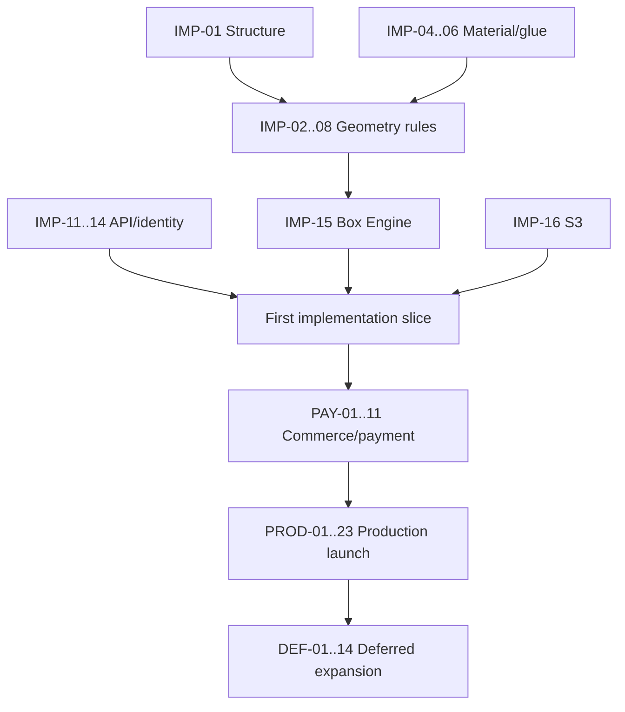

# Packerz Owner Decision Register

**Status:** Open for owner review
**Consolidated from:** Every existing document in `/docs` and the read-only code
inventory
**Rule:** Recommended defaults are planning proposals, not implicit approval
**Decision authority:** Owner/Project Manager assigns the final approver for
business, factory, security, and architecture decisions

---

## 1. How to Use This Register

Each decision is placed under the earliest gate it blocks:

1. Must decide before implementation
2. Must decide before payment integration
3. Must decide before production launch
4. Can safely defer to Phase 2

For each row the owner should add:

- selected answer;
- named decision owner;
- approver;
- decision date;
- supporting drawing, policy, provider contract, test, or factory evidence;
- affected document/version.

No developer should infer a physical manufacturing rule, payment policy, or
security policy from a recommended default.

---

## 2. Must Decide Before Implementation

These decisions block the first guest/box/validation/SVG/PDF slice.

### IMP-01 — Initial box structure

| Field | Detail |
|---|---|
| **Question** | What exact box structure, topology, closure, panel order, and factory drawing define the one MVP box? |
| **Why it matters** | It determines the data model, input constraints, panel geometry, glue flap, score paths, cut contour, material compatibility, UI explanation, price, and physical tests. |
| **Recommended default** | Use the single unprinted structure the factory already produces most reliably with one existing signed drawing. Do not select a structure based on the current FC/SL/RSC prototype labels. |
| **Risks of the default** | The easiest factory structure may not fit the intended first market; a legacy drawing may lack versioned tolerances or digital geometry. |
| **Owner must provide** | Structure name/code, marked-up flat and assembled drawings, panel/fold/glue description, allowed dimension range, manufacturing owner, and signed revision. |

### IMP-02 — Meaning and order of length, width, depth, and height

| Field | Detail |
|---|---|
| **Question** | Which three canonical dimensions are used, in what order, and how do Korean/customer labels map to API, MySQL, Box Engine, drawings, and machine axes? |
| **Why it matters** | Existing code/docs use `w/d/h`; Box Engine uses Length/Width/Height. A silent swap creates incorrect physical tooling. |
| **Recommended default** | Adopt Length × Width × Height for the manufacturing contract, with one explicit compatibility map from current Width × Depth × Height fields. Block implementation until a marked physical drawing confirms the mapping. |
| **Risks of the default** | Customers/factory may use “width” and “length” oppositely; migration from current `w/d/h` can swap axes. |
| **Owner must provide** | Annotated assembled-box drawing, internal/external examples, Korean/English labels, axis order, API names, and sign-off from the CNC/factory owner. |

### IMP-03 — Dimension basis and conversion

| Field | Detail |
|---|---|
| **Question** | Does the customer enter internal or external dimensions by default, may they choose either, and what exact formula converts each basis? |
| **Why it matters** | Thickness, fold topology, score allowance, and glue behavior affect finished dimensions; a universal `±2×thickness` formula is unsafe. |
| **Recommended default** | Default to internal dimensions for customer usability, allow external only if the factory supplies a separately tested conversion, and store both derived sets. |
| **Risks of the default** | Some buyers specify external shipping dimensions; incorrect conversion can make the product unusable. |
| **Owner must provide** | Default basis, allowed basis choices, per-template/material formulas, rounding/precision, tolerance, and physical test results. |

### IMP-04 — Initial material and board type

| Field | Detail |
|---|---|
| **Question** | What exact initial material and board construction are supported, and is material customer-selectable in the first slice? |
| **Why it matters** | Material behavior changes thickness, score allowance, minimum flap size, sheet limits, price, and QC. Current SC350/IV300/E-flute options are unapproved prototype constants. |
| **Recommended default** | Launch the first geometry slice with one factory-stocked material/board combination; expose it as read-only until multiple choices pass physical tests. |
| **Risks of the default** | One material may limit demand; stock availability may make the product temporarily unsellable. |
| **Owner must provide** | Supplier/manufacturing code, customer name, board type, basis weight/specification, natural color, stock policy, compatible dimensions/quantity, and substitute policy. |

### IMP-05 — Board/paper thickness

| Field | Detail |
|---|---|
| **Question** | What exact nominal thickness and acceptable measured range apply to the initial material? |
| **Why it matters** | Thickness affects finished dimensions, score offsets, allowances, glue flap, sheet fit, and QC. |
| **Recommended default** | Treat thickness as a versioned server catalog value in millimeters, not a customer-entered field; record nominal plus factory acceptance range. |
| **Risks of the default** | Real lots vary; nominal-only calculations can drift if incoming material is outside expected range. |
| **Owner must provide** | Nominal thickness, min/max measured thickness, measurement method/tool, lot variation policy, and source specification. |

### IMP-06 — Initial glue method

| Field | Detail |
|---|---|
| **Question** | What one glue product/method, seam, flap geometry, application process, and cure/set rule define the MVP? |
| **Why it matters** | The glue rule changes dieline geometry and production/QC. Current code has no glue field. |
| **Recommended default** | Use one factory-standard glue process, show it read-only, and version its glue-flap/compatibility rules. |
| **Risks of the default** | The selected adhesive may not work across temperature, material coating, or customer use conditions. |
| **Owner must provide** | Glue code/product, manual/machine method, flap min/max/taper, application amount, pressure/set/cure time, environmental limits, and bond test. |

### IMP-07 — Manufacturing formulas and tolerances

| Field | Detail |
|---|---|
| **Question** | What formulas and limits govern internal/external allowances, glue flap, score offsets, cuts, minimum gaps, finished dimensions, and rounding? |
| **Why it matters** | These are the Box Engine’s physical truth and cannot be safely invented by software. |
| **Recommended default** | Encode only formulas signed by the factory; represent all values as versioned millimeter decimal rules; block unsupported combinations. |
| **Risks of the default** | A narrow initial rule set may reject sellable configurations; inaccurate factory assumptions still produce bad output. |
| **Owner must provide** | Formula sheets, min/max values, precision/rounding, cut/score/fold/glue/finished tolerances, exception policy, and signed physical fixtures. |

### IMP-08 — Grain, sheet orientation, rotation, and one-up policy

| Field | Detail |
|---|---|
| **Question** | Is grain direction required, may the dieline rotate, and is the first output one-up only or nested/multi-up? |
| **Why it matters** | Orientation affects fold quality and sheet fit; nesting changes geometry/material planning and machine preparation. |
| **Recommended default** | One-up only, fixed approved orientation, and no automatic rotation unless the factory explicitly confirms grain does not constrain it. |
| **Risks of the default** | Higher material waste and fewer valid dimensions; fixed orientation may exceed a sheet that rotation could fit. |
| **Owner must provide** | Grain rule, allowed rotations, sheet sizes/margins, one-up confirmation, and whether nesting is performed later in CAM. |

### IMP-09 — Product purpose and quantity range

| Field | Detail |
|---|---|
| **Question** | What quantities define sample, mockup, and low-volume production, and are overrun/underrun allowed? |
| **Why it matters** | Quantity gates validation, price, lead time, production allocation, QC sampling, and the boundary against current high-volume logic. |
| **Recommended default** | Approve a small explicit integer range based on real factory capacity; reject values outside it and do not publish current 300–5000 tiers. |
| **Risks of the default** | Too narrow reduces sales; too broad overloads manual production and invalidates the `t3.small`/factory assumptions. |
| **Owner must provide** | Min/max and allowed increments per purpose, overrun/underrun policy, sample handling, factory daily capacity, and lead-time expectations. |

### IMP-10 — Customer dieline approval policy

| Field | Detail |
|---|---|
| **Question** | Must the customer explicitly approve the exact dieline before cart/Buy Now, and what acknowledgements are required? |
| **Why it matters** | Approval binds the purchased box to one geometry hash and determines edit/revision behavior. |
| **Recommended default** | Require explicit approval of dimensions, basis, material, and exact geometry hash before purchase; any geometry-affecting edit invalidates it. |
| **Risks of the default** | Adds friction and may imply the customer understands technical cut/score geometry beyond their expertise. |
| **Owner must provide** | Approval copy, required acknowledgements, whether warnings may be accepted, legal meaning, reapproval triggers, and support/escalation path. |

### IMP-11 — PHP public API ownership

| Field | Detail |
|---|---|
| **Question** | Is `api.packerz.co.kr/api/v1` directly implemented by PHP/GnuBoard, and what limited role may Next.js Route Handlers have? |
| **Why it matters** | `API.md` says Next.js is the public edge, while `ARCHITECTURE.md` makes PHP authoritative. Two authorities would duplicate validation and transactions. |
| **Recommended default** | PHP/GnuBoard directly owns every authoritative `/api/v1` business endpoint; Next.js uses it and may have frontend-only adapters that persist no business state. |
| **Risks of the default** | More CORS/cookie/SSR integration work; PHP service quality/structure must be production-grade. |
| **Owner must provide** | Written architecture approval, public/private route boundaries, CORS/cookie domains, PHP module owner, and exception policy for Next adapters. |

### IMP-12 — Repository and deployable boundaries

| Field | Detail |
|---|---|
| **Question** | Where will PHP/GnuBoard, Box Engine, infrastructure, and shared contracts live? |
| **Why it matters** | No PHP, SQL, Box Engine, or deployment code exists in the current frontend repository; folder creation is structural. |
| **Recommended default** | Keep separate deployables/repositories for frontend, PHP API/admin, Box Engine, and infrastructure, with a versioned API contract package/specification. |
| **Risks of the default** | Cross-repository coordination/version drift; more CI/release management. |
| **Owner must provide** | Repository locations, maintainers, access, release coupling, shared-contract method, and final structural-change approver. |

### IMP-13 — GnuBoard identity integration

| Field | Detail |
|---|---|
| **Question** | How do GnuBoard members/staff map to `users`/`admin_users`, and which system validates passwords and account state? |
| **Why it matters** | Duplicate identity sources can create authorization, password, deletion, and audit inconsistencies. |
| **Recommended default** | GnuBoard/PHP validates credentials and issues Packerz-scoped sessions; MySQL stores explicit stable mapping and Packerz authorization metadata. |
| **Risks of the default** | GnuBoard schema/plugin upgrades may couple identity to commerce; member IDs may not meet public-ID/privacy needs. |
| **Owner must provide** | Current GnuBoard version/schema, member/staff tables, password/auth flow, account states, migration population, and identity owner. |

### IMP-14 — Guest session security

| Field | Detail |
|---|---|
| **Question** | What JWT/session format, issuer, audience, key custody, cookie names/domains, expiry, rotation, revocation, CSRF, and origin rules apply to guests? |
| **Why it matters** | The first slice starts with a guest-owned box; current code has no identity and exposes drafts by ID. |
| **Recommended default** | Short-lived guest access token in `Secure`, `HttpOnly`, host-scoped cookie; rotating server-recorded refresh session; exact origins and CSRF on mutations. |
| **Risks of the default** | Cross-subdomain cookie/CORS complexity; lost cookies can orphan guest work; refresh storage/rotation adds state. |
| **Owner must provide** | Issuer/audience, algorithm/key owner, cookie domains/names, lifetimes, CSRF pattern, allowed origins, revocation/cleanup rules, and privacy retention. |

### IMP-15 — Box Engine runtime and job model

| Field | Detail |
|---|---|
| **Question** | Is generation synchronous or asynchronous, where does the worker run, and how are jobs leased/retried? |
| **Why it matters** | It determines API responses, MySQL state, PM2 process, S3 failure behavior, idempotency, and `t3.small` load. |
| **Recommended default** | Separate PM2-managed Node worker, concurrency 1, persisted pending job/dieline state, bounded lease/retry; allow synchronous completion only within a measured budget. |
| **Risks of the default** | Polling/queue complexity without a managed queue; one worker may delay users. |
| **Owner must provide** | Expected generation volume/latency, worker/repository owner, queue choice, retry/timeout limits, and CPU/memory budget. |

### IMP-16 — Generated-file S3 policy

| Field | Detail |
|---|---|
| **Question** | Which bucket/prefix, region, encryption, IAM role, signed-read method, versioning, retention, and checksum policy apply to canonical/SVG/PDF files? |
| **Why it matters** | Files are manufacturing evidence and customer documents; current presign flow lacks authority and traceability. |
| **Recommended default** | Private versioned S3, EC2 instance roles, immutable revision prefixes, SSE, stored SHA-256, short-lived authorized CloudFront/S3 reads, no browser-selected keys. |
| **Risks of the default** | Higher storage/operations complexity; accidental retention costs; CloudFront signed access needs key management. |
| **Owner must provide** | AWS account/region/bucket ownership, encryption/key, IAM owner, prefix/retention, signed URL duration, CloudFront choice, and recovery requirements. |

### IMP-17 — Customer upload scope and scanning

| Field | Detail |
|---|---|
| **Question** | Are any customer reference/support uploads allowed in MVP, and if so what scanner validates them? |
| **Why it matters** | Current upload routes accept artwork broadly, while printing/artwork is excluded and no scanning service is selected. |
| **Recommended default** | Disable all customer file uploads in the sellable MVP; use server-generated dielines only. Revisit support attachments in Phase 2 with quarantine/scanning. |
| **Risks of the default** | Support may need evidence/photos; customers may expect to send references. |
| **Owner must provide** | Confirm exclusion or allowed purposes/types/sizes, retention/consent, scanner/service owner, support workflow, and incident policy. |

### IMP-18 — Existing tracked data and S3 objects

| Field | Detail |
|---|---|
| **Question** | Are `.data`, `.local` orders/uploads, the existing stash, and existing S3 objects real customer data, test data, or disposable prototypes? |
| **Why it matters** | They may contain PII/customer files and already exist in Git history; deletion or migration has legal/security consequences. |
| **Recommended default** | Treat all as potentially sensitive, freeze them, perform owner/legal classification, and do not import them into production by default. |
| **Risks of the default** | Retaining sensitive data longer increases exposure; delaying cleanup keeps repository size/risk. |
| **Owner must provide** | Data owner, real/test status, consent/retention basis, open obligations, archive destination, deletion approval, and whether Git history remediation is required. |

### IMP-19 — Retention and deletion baseline

| Field | Detail |
|---|---|
| **Question** | What retention windows apply to guests, drafts, idempotency, generated files, audit, payment events, PII, and failed uploads? |
| **Why it matters** | The schema, cleanup jobs, S3 lifecycle, privacy notices, backups, and guest conversion depend on it. |
| **Recommended default** | Retain paid/order/manufacturing/audit records per legal policy; expire abandoned guest/drafts quickly; separate S3 lifecycle by artifact class; never infer legal periods. |
| **Risks of the default** | Over-retention raises privacy/cost risk; under-retention breaks disputes, tax, reorders, and audit. |
| **Owner must provide** | Legal/accounting advice, artifact-specific periods, deletion/pseudonymization rules, backup treatment, and data-subject request policy. |

### IMP-20 — Structural change approval

| Field | Detail |
|---|---|
| **Question** | Who may approve new repositories/folders, migrations, routes, service boundaries, and retirement of legacy files? |
| **Why it matters** | The project explicitly requires approval before structural changes; implementation cannot start without an accountable gate. |
| **Recommended default** | Project Manager coordinates; business owner approves product/commercial; factory owner approves physical rules; engineering owner approves architecture/schema; explicit written approval for deletion. |
| **Risks of the default** | Multiple approvers may slow delivery; unclear tie-break authority can stall decisions. |
| **Owner must provide** | Named people/roles, approval medium, escalation/tie-break process, and which changes require business/factory/security review. |

---

## 3. Must Decide Before Payment Integration

These decisions do not block the first geometry slice but block cart/checkout,
payment, and paid-order creation.

### PAY-01 — Payment provider

| Field | Detail |
|---|---|
| **Question** | Which Korean payment provider and merchant account will Packerz use? |
| **Why it matters** | SDK/API, redirect/callback, webhook signature, payment IDs, methods, settlement, cancellation, refunds, and sandbox tests are provider-specific. |
| **Recommended default** | Select one provider with strong server confirmation/webhooks, KRW card/bank/virtual-account support, sandbox, and documented idempotency; do not build a provider abstraction for multiple providers initially. |
| **Risks of the default** | Vendor lock-in; provider may not support desired tax/refund/virtual-account behavior or approval timeline. |
| **Owner must provide** | Provider name, contract/account, merchant IDs, methods, sandbox credentials, API version, callback/webhook specs, fees, settlement, and support contact. |

### PAY-02 — Supported payment methods

| Field | Detail |
|---|---|
| **Question** | Which of card, real-time transfer, virtual account, or other methods launch, and how do pending/expiry states behave? |
| **Why it matters** | Current UI lists three methods without provider backing; each has different confirmation/cancellation timing. |
| **Recommended default** | Start with the smallest provider-supported set that confirms reliably; add virtual accounts only with explicit expiry/reconciliation/customer communication. |
| **Risks of the default** | Fewer methods may reduce conversion; asynchronous methods complicate production release. |
| **Owner must provide** | Launch methods, method eligibility/limits, asynchronous expiry, receipt behavior, and production-release condition. |

### PAY-03 — Pricing, currency, tax, and rounding

| Field | Detail |
|---|---|
| **Question** | What formula determines setup/unit/material/quantity/lead price, VAT/tax, discount, and KRW rounding? |
| **Why it matters** | Current client estimate is unapproved; displayed, charged, stored, refunded, and accounted totals must match. |
| **Recommended default** | PHP calculates KRW totals from versioned rules using decimal arithmetic; show VAT/shipping explicitly; no client-trusted calculation. |
| **Risks of the default** | Pricing may require manual quotation inputs; rule errors can create loss or legal disputes. |
| **Owner must provide** | Price tables/formulas, VAT inclusion, rounding unit, setup/waste/shipping cost, quantity tiers, lead surcharge, quote validity, and approver. |

### PAY-04 — Shipping price, service area, and checkout methods

| Field | Detail |
|---|---|
| **Question** | Where does Packerz ship, which shipping methods appear at checkout, and how is shipping price calculated? |
| **Why it matters** | Checkout total cannot be authoritative without delivery eligibility and cost. |
| **Recommended default** | Domestic Korea only, one standard tracked method, server flat/rule price, unsupported addresses blocked before payment. |
| **Risks of the default** | Flat pricing may lose money for remote/large packages; one service may not meet rush needs. |
| **Owner must provide** | Service area/exclusions, method names, remote-area policy, pricing/weight rules, free-shipping rule, estimated transit, and address validation source. |

### PAY-05 — Commercial order timing and state

| Field | Detail |
|---|---|
| **Question** | Is a commercial `payment_pending` order created before payment, while the production job is created only after verified payment? |
| **Why it matters** | PRD terminology conflicts with API/DB; idempotency, lookup, abandoned payment, and production creation depend on one model. |
| **Recommended default** | Create one immutable commercial order before provider launch; create production jobs exactly once only after authoritative payment confirmation. |
| **Risks of the default** | Many abandoned orders require expiry/reporting; customers may confuse pending order with accepted production. |
| **Owner must provide** | Approved terminology, pending-order expiry, number allocation policy, customer messaging, and production trigger. |

### PAY-06 — Cancellation and refund policy

| Field | Detail |
|---|---|
| **Question** | When may customers/staff cancel, what amount is refundable by production stage, and who may approve full/partial refunds? |
| **Why it matters** | Order cancellation, payment refund, material/work disposition, customer notification, and accounting are separate workflows. |
| **Recommended default** | Permit self-service cancellation only before production approval; later cancellation/refund requires staff review; provider result is authoritative; every action audited. |
| **Risks of the default** | Manual review increases support load; strict cutoff may create customer disputes. |
| **Owner must provide** | Stage-based policy, fees/nonrefundable costs, refund limits/roles, partial refund rules, SLA, legal copy, and exception authority. |

### PAY-07 — Guest order verification

| Field | Detail |
|---|---|
| **Question** | How does a guest later access one order: email/phone match, OTP, magic link, lookup token, or combination? |
| **Why it matters** | Order/contact data and documents are sensitive; current UI only claims email/phone lookup without implementation. |
| **Recommended default** | Order number plus OTP sent to the normalized checkout email or phone; issue a short-lived JWT scoped to one order; anti-enumeration and rate limits. |
| **Risks of the default** | SMS/email cost/delivery failures; lost contact access requires support; OTP provider/retention needed. |
| **Owner must provide** | Verification channel/provider, allowed contact field, OTP length/expiry/attempts, fallback support process, rate limit, and customer copy. |

### PAY-08 — Checkout identity, address, consent, and tax documents

| Field | Detail |
|---|---|
| **Question** | Which customer/recipient/address/consent fields are mandatory, and are tax invoices/cash receipts in launch scope? |
| **Why it matters** | Current review collects buyer and tax fields but no shipping address or consent; database/privacy/tax flows depend on the approved set. |
| **Recommended default** | Collect only required contact, recipient, domestic address, delivery note, terms/privacy consents; enable tax-document fields only after accounting/provider policy is approved. |
| **Risks of the default** | Delaying tax documents may block B2B buyers; collecting too much PII increases risk. |
| **Owner must provide** | Required fields, validation rules, legal versions, tax invoice/cash receipt workflow, business-number checks, PII notice, and accounting owner. |

### PAY-09 — Coupon launch

| Field | Detail |
|---|---|
| **Question** | Are coupons active in the sellable MVP? |
| **Why it matters** | Database/API model coupons while PRD excludes complex discounts; coupons affect totals, concurrency, refunds, and abuse. |
| **Recommended default** | Keep coupons feature-disabled through Phase 1; retain no active seed records. |
| **Risks of the default** | Marketing has fewer launch tools; manual discounts may be requested. |
| **Owner must provide** | Confirm disabled, or define discount type/value, eligibility, limits, tax allocation, refund behavior, abuse controls, and campaign owner. |

### PAY-10 — Payment idempotency and reconciliation operations

| Field | Detail |
|---|---|
| **Question** | What retry windows, idempotency retention, webhook reconciliation schedule, and manual exception process apply? |
| **Why it matters** | Network/provider retries can duplicate charges/orders/jobs or leave provider/MySQL states different. |
| **Recommended default** | Require idempotency on order/payment mutations; deduplicate provider event ID; daily automated reconciliation plus an admin exception queue before production release. |
| **Risks of the default** | Additional storage/operations; provider may not expose all reconciliation data promptly. |
| **Owner must provide** | Provider capabilities, retry/idempotency windows, reconciliation report/API, exception roles/SLA, and amount mismatch policy. |

### PAY-11 — Customer approval versus production acceptance

| Field | Detail |
|---|---|
| **Question** | What does customer dieline approval promise, and can internal production reject/hold an approved paid design? |
| **Why it matters** | Customer and production approvals are separate; responsibilities and refund/revision handling must be clear. |
| **Recommended default** | Customer confirms inputs/preview; Packerz retains production review authority and may hold before manufacturing with transparent correction/refund policy. |
| **Risks of the default** | Customers may perceive approval as final acceptance; manual holds can delay promised lead time. |
| **Owner must provide** | Terms/copy, internal review SLA, correction/reapproval process, price/date change policy, and cancellation/refund response. |

---

## 4. Must Decide Before Production Launch

These may be developed after the first geometry slice, but no paid production
may launch until they are approved and physically tested.

### PROD-01 — Initial CNC machine and capability

| Field | Detail |
|---|---|
| **Question** | What actual machine/manufacturer/model, bed/sheet limits, tools, precision, and supported board/thickness define launch capability? |
| **Why it matters** | Machine limits determine manufacturability, CNC preparation, queueing, tolerances, and physical acceptance. |
| **Recommended default** | Approve one actual machine/profile for launch; do not model a generic fleet. |
| **Risks of the default** | Single-machine downtime stops production; future machines may need incompatible exports. |
| **Owner must provide** | Machine details/manual, usable dimensions, tools, tolerances, materials/thicknesses, maintenance status, operator, and fallback machine policy. |

### PROD-02 — CNC software and operator workflow

| Field | Detail |
|---|---|
| **Question** | Which CAD/CAM/CNC software/version imports the source, who prepares the job, and what verification occurs before machine start? |
| **Why it matters** | A valid SVG/PDF/DXF can be altered during import, layer mapping, scaling, tool setup, or CAM editing. |
| **Recommended default** | One named qualified operator follows a versioned checklist: units, scale, CUT/SCORE operations, origin, sheet bounds, reference dimension, checksum/job reference. |
| **Risks of the default** | Manual steps introduce inconsistency and bottlenecks; software upgrades may change import. |
| **Owner must provide** | Software/version, import procedure, operator role, screenshots/sample job, allowed edits, checksum/file record, setup checklist, and sign-off. |

### PROD-03 — CNC input file format

| Field | Detail |
|---|---|
| **Question** | What file format is the authoritative CNC preparation input for launch? |
| **Why it matters** | The roadmap says SVG/PDF first while Box Engine can support DXF; actual machine compatibility decides the launch gate. |
| **Recommended default** | Use SVG/PDF only if the real CAM workflow proves exact scale and CUT/SCORE semantics; otherwise require profile-bound DXF before sales. |
| **Risks of the default** | SVG/PDF import may flatten/lossily map operations; requiring DXF delays launch and adds schema/export complexity. |
| **Owner must provide** | Actual import tests for SVG/PDF/DXF, scale/layer results, machine sample cuts, operator preference, and final approved format. |

### PROD-04 — Whether SVG/PDF is sufficient for launch

| Field | Detail |
|---|---|
| **Question** | Can the factory safely and repeatably create a controlled CNC job from the generated SVG/PDF? |
| **Why it matters** | This decides whether DXF is Phase 1 P0 or a later enhancement. |
| **Recommended default** | Treat sufficiency as unproven until the same approved geometry is imported, checked, cut/scored, assembled, measured, and traced by checksum. |
| **Risks of the default** | Physical testing takes time; a false positive can cause bad production. |
| **Owner must provide** | Test protocol/results, produced sample measurements, source and derived checksums, operator sign-off, and acceptable manual steps. |

### PROD-05 — DXF profile, if required

| Field | Detail |
|---|---|
| **Question** | If DXF is required, what version, units, entities, layers, colors/line types, origin, axis, precision, and text policy apply? |
| **Why it matters** | Different CAM/machines interpret DXF differently; generic export is unsafe. |
| **Recommended default** | Start with the simplest ASCII version the actual software proves, often R12, with `CUT` and `SCORE` only in manufacturing layers and millimeter validation. |
| **Risks of the default** | R12 lacks richer unit/entity behavior; line/polyline conversion may create gaps; other machines may differ. |
| **Owner must provide** | Accepted sample DXF, software import settings, entity/layer specification, reference dimension, tolerance, title/annotation policy, and physical test. |

### PROD-06 — Cut, score, kerf, margin, and sheet rules

| Field | Detail |
|---|---|
| **Question** | What kerf/tool compensation, score method/offset, minimum segment/gap, sheet margin, origin, and rotation rules apply? |
| **Why it matters** | These affect machine output and must be versioned independently from customer dimensions. |
| **Recommended default** | Keep canonical geometry uncompensated where possible and apply approved profile-specific manufacturing transforms; prohibit unversioned operator geometry edits. |
| **Risks of the default** | Some workflows require compensation in CAM; separating canonical/profile output adds complexity. |
| **Owner must provide** | Tool/score specs, kerf owner, min gaps/segments, margins/origin, compensation stage, allowed edits, and measurements. |

### PROD-07 — Material lot and preparation policy

| Field | Detail |
|---|---|
| **Question** | Must material lot, measured thickness, grain, sheet count/size, inspection, and substitution be recorded? |
| **Why it matters** | Traceability, thickness variation, defects, rework, and recalls depend on preparation evidence. |
| **Recommended default** | Record lot/source, measured thickness sample, prepared quantity/sheet size, condition, and operator; prohibit substitution without new approval. |
| **Risks of the default** | Manual data entry burden; suppliers may not provide stable lot identifiers. |
| **Owner must provide** | Incoming inspection, lot/source fields, measurement frequency, substitution authority, waste records, and retention. |

### PROD-08 — Production and QC status model

| Field | Detail |
|---|---|
| **Question** | Which high-level job statuses, detailed stage codes, customer mappings, and transitions are canonical? |
| **Why it matters** | PRD/API/Admin/DB differ; API permissions, dashboard, customer tracking, and audit require one state machine. |
| **Recommended default** | Adopt `PRODUCTION.md` high-level statuses plus separate detailed stages; use append-only events and an explicit role transition matrix. |
| **Risks of the default** | More fields/transitions than a very manual factory initially needs; migration/schema work. |
| **Owner must provide** | Approved statuses/stages, transition diagram, customer labels, terminal states, required data, and role permissions. |

### PROD-09 — Hold and release policy

| Field | Detail |
|---|---|
| **Question** | Who may place/release each hold, what reason/owner/SLA is required, and what state resumes? |
| **Why it matters** | Holds protect payment, geometry, material, machine, QC, packing, and shipping; an incorrect release can manufacture bad work. |
| **Recommended default** | Any qualified operator may request/safety-hold; only production manager/admin releases after documented resolution; resume based on unchanged versus revised inputs. |
| **Risks of the default** | Manager bottleneck; operators may overuse holds; long delays need customer communication. |
| **Owner must provide** | Reason codes, permissions, resolution evidence, SLA/escalation, customer notification, and cancellation/refund linkage. |

### PROD-10 — Operator qualifications and separation of duty

| Field | Detail |
|---|---|
| **Question** | Which operators may prepare CNC, run machines, fold/glue, inspect QC, pack, and ship; may the producer perform final QC? |
| **Why it matters** | Safety, quality, RBAC, assignment, and audit depend on qualifications and independent inspection policy. |
| **Recommended default** | Track one `operator` auth role plus approved job qualifications; require independent QC when staffing permits and always for overrides/rework closure. |
| **Risks of the default** | Small-team staffing may make separation impractical; qualification records add admin work. |
| **Owner must provide** | Staff list/skills/certifications, prohibited combinations, backup roles, training records, and final QC authority. |

### PROD-11 — QC checklist, sampling, tolerance, and override

| Field | Detail |
|---|---|
| **Question** | What is measured, how many units are sampled, what passes/fails, is `conditional_pass` allowed, and who may override? |
| **Why it matters** | Shipment eligibility and rework depend on consistent evidence; arbitrary overrides weaken safety. |
| **Recommended default** | Versioned checklist covering material, dimensions, cut, score, fold, glue, surface, quantity; no conditional pass at first unless manager signs a documented exception. |
| **Risks of the default** | Full inspection may be slow; no conditional path may cause unnecessary remake. |
| **Owner must provide** | Checklist, expected ranges/units, sampling plan by quantity, defect categories, evidence/photos, conditional/override authority, and retention. |

### PROD-12 — Rework, remake, scrap, and failure policy

| Field | Detail |
|---|---|
| **Question** | Which defects may be reworked, when is a remake required, who approves scrap/failure, and how are cost/date/customer/refund handled? |
| **Why it matters** | Rework must not erase the source failure and can affect material, quantity, lead time, and commercial obligation. |
| **Recommended default** | Child job linked to source, exact quantity, manager disposition, new QC, append-only failure; customer/refund handled separately. |
| **Risks of the default** | More operational records; manual root-cause review delays shipping. |
| **Owner must provide** | Defect disposition matrix, approvers, cost ownership, max attempts, scrap records, customer communication, date/refund rules. |

### PROD-13 — Production quantity and partial fulfillment

| Field | Detail |
|---|---|
| **Question** | Are production splits, overruns, underruns, partial packing, and partial shipments allowed? |
| **Why it matters** | Database allocations and status aggregation must prevent producing/shipping wrong quantities. |
| **Recommended default** | No customer-visible partial shipment in first launch unless explicitly requested; record rejects/rework; ship only complete QC-passed ordered quantity. |
| **Risks of the default** | One shortage delays the entire order; customers may prefer partial delivery. |
| **Owner must provide** | Split/partial policy, overrun/underrun limits, customer consent, shipping charge, status/notification, and completion rule. |

### PROD-14 — Packing method and completion event

| Field | Detail |
|---|---|
| **Question** | How are boxes protected/count-labelled, what package fields are captured, and is an order completed at handoff or delivery? |
| **Why it matters** | Packing damage, shipment eligibility, quantity reconciliation, tracking, lead time, and customer status depend on this. |
| **Recommended default** | Record packed quantity/package count/method/operator; `shipped` at carrier handoff and `completed` at confirmed delivery or an approved timeout. |
| **Risks of the default** | Carrier delivery data may be delayed/unavailable; extra package measurements burden operators. |
| **Owner must provide** | Packing materials/method, label/content, package fields, damage policy, and exact completion trigger. |

### PROD-15 — Shipping carrier and tracking integration

| Field | Detail |
|---|---|
| **Question** | Which carrier/service launches, is label generation manual, and are tracking events entered manually or received by webhook? |
| **Why it matters** | Shipment validation, tracking uniqueness, customer URLs, exception/return states, and notification depend on carrier behavior. |
| **Recommended default** | One domestic carrier, manual verified tracking registration for MVP, customer link from an approved URL template; add webhook after stable volume. |
| **Risks of the default** | Manual entry errors and stale delivered status; no automatic exception alerts. |
| **Owner must provide** | Carrier/account/service codes, tracking format/URL, label workflow, pickup/handoff process, exception/return rules, and integration documents. |

### PROD-16 — Machine queue, downtime, and priority

| Field | Detail |
|---|---|
| **Question** | How are job priority, due date, setup grouping, machine downtime, pause/restart, and maintenance conflicts resolved? |
| **Why it matters** | Dashboard/schedule behavior and promised dates require deterministic rules; safety cannot be automated casually. |
| **Recommended default** | Manager-controlled priority then due date; one fixed machine queue; manual maintenance status; no automatic machine start or reorder. |
| **Risks of the default** | Manual scheduling may not optimize setup/material; manager bottleneck. |
| **Owner must provide** | Priority levels, due-date calculation, grouping policy, downtime statuses, maintenance owner, pause/resume data, and escalation. |

### PROD-17 — Machine/statistics schema in MVP

| Field | Detail |
|---|---|
| **Question** | Which minimal machine/profile/assignment/CNC authorization tables and which statistics enter Phase 1? |
| **Why it matters** | Admin/Engine require a machine profile, but DB/API do not define it; broad analytics can overload `t3.small`. |
| **Recommended default** | Minimal one-machine versioned profile and job authorization; operational counts from bounded queries; defer advanced maintenance/analytics schemas. |
| **Risks of the default** | Manual machine data may be insufficient for traceability; later migrations needed. |
| **Owner must provide** | Required machine fields/events, reports/KPIs, refresh/range, users, compliance evidence, and Phase 1 scope. |

### PROD-18 — Admin authentication, MFA, and access boundary

| Field | Detail |
|---|---|
| **Question** | How do staff sign in, what MFA provider/policy applies, and is admin access restricted by VPN/IP? |
| **Why it matters** | Admin can view PII, refund, authorize CNC, override QC, and change manufacturing rules. |
| **Recommended default** | Separate admin audience/cookies, MFA required for admin/production manager, recent authentication for high-impact actions, optional IP/VPN restriction if operationally feasible. |
| **Risks of the default** | MFA/VPN support and account recovery complexity; factory networks/mobile access may conflict. |
| **Owner must provide** | MFA provider, enrollment/recovery, enforcement date/roles, admin origin/cookie policy, VPN/IP needs, lockout/support, and security owner. |

### PROD-19 — Role-to-permission matrix

| Field | Detail |
|---|---|
| **Question** | What exact permission codes apply to admin, production manager, operator, support, QC, shipping, refunds, and configuration? |
| **Why it matters** | Role names alone are insufficient for server authorization and least privilege. |
| **Recommended default** | Deny by default; use explicit permissions; support read-only/minimized PII; operator assigned jobs; manager production/QC/shipping; admin configuration/staff/refunds. |
| **Risks of the default** | Small teams may need broader access; excessive granularity increases admin complexity. |
| **Owner must provide** | Staff duties, matrix approval, exceptional access, separation-of-duty rules, temporary access, and review cadence. |

### PROD-20 — Audit history and retention

| Field | Detail |
|---|---|
| **Question** | Which actions must be audited, who may view/export logs, and how long are manufacturing/security audits retained? |
| **Why it matters** | Payments, approvals, files, production, QC overrides, shipment, and staff changes need nonrepudiation and investigations. |
| **Recommended default** | Audit all sensitive mutations/downloads, append-only, redacted before/after, same transaction where required; access limited to admin/security; no UI deletion. |
| **Risks of the default** | Storage/PII growth and performance; excessive logs can expose data if poorly redacted. |
| **Owner must provide** | Required actions, legal retention, access/export roles, redaction, incident/legal hold, archival, and deletion policy. |

### PROD-21 — Backup, RPO, RTO, and restore approval

| Field | Detail |
|---|---|
| **Question** | What data-loss and downtime targets apply, and who signs restore tests? |
| **Why it matters** | Single EC2 is a failure domain; production cannot rely on untested backups. |
| **Recommended default** | MySQL RPO ≤15 minutes/RTO ≤4 hours, S3 near-zero after verified write/RTO ≤2 hours, nightly full + binlogs + encrypted EBS/S3 versioning, quarterly restore drill. |
| **Risks of the default** | Cost/operations may exceed early needs; logical backups on small host can affect performance. |
| **Owner must provide** | Approved RPO/RTO per service, retention, backup window, cross-account/region need, restore approver, and business continuity priority. |

### PROD-22 — Launch volume, staffing, and scaling threshold

| Field | Detail |
|---|---|
| **Question** | What order/generation/concurrent-user volume and factory staffing are expected, and what metrics trigger leaving `t3.small`/local MySQL? |
| **Why it matters** | Next/PHP/worker/MySQL share one small host; factory capacity can be a bigger bottleneck than web capacity. |
| **Recommended default** | Controlled launch with explicit daily order cap, generation concurrency 1, one Next process, small PHP pool, bounded reports; scale vertically/separate DB on measured pressure. |
| **Risks of the default** | Traffic spikes or PDF generation may exhaust memory/CPU; daily cap can reject sales. |
| **Owner must provide** | Launch forecast, campaign peaks, daily factory capacity, staffing/shifts, response targets, CPU/memory/disk thresholds, and scale budget. |

### PROD-23 — Notifications, SES, and support

| Field | Detail |
|---|---|
| **Question** | Which order/payment/hold/shipment/refund emails are required, from what identity, and who handles bounces/support? |
| **Why it matters** | Guest access and production exceptions require reliable communication; email cannot be coupled synchronously to transactions. |
| **Recommended default** | SES with verified Packerz domain; durable outbox; send verification, payment/order confirmation, actionable hold, shipment, refund; monitor bounce/complaint. |
| **Risks of the default** | SES production access/deliverability setup; customer notifications can expose status or arrive late. |
| **Owner must provide** | Sender/domain, templates/languages, legal footer, event list, support address/hours, bounce/complaint owner, resend policy, and retention. |

---

## 5. Can Safely Defer to Phase 2

The default is to keep these disabled or manual in Phase 1. Deferral is safe
only if it does not undermine the approved sales-readiness gate.

### DEF-01 — AI recommendation provider

| Field | Detail |
|---|---|
| **Question** | Which AI provider/model recommends material/dimensions, and what customer data may be sent/retained? |
| **Why it matters** | PRD mentions limited AI assistance, but it is not necessary for the deterministic first product and adds privacy/quality/cost risk. |
| **Recommended default** | Defer external AI; launch rule-based guidance and instrument customer questions first. |
| **Risks of the default** | “AI platform” positioning is less visible; support burden may remain higher. |
| **Owner must provide** | Provider/model, use cases, evaluation target, data fields, consent/retention, region, cost limit, fallback, and legal approval. |

### DEF-02 — Saved projects, account conversion, and reorder

| Field | Detail |
|---|---|
| **Question** | When do registered accounts, saved projects, guest conversion, and reorder launch? |
| **Why it matters** | They improve retention but add identity/resource-transfer and obsolete-rule revalidation complexity. |
| **Recommended default** | Sell with guest checkout/order lookup first; add account conversion and reorder from immutable snapshots after real demand. |
| **Risks of the default** | Repeat customers have more friction; project loss if guest session expires before purchase. |
| **Owner must provide** | Account strategy, conversion rules, reorder demand, revalidation/price behavior, and retention. |

### DEF-03 — DXF when SVG/PDF launch is proven

| Field | Detail |
|---|---|
| **Question** | If SVG/PDF-to-CAM passes launch tests, when should profile-bound DXF be added? |
| **Why it matters** | DXF improves automation/traceability but is not customer-sales scope if manual preparation is safe. |
| **Recommended default** | Prioritize after early production evidence, before multiple machines/structures. |
| **Risks of the default** | Continued manual CAM time/errors; later schema/API migration. |
| **Owner must provide** | Manual preparation time/error data, machine roadmap, desired automation date, and DXF acceptance owner. |

### DEF-04 — Advanced machine maintenance and telemetry

| Field | Detail |
|---|---|
| **Question** | When are maintenance schedules, health telemetry, automated status, and machine-event integration required? |
| **Why it matters** | Manual one-machine status is adequate for small launch; integration raises safety/vendor complexity. |
| **Recommended default** | Manual status/maintenance log in Phase 1; no direct control; add telemetry read-only after stable operation. |
| **Risks of the default** | Dashboard may show stale availability; downtime analysis is manual. |
| **Owner must provide** | Machine interfaces, vendor permission, telemetry fields/frequency, network/security, maintenance process, and safety review. |

### DEF-05 — Advanced statistics and analytics store

| Field | Detail |
|---|---|
| **Question** | Which sales/production/QC/machine/shipping analytics need preaggregation, replica, or analytics storage? |
| **Why it matters** | Broad reports can overload operational MySQL on `t3.small`; early metric needs are uncertain. |
| **Recommended default** | Phase 1 bounded operational counts; define metrics from real usage; add daily summaries/read replica later. |
| **Risks of the default** | Limited business insight at launch; retroactive event gaps if required fields are not captured. |
| **Owner must provide** | KPI definitions, decisions they support, range/freshness, users, export needs, and volume. |

### DEF-06 — Carrier API/webhooks and label automation

| Field | Detail |
|---|---|
| **Question** | When should label creation, pickup, tracking webhooks, and delivery exceptions be automated? |
| **Why it matters** | Manual tracking is sufficient for small volume but error-prone at scale. |
| **Recommended default** | Manual Phase 1 registration; integrate one carrier after measuring volume/error/support burden. |
| **Risks of the default** | Stale delivered status, manual typo, delayed exception response. |
| **Owner must provide** | Volume/error data, carrier API contract, account/fees, webhook signature, label hardware, and operations owner. |

### DEF-07 — Coupons and promotions

| Field | Detail |
|---|---|
| **Question** | When are coupon codes/promotions required? |
| **Why it matters** | Existing DB/API can model them, but launch scope excludes complexity. |
| **Recommended default** | Disabled in Phase 1; decide Phase 2 from acquisition strategy. |
| **Risks of the default** | Marketing limits; customer-service manual compensation. |
| **Owner must provide** | Campaign goals, budget, eligibility/limits, fraud policy, accounting/tax/refund behavior, and owner. |

### DEF-08 — Support/reference uploads and malware scanning

| Field | Detail |
|---|---|
| **Question** | When should customers attach reference photos/documents to support requests? |
| **Why it matters** | Useful for support but unrelated to manufacturing geometry; requires quarantine/scanning/retention. |
| **Recommended default** | Phase 2 after a scanner and support case model are selected; never accept artwork as trusted geometry. |
| **Risks of the default** | Support must use another secure channel at launch; external email attachments may be less controlled. |
| **Owner must provide** | Use cases, file policy, scanner, storage/retention, support integration, and incident owner. |

### DEF-09 — Additional structures, materials, and glue methods

| Field | Detail |
|---|---|
| **Question** | Which product option expands first after the one-box MVP? |
| **Why it matters** | Every option multiplies rules, tests, UI, price, machine compatibility, and QC. |
| **Recommended default** | Choose expansion only from measured demand and factory capability; one change at a time with full physical fixtures. |
| **Risks of the default** | Slow catalog growth; competitors may offer more variety. |
| **Owner must provide** | Demand/revenue evidence, drawings/formulas, materials/machine, price/capacity, and physical acceptance owner. |

### DEF-10 — 3D folding preview

| Field | Detail |
|---|---|
| **Question** | What accuracy and technology are required for 3D preview? |
| **Why it matters** | 3D can improve confidence but must derive from canonical geometry and not imply print/photorealistic accuracy. |
| **Recommended default** | Defer until Box Engine is stable; build structural fold preview from the same geometry hash. |
| **Risks of the default** | Less visual customer confidence at launch; later architecture work. |
| **Owner must provide** | Use cases, fidelity/performance/accessibility targets, mobile support, technology preference, and acceptance examples. |

### DEF-11 — Multi-up nesting and material optimization

| Field | Detail |
|---|---|
| **Question** | Should Packerz optimize multiple boxes on sheets or leave nesting to CAM? |
| **Why it matters** | It affects grain, rotation, waste, price, machine jobs, and deterministic outputs. |
| **Recommended default** | One-up canonical dieline and manual/CAM nesting in Phase 1; add optimization after material/waste data. |
| **Risks of the default** | Higher waste/manual work; customer quote may not reflect optimal production. |
| **Owner must provide** | CAM capability, sheet/material costs, grain/rotation constraints, typical quantities, optimization objective, and validation owner. |

### DEF-12 — Sketch/photo AI

| Field | Detail |
|---|---|
| **Question** | When may sketches/photos produce structured recommendations, and what confidence/scale rules apply? |
| **Why it matters** | It is a Phase 4 capability with privacy, IP, scale, and hallucination risks; it must never directly generate trusted CNC paths. |
| **Recommended default** | Defer until multiple deterministic structures and an evaluation dataset exist; always require user confirmation and rule validation. |
| **Risks of the default** | Long delay to headline AI capability; competitors may appear more advanced. |
| **Owner must provide** | Dataset rights, scale reference, target accuracy, confidence threshold, provider/training policy, consent, fallback, and evaluation owner. |

### DEF-13 — MES/ERP, inventory, and multi-factory integration

| Field | Detail |
|---|---|
| **Question** | Which operational/enterprise system integration is first justified? |
| **Why it matters** | Inventory, procurement, accounting, routing, and factory partners require reconciled master data and major infrastructure. |
| **Recommended default** | Defer until single-factory order/job/material/QC/shipping events are stable; integrate one bounded domain with reconciliation/rollback. |
| **Risks of the default** | Manual back-office work persists; later integration may expose missing identifiers/events. |
| **Owner must provide** | Target system/vendor, business process/owner, data authority, volume, API, reconciliation, security, and SLA. |

### DEF-14 — Internationalization and broader commerce

| Field | Detail |
|---|---|
| **Question** | When are international shipping, currency, tax, localization, enterprise approvals, or subscriptions required? |
| **Why it matters** | They change every commerce, legal, pricing, address, payment, and support contract. |
| **Recommended default** | Korea/KRW/domestic B2C/B2B-light only through Phase 1–2; expand one market after stable domestic operation. |
| **Risks of the default** | Limits market; Korean-only architecture/copy may require later refactoring. |
| **Owner must provide** | Target markets/languages/currencies, tax/legal counsel, payment/carrier support, business case, and launch order. |

---

## 6. Decision Dependencies



The first coding task cannot start until IMP-01 through IMP-16 and IMP-20 have
approved answers. IMP-17 may use the recommended “uploads excluded” default.
IMP-18 and IMP-19 require at least an approved preservation/retention direction
before a branch touches related data.

---

## 7. Recommended Decision Order

1. Assign decision owners and structural approval authority.
2. Approve the box drawing and dimension mapping.
3. Approve initial material/thickness/glue/formulas/tolerances.
4. Approve product purpose/quantity and customer dieline approval.
5. Confirm PHP API/repository/GnuBoard/guest identity boundaries.
6. Approve Box Engine runtime and private S3 policy.
7. Confirm customer uploads are excluded.
8. Classify legacy tracked data/S3.
9. Approve the first implementation slice.
10. In parallel after the slice starts, decide payment/commercial policies.
11. Before sales, complete machine/CNC/production/QC/shipping/admin/recovery
    decisions and physical tests.

---

## 8. Decision Record Template

Use this block when an item is approved:

```text
Decision ID:
Selected answer:
Decision owner:
Approvers:
Date:
Evidence / attachment:
Affected documents:
Required follow-up:
Review/expiry date:
```

An owner statement without the referenced physical drawing, provider contract,
policy, or test evidence does not complete decisions that depend on such
evidence.

---

## 9. Documentation-Only Boundary

This register does not choose any owner decision and does not authorize code,
file, Git, database, AWS, payment, deployment, or factory changes.
