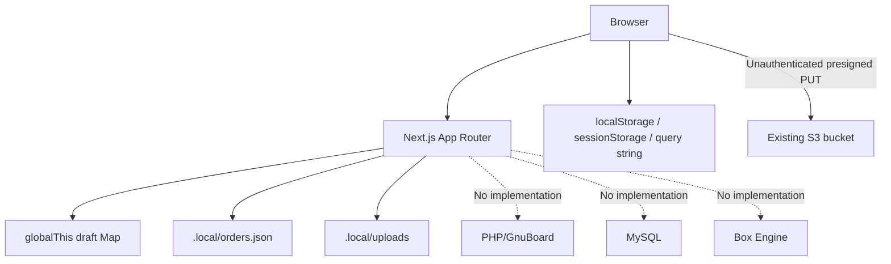
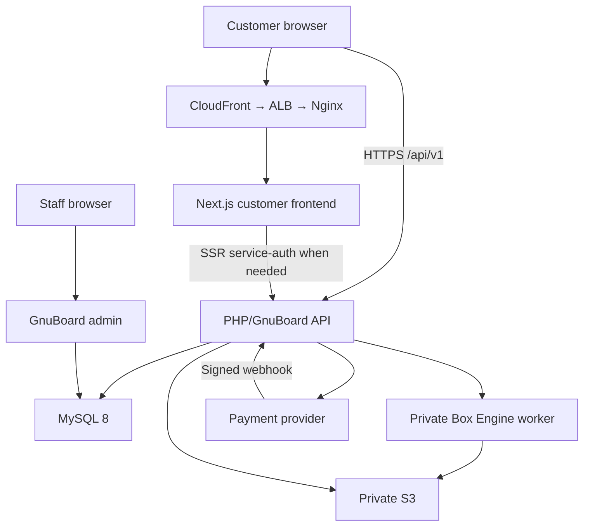

# Packerz Safe Codebase Migration Plan

**Status:** Documentation-only proposal
**Source:** `CODE_INVENTORY.md` and all approved planning documents in `/docs`
**Constraint:** No move, rename, deletion, formatting, code edit, branch, commit,
push, data migration, or infrastructure action is authorized by this plan
**Migration style:** Parallel expand → verify → cut over → contract

---

## 1. Objective

Migrate the existing Next.js printing/order prototype into the customer
frontend of the Packerz AI Packaging Manufacturing Platform without making
Next.js the permanent authoritative order database and without destroying
unknown customer-like data or current user work.

The target MVP is:

- packaging only;
- one unprinted custom-box structure;
- sample, mockup, and low-volume quantities;
- one fixed glue method;
- deterministic manufacturing validation;
- automatic SVG/PDF dielines;
- guest checkout;
- PHP/GnuBoard/MySQL commerce authority;
- private S3 files;
- controlled production, QC, packing, and shipping.

DXF is not a migration dependency until the actual CNC workflow proves that
SVG/PDF-based CAM preparation is insufficient.

---

## 2. Current Architecture Summary

### 2.1 Current container view



### 2.2 Current responsibilities

- Next.js owns UI, draft storage, local order storage, upload authorization, and
  mock payment navigation.
- Browser state carries configuration and S3 metadata.
- Local JSON/disk acts as a prototype database/file store.
- S3 accepts browser PUTs through a Next-issued presigned URL.
- No authoritative identity, transaction, geometry, production, or audit
  service exists.

### 2.3 Current flow

```text
/package/configure
→ localStorage draft
→ /package/upload
→ direct S3 PUT + sessionStorage metadata
→ /package/review
→ in-memory buyer/tax draft
→ /pay
→ mock navigation
→ /order/complete
```

The flow does not carry configuration or uploaded-file metadata into the review
draft, does not create a verified payment, and does not create an authoritative
order.

---

## 3. Target Architecture Summary

### 3.1 Domain ownership

| Domain | Runtime | Responsibility |
|---|---|---|
| `packerz.co.kr` | Next.js App Router under PM2 | Customer presentation and interaction |
| `api.packerz.co.kr` | PHP 8.3/GnuBoard5 under PHP-FPM | Authoritative `/api/v1`, identity, commerce, files, production transactions |
| `admin.packerz.co.kr` | PHP/GnuBoard5 | Staff admin and production operations |

### 3.2 Data and service ownership

| Concern | Authority |
|---|---|
| Customer/guest/admin identity | PHP/GnuBoard + MySQL |
| Box/catalog/rules | PHP/MySQL |
| Manufacturing geometry | Box Engine canonical output |
| SVG/PDF | Box Engine + private S3 metadata in MySQL |
| Quote/cart/checkout/order/payment | PHP/MySQL |
| Production/QC/packing/shipping | PHP/MySQL |
| Files | Private S3; PHP authorizes, Box Engine writes generated files |
| Customer frontend | Next.js |
| Payment truth | Verified provider event committed by PHP |

### 3.3 Target container view



Next.js may render and aggregate UI data, but it must not retain a competing
cart, order, payment, production, or file-authorization database.

---

## 4. Gap Analysis

| Domain | Current | Target | Gap severity | Migration response |
|---|---|---|---|---|
| Product scope | Three structures, printing, high quantity | One unprinted low-volume box | High | Add new parallel one-box flow; retire old choices later |
| Dimensions | Optional JS `w/d/h` | Approved named decimal strings and basis | Critical | Owner mapping + typed contract + server validation |
| Material/glue | Hardcoded materials; no glue | Versioned catalog + fixed glue rule | Critical | MySQL seed and API |
| Identity | None | Guest/customer/admin JWT/session | Critical | PHP identity first |
| Draft | React/localStorage/Map | Guest-owned versioned MySQL resources | Critical | Replace, never dual-authoritative |
| Validation | Step completeness only | Manufacturing rules and Box Engine | Critical | Deterministic server/engine validation |
| Dieline | None | Canonical geometry + SVG/PDF | Critical | New Box Engine vertical slice |
| S3 | Unauthenticated browser PUT | Private immutable outputs and authorized reads | Critical | Disable new customer artwork flow; PHP/engine ownership |
| Pricing | Client hardcoded estimate | Versioned server quote | Critical | PHP pricing after geometry slice |
| Cart/Buy Now | None | Guest/customer cart and checkout | High | New PHP resources |
| Checkout | Buyer/tax Map draft | Versioned checkout session/address/consent/totals | Critical | PHP/MySQL replacement |
| Payment | Mock redirect | Provider request/webhook/reconciliation | Critical | Implement only after commerce decisions |
| Order | Local JSON | Immutable MySQL snapshots | Critical | Fresh schema; conditional legacy import |
| Admin/production | None | GnuBoard operations | Critical | Build after paid-order contract |
| QC/shipping | None | Audited quantity-based workflows | Critical | Implement after production decisions |
| UI system | Partial Tailwind strings | Formal tokens/components/states | Medium | Refactor incrementally |
| Tests | None | Unit/contract/integration/E2E/physical | Critical | Add at every slice |
| Deployment | Vercel boilerplate/no files | EC2/Nginx/PM2/CloudFront/ALB | High | Add only after runtime boundaries approved |
| Backup/observability | None | CloudWatch and tested restore | Critical | Production launch gate |
| Data hygiene | PII/binaries tracked | Private retained data | Critical | Owner/legal classification before any removal |

---

## 5. Migration Rules

1. Do not edit legacy files to “make room” for the new flow.
2. Add the first target flow under new routes and service boundaries.
3. Do not dual-write orders or payments to Next local storage and MySQL.
4. Use MySQL/PHP as authority from the first new guest resource.
5. Add schema before consumers; remove old schema/code only after cutover.
6. Keep S3 objects immutable and versioned.
7. Keep legacy data untouched until it is classified.
8. Never display payment success from browser navigation alone.
9. Do not introduce DXF until factory evidence makes it required or approved.
10. Every step has a rollback and test checkpoint.
11. No structural change begins without explicit approval.

---

## 6. Files That Should Not Be Touched Initially

### 6.1 Protected current user work

- `app/package/review/page.tsx`
- `app/pay/page.tsx`

These are pre-existing modified files. The owner must decide how to preserve
their work before a feature branch is created.

### 6.2 Legacy flow retained during parallel build

- `app/package/configure/**`
- `app/package/upload/page.tsx`
- `app/order/complete/page.tsx`
- `app/api/orders/**`
- `app/api/s3/presign/route.ts`
- `app/api/uploads/route.ts`
- `lib/draft/packageDraft.ts`
- `lib/pricing/packagePricing.ts`
- `lib/server/orderStore.ts`
- `lib/server/s3Presign.ts`
- `lib/sku/packageSku.ts`
- `types/package.ts`

They remain isolated until the new slice is proven. They must not be copied into
the new authority layer.

### 6.3 Data/evidence not to touch

- `.data/orders.jsonl`
- `.local/orders.json`
- `.local/uploads/*`
- the existing S3 bucket/objects
- `stash@{0}`
- `.env.local`

Deletion, untracking, redaction, bucket cleanup, history rewrite, or stash
mutation requires separate approval.

### 6.4 Lock/config stability

Do not change `pnpm-lock.yaml`, `package.json`, deployment configuration, or
framework versions until the first slice identifies exact dependencies and the
change is reviewed.

---

## 7. Proposed Customer Route Structure

Routes are proposals and require structural approval.

```text
/
├── box
│   ├── new
│   └── [boxId]
│       ├── configure
│       ├── validate
│       └── dieline
│           └── export
├── cart
├── checkout
│   └── [checkoutId]
│       ├── page
│       ├── payment
│       └── payment/result
├── orders
│   ├── lookup
│   ├── confirmation/[orderId]
│   └── [orderId]
└── support
    ├── manufacturing-guide
    ├── dimension-guide
    ├── faq
    └── contact
```

### 7.1 Legacy-to-target mapping

| Legacy route | Target | Migration action |
|---|---|---|
| `/` starter | `/` Packerz landing | Replace after new box CTA is ready |
| `/package/configure` | `/box/new` then `/box/[boxId]/configure` | Parallel build, then redirect |
| `/package/upload` | None in initial MVP | Disable entry after new flow; retire later |
| `/package/review` | `/checkout/[checkoutId]` | Replace after cart/checkout API |
| `/pay` | `/checkout/[checkoutId]/payment` | Replace after provider integration |
| `/order/complete` | `/orders/confirmation/[orderId]` | Replace with verified state |
| Missing | `/cart` | New |
| Missing | `/orders/lookup` | New |
| Missing | `/orders/[orderId]` | New |

### 7.2 Route cutover

- New routes launch behind an environment/owner-controlled feature flag.
- Do not redirect legacy routes until new E2E and physical tests pass.
- After cutover, legacy routes become an informational migration/expiry page
  before code retirement.
- No payment route is enabled publicly before provider verification passes.

---

## 8. Proposed Frontend Folder Structure

The current repository should remain the Next.js customer frontend. Do not place
the authoritative PHP admin/API inside the Next.js `app` tree.

```text
app/
├── (marketing)/
│   ├── page.tsx
│   └── support/
├── (customer)/
│   ├── box/
│   ├── cart/
│   ├── checkout/
│   └── orders/
├── layout.tsx
├── globals.css
├── error.tsx
├── not-found.tsx
└── loading.tsx

components/
└── ui/
    ├── Button.tsx
    ├── Card.tsx
    ├── Input.tsx
    ├── Select.tsx
    ├── Status.tsx
    └── ...

features/
├── guest/
├── box-config/
├── dieline/
├── cart/
├── checkout/
├── payment/
└── orders/

lib/
├── api/
│   ├── client.ts
│   ├── errors.ts
│   └── server-client.ts
├── config/
├── format/
└── telemetry/

contracts/
└── api-v1/

public/
└── approved Packerz brand/help assets
```

### 8.1 Separate deployables

Recommended ownership:

```text
packerz-frontend     Next.js customer UI
packerz-api          PHP 8.3 + GnuBoard5 API/admin modules
packerz-box-engine   TypeScript/Node geometry worker
packerz-infra        Nginx/PM2/AWS/backup definitions
```

Whether these are separate repositories or one approved monorepo is an owner
decision. Do not create or move directories until that decision is made.

---

## 9. API Ownership Boundaries

### 9.1 PHP/GnuBoard owns

- `/api/v1/auth/**`
- `/api/v1/guests/**`
- `/api/v1/users/**`
- `/api/v1/catalog/**`
- `/api/v1/boxes/**`
- `/api/v1/quotes/**`
- `/api/v1/dielines/**`
- `/api/v1/cart/**`
- `/api/v1/checkout-sessions/**`
- `/api/v1/orders/**`
- `/api/v1/payments/**`
- `/api/v1/admin/**`
- payment/carrier webhooks
- MySQL transactions and audit
- S3 read/upload authorization

### 9.2 Next.js owns

- page rendering;
- client interaction and accessibility;
- server-component reads through an authenticated PHP client;
- safe public content caching;
- frontend-only telemetry;
- optional same-origin UI adapter only if it does not persist business state or
  diverge from the PHP contract.

Current business Route Handlers are transitional and must not be expanded.

### 9.3 Box Engine owns

- deterministic input normalization;
- template/material/glue/rule resolution validation;
- canonical geometry;
- SVG/PDF generation;
- optional later DXF;
- checksums/manifests;
- private S3 generated-object writes.

It does not create orders, confirm payments, or authorize customers.

### 9.4 MySQL and S3

- MySQL is the business source of truth.
- S3 is the file-content source; MySQL stores immutable keys/hashes/metadata.
- A file is not available until object and checksum verification completes.
- Browser-supplied bucket/object keys are never authoritative.

---

## 10. Proposed Data Migration Approach

### 10.1 Treat target MySQL as a new authoritative store

The local JSON/Map/browser data do not implement the target schema and should
not be bulk-copied into production tables.

Create versioned MySQL migrations for the approved subset, initially:

1. `guests`
2. `board_types`
3. `glue_types`
4. `materials`
5. `box_templates`
6. `boxes`
7. `dielines`
8. generation/idempotency/audit support approved for the first slice

Commerce tables follow only after the geometry slice passes.

### 10.2 Classify legacy records first

For `.data/orders.jsonl`, `.local/orders.json`, `.local/uploads`, and existing
S3 objects, record:

- real customer, demo, test, duplicate, or unknown;
- data owner;
- consent/legal retention basis;
- whether a corresponding paid obligation exists;
- checksum and safe metadata;
- required secure archive;
- migration, manual re-entry, or approved deletion disposition.

Do not display raw PII in the migration report.

### 10.3 Import policy

- **Default:** Do not import prototype records into production.
- If a record is a real open obligation, reconstruct it through a reviewed
  one-time importer or manual controlled entry.
- Validate every imported field against the new catalog/rules.
- Never trust client estimate, status, SKU, file MIME, or storage path.
- Generate new public IDs.
- Preserve source reference and import audit.
- Do not mark an imported order paid without provider/owner evidence.
- Do not attach an existing file as manufacturing geometry.

### 10.4 S3 inventory

Before changing the bucket:

1. perform a read-only object inventory;
2. group by `uploads/original` prefix/date;
3. record size, checksum/ETag, encryption, versioning, and last modified;
4. find references in known local metadata;
5. classify orphan/unknown objects;
6. create an owner-approved retention/quarantine plan.

No bucket deletion, object copy, lifecycle expiration, or public-policy change
is part of this documentation task.

### 10.5 Expand/contract database policy

- Add tables/columns/indexes first.
- Deploy writers compatible with the expanded schema.
- Backfill only validated data.
- Deploy readers using the new fields.
- Observe and reconcile.
- Remove old fields/tables only in a later approved migration.
- Never use destructive down migrations for paid/order/production/audit data.

---

## 11. Replacing Temporary Order Draft Storage

### 11.1 Current problem

`/api/orders/draft` stores buyer/tax PII in a global Map and returns it to anyone
who knows the UUID. It is lost on restart and is not connected to box, quote,
cart, address, consent, or amount.

### 11.2 Target

Use PHP/MySQL resources:

```text
guest session
→ owned box revision
→ owned cart or Buy Now selection
→ checkout_session
→ immutable payment_pending commercial order
→ verified payment
→ production job
```

The checkout session stores:

- guest/user owner;
- exact cart/item/box/dieline/quote references;
- customer and recipient fields;
- delivery address;
- consent versions/timestamps;
- server totals;
- version/ETag;
- expiry;
- status.

### 11.3 Cutover

1. Implement PHP guest and checkout APIs.
2. Add a new checkout route; do not edit protected review/pay files.
3. Persist each mutation with `If-Match` and server validation.
4. Put only opaque checkout/order IDs in URLs.
5. Stop new traffic from entering legacy review/draft through the new flow.
6. Allow existing in-memory drafts to expire naturally; do not attempt unsafe
   dual-write.
7. Confirm no supported route calls `/api/orders/draft`.
8. Retire the handler in a later approved cleanup.

---

## 12. Removing Mock and Local Storage Safely

Removal order is dependency-based:

1. **Introduce guest/MySQL box drafts.**
2. **Hydrate new UI only from PHP.**
3. Stop `pkg_draft_v1` writes in the new route.
4. Verify existing legacy route remains isolated.
5. **Introduce Box Engine/S3 generated outputs.**
6. Stop new customer artwork uploads in the new route.
7. Inventory existing S3 and local uploads.
8. **Introduce PHP checkout/order.**
9. Stop new Map/local JSON order writes in the new route.
10. **Introduce verified payment.**
11. Remove mock completion from public navigation after cutover.
12. Redirect legacy routes after migration window.
13. Remove unused utilities/dependencies in a separate cleanup PR.
14. Untrack/delete legacy data only after owner/legal/security approval.
15. Consider Git history remediation only as a separate high-risk project.

Do not delete all mocks at the beginning; doing so removes comparison/evidence
without creating a functioning replacement.

---

## 13. Safe Migration Sequence

### M0 — Approval and preservation

- Approve decisions listed for the first task in section 18.
- Assign ownership for current modified source files.
- Classify tracked local data and stash.
- Approve repository/deployable boundaries.
- Capture read-only baseline hashes and tests.

**Exit:** Clean approved base and explicit structural authorization.

### M1 — Contracts and quality harness

- Freeze API v1 subset for guest/box/validation/dieline.
- Define typed decimal-string/error contracts.
- Add contract, unit, and authorization test harnesses in the correct services.
- Add CI quality gates without touching legacy behavior.

**Exit:** Executable contract tests fail for missing implementation, not
ambiguity.

### M2 — PHP guest and box authority

- Add MySQL migrations for first-slice tables.
- Seed one approved board/material/glue/template/rule set.
- Implement guest session and versioned box create/read/validate endpoints.
- Implement ownership, CSRF/origin, idempotency, rate limit, and audit.

**Exit:** Guest isolation and versioned validation contract tests pass.

### M3 — Parallel Next.js box UI

- Add new `/box/new` route and feature modules.
- Use the PHP API; no localStorage/order Route Handler authority.
- Render one structure, fixed glue, approved material, dimensions, and
  validation errors.
- Keep all legacy routes unchanged.

**Exit:** Browser E2E proves guest → persisted box → validation.

### M4 — Box Engine, SVG/PDF, and private S3

- Implement one signed-off geometry template.
- Generate canonical JSON, SVG, PDF, preview, and manifest.
- Store immutable objects privately.
- Record keys/checksums/versions in MySQL through PHP.
- Add customer approval bound to geometry hash.

**Exit:** First implementation slice acceptance criteria pass.

### M5 — Quote, cart, and checkout

- Implement versioned price/lead rules and quotes.
- Implement cart and Buy Now convergence.
- Implement checkout session, address, consent, reprice, and immutable order
  snapshots.
- Add new target routes; legacy review remains untouched.

**Exit:** Guest checkout creates one `payment_pending` order with exact totals.

### M6 — Payment

- Integrate approved provider.
- Implement payment creation, confirmation, webhook dedupe, reconciliation,
  cancellation/refund.
- Replace mock completion only on the new flow.

**Exit:** Amount/idempotency/failure/security tests and provider sandbox pass.

### M7 — Admin and production

- Implement GnuBoard staff auth/RBAC.
- Build paid-order review, production approval, material/CNC/cut/score/fold/glue
  stages, QC, rework, packing, and shipping.
- Keep DXF gated unless required by the approved machine path.

**Exit:** Physical pilot order passes end-to-end.

### M8 — Deployment and recovery

- Add Nginx/PM2/CloudFront/ALB/S3/SES/CloudWatch definitions.
- Build artifacts off host.
- Add release/rollback, health checks, backup/binlog, and restore drill.

**Exit:** Production-like deploy, rollback, security, load, and recovery gates
pass.

### M9 — Cutover

- Enable new landing/box flow.
- Redirect eligible legacy customer routes.
- Monitor errors, conversion, resource use, and production exceptions.
- Keep legacy code available for bounded rollback but block unsafe new writes.

**Exit:** Approved observation period with no unreconciled data.

### M10 — Contract and retirement

- Remove unused print/upload/mock/local authority in small reviewed changes.
- Remove frontend AWS dependencies if unused.
- Resolve tracked data under approved disposition.
- Update docs, README, and dependency inventory.

**Exit:** No active route or job depends on legacy storage.

---

## 14. Test Checkpoints

| Step | Required automated checks | Required manual/operational checks | Rollback trigger |
|---|---|---|---|
| M0 | Hash/status baseline | Owner confirms protected files/data | Any unexpected working-tree change |
| M1 | Typecheck, lint for new files, contract schemas | API/field review | Ambiguous or changing contract |
| M2 | DB migration, guest isolation, auth/CSRF, validation, idempotency | Inspect one guest/box/audit record | Ownership leak or destructive migration |
| M3 | Component/unit, API-client, browser E2E, accessibility | Complete/reload/resume box flow | Local-only authority or broken legacy route |
| M4 | Geometry unit/property/golden, SVG/PDF parser/hash, S3 auth | 1:1 PDF and physical cut/score/fold/glue sample | Geometry mismatch or public file |
| M5 | Quote/cart/checkout totals, expiry, concurrency, E2E | Address/consent/reprice review | Total mismatch or duplicate order |
| M6 | Provider contract, webhook signature/dedupe, amount/currency, refund | Sandbox success/pending/fail/cancel/refund | Unverified paid state or duplicate charge |
| M7 | RBAC/state/quantity/QC/shipment integration | Factory pilot, rework, packing, tracking | Invalid transition/quantity or QC bypass |
| M8 | Deploy smoke, health, rollback, backup integrity | Isolated restore and runbook drill | RPO/RTO or rollback failure |
| M9 | Full regression, synthetic purchase, monitoring | Staff/customer acceptance | Error/defect/reconciliation threshold |
| M10 | No-reference search, typecheck/lint/test/build | Confirm archive/data disposition | Any active dependency on retired code |

### 14.1 Baseline lint handling

The repository currently has 10 lint errors and 12 warnings. During parallel
work:

- new/modified files must introduce zero lint violations;
- baseline violations are tracked explicitly;
- protected legacy files are not reformatted as collateral work;
- global lint reaches zero before sales readiness.

---

## 15. Proposed Git Branch Strategy

No branch is created by this document.

### 15.1 Before branching

1. Owner reviews `app/package/review/page.tsx` and `app/pay/page.tsx`.
2. Owner chooses to commit them separately, preserve them on an owner branch, or
   otherwise provide explicit disposition.
3. Owner reviews current documentation changes.
4. Start implementation only from a clean, approved base.
5. Do not apply, drop, or rewrite `stash@{0}` without owner instruction.

### 15.2 Branches

Suggested Codex branches:

```text
codex/mvp-foundation-contracts
codex/mvp-guest-box
codex/mvp-box-engine-svg-pdf
codex/mvp-commerce
codex/mvp-payment
codex/mvp-production
```

Rules:

- one bounded migration concern per branch/PR;
- no legacy deletion in the same PR that introduces replacement;
- schema expand and contract in separate releases;
- no force push to shared branches;
- no unrelated formatting;
- stage only explicitly reviewed files;
- keep physical acceptance evidence linked to geometry releases.

### 15.3 Commit shape

Prefer independently reversible commits:

1. contract/tests;
2. additive schema;
3. backend implementation;
4. frontend integration;
5. observability/docs;
6. later cutover;
7. later retirement.

---

## 16. Rollback Strategy

### 16.1 Frontend

- New route is parallel and feature-flagged.
- Roll back the release or disable the flag.
- Legacy route remains unchanged during the first slice.
- Never discard a server-created box/dieline when UI rolls back.

### 16.2 PHP/API

- Keep `/api/v1` backward compatible.
- Use idempotency and immutable public IDs.
- Roll back application code only while schema remains forward compatible.
- Do not revert committed commercial/production events by deleting rows.

### 16.3 Database

- Expand-only migrations for a release.
- Restore from backup only for disaster recovery, not ordinary application
  rollback.
- Correct data through audited forward transactions.
- Test migration on a production-like copy.

### 16.4 Box Engine and S3

- Pin template/generator/exporter versions.
- Retain prior worker artifact for rollback.
- Never overwrite approved S3 revisions.
- Retry failed generation idempotently.
- A bad generator version is deactivated; previous approved outputs remain
  readable.

### 16.5 Payment

- Keep provider feature disabled until verified.
- If disabled after launch, existing payment attempts remain reconcilable.
- Never mark paid orders unpaid because code rolled back.
- Process provider events through the compatible previous handler or a reviewed
  reconciliation runbook.

### 16.6 Production

- Stop new job release if files/state are uncertain.
- Preserve job/audit history.
- Factory safety and manual holds override software availability.

---

## 17. Exact First Implementation Slice

### Slice name

**MVP Foundation Slice 1 — Guest → Box → Validate → SVG/PDF → Preview**

### 17.1 Included

#### PHP/MySQL

- Create guest session.
- Issue secure guest access/refresh mechanism.
- Return approved one-box catalog/constraints.
- Create one versioned box revision.
- Validate dimensions/material/thickness/fixed glue against approved rules.
- Create/reuse a dieline generation request idempotently.
- Store dieline state and immutable S3 metadata/checksums.
- Authorize one guest to read only their box/dieline/preview/export.
- Write audit/correlation events required by the slice.

#### Box Engine

- One approved template.
- One approved material/thickness set.
- One fixed glue rule.
- Canonical fixed-point geometry.
- Cut/score/glue-flap validation.
- SVG, vector PDF, preview, manifest, hashes.
- Private S3 writes.
- No DXF.

#### Next.js

- New `/box/new` parallel route.
- Purpose: sample/mockup/low-volume.
- Approved dimension basis and three fields.
- Approved material selection or read-only material.
- Read-only fixed glue method.
- Quantity within approved slice range if needed for validation.
- Server validation errors.
- Generation progress/failure.
- SVG/PDF preview and authorized downloads.
- Explicit customer approval bound to geometry hash.

### 17.2 Excluded

- Legacy route edits
- Artwork upload
- Cart and Buy Now
- Quote/pricing
- Checkout/customer PII
- Payment
- Order
- Admin/production/QC/shipping
- DXF/CNC integration
- AI recommendations
- Additional structures/materials/glue methods

### 17.3 First coding task inside the slice

> Implement the PHP-owned guest-session and versioned box create/read/validate
> contract with MySQL persistence and contract tests for one approved box
> template—before changing any existing Next.js customer route.

Proposed endpoints:

```text
POST /api/v1/guests/sessions
GET  /api/v1/catalog/box-templates
GET  /api/v1/catalog/materials
GET  /api/v1/catalog/glue-types
GET  /api/v1/catalog/box-constraints
POST /api/v1/boxes
GET  /api/v1/boxes/{boxId}
POST /api/v1/boxes/{boxId}/validate
```

The first code change cannot start until the PHP repository/location and the
owner decisions in section 18 are approved.

---

## 18. Owner Decisions Required Before the First Coding Task

Only decisions needed for guest/box/validation are blockers for the first task:

1. Exact initial box structure and factory-approved template reference
2. Canonical dimension names/order and internal/external meaning
3. Initial material, board type, and exact thickness
4. Whether material is customer-selectable in the first slice
5. Fixed glue method and glue-flap rule
6. Internal/external allowance formulas
7. Dimension/material/score/glue manufacturing limits and tolerances
8. Allowed sample/mockup/low-volume quantity range used by validation
9. Confirmation that PHP/GnuBoard owns the public authoritative API
10. PHP code repository/folder and MySQL migration ownership
11. GnuBoard guest/member mapping boundary
12. Guest JWT/session issuer, cookie names/domains, expiry, rotation, CSRF, and
    allowed origin policy
13. Box Engine runtime boundary and synchronous/asynchronous generation approach
14. Private S3 bucket/prefix, region, encryption, signed-read, and retention
    policy for first-slice generated files
15. Customer dieline approval acknowledgement and whether approval is required
    before later cart entry

Payment provider, refund, carrier, production statuses, QC, and DXF do not block
the first task; they block their later phases.

---

## 19. Acceptance Criteria for the First Slice

### 19.1 Contract and ownership

- A new guest receives a revocable/expiring server identity.
- Guest A cannot read or mutate Guest B’s box/dieline.
- Cookie/Bearer, origin, CSRF, rate limit, and token behavior follow the approved
  policy.
- Browser does not create owner IDs, prices, hashes, rule versions, or S3 keys.
- No business state is stored by a Next.js Route Handler, local JSON, or global
  Map.

### 19.2 Box configuration

- Only the approved box structure is available.
- Only approved sample/mockup/low-volume purpose/quantity is accepted.
- Dimension names/order/basis match API, MySQL, Engine, and drawing labels.
- Decimal inputs are normalized deterministically.
- Material/thickness and fixed glue come from authoritative records.
- Invalid values return typed field/manufacturing errors.
- Editing creates/updates an allowed versioned draft; approved/locked revisions
  are not mutated in place.

### 19.3 Geometry

- Identical versioned inputs produce the same canonical geometry hash.
- Cut contour is closed and non-self-intersecting.
- Score and glue-flap rules pass unit/property/golden tests.
- SVG and PDF derive from the same canonical geometry.
- PDF is vector and verified at 1:1 scale.
- Output contains no print/artwork behavior.
- DXF is not required or exposed.

### 19.4 Files

- Generated objects are private and immutable.
- S3 keys are assigned by the service, not the browser.
- Size/checksum/generator/template/rule versions are recorded.
- A database `generated` state is committed only after object verification.
- Preview/download uses short-lived authorized access.
- Raw bucket/private object keys are not exposed as durable client state.

### 19.5 Frontend

- The new route is parallel; legacy routes and protected files are unchanged.
- Loading, empty, validation, generation, retry, forbidden, and failure states
  are implemented.
- Keyboard/focus/labels/errors meet the approved accessibility baseline.
- Refresh/resume retrieves the server-owned box.
- No `localStorage` or `sessionStorage` is authoritative.

### 19.6 Tests and physical acceptance

- Typecheck and lint pass for new/modified files.
- PHP unit/integration/authorization/idempotency tests pass.
- API contract examples pass.
- Box Engine golden/property/cross-format tests pass.
- Browser E2E passes on a fresh guest and expired/revoked guest.
- At least the approved physical sample is plotted/checked, cut, scored, folded,
  glued, and measured by the factory owner.
- No current source/data file changes outside the approved slice appear in Git.

---

## 20. Cutover Completion Criteria

The migration is complete only when:

- all active customer business routes use PHP/MySQL authority;
- no current Next Route Handler persists order/payment/production state;
- no production flow reads `.local`, `.data`, global Map, localStorage, or
  sessionStorage as truth;
- S3 access is private, authorized, traceable, and lifecycle-managed;
- printing/multiple-structure prototype options are unavailable;
- legacy routes have no active traffic or obligation;
- owner-approved legacy-data disposition is complete;
- tests, deploy, rollback, backup, and recovery pass;
- documentation reflects the implemented state.

---

## 21. Documentation-Only Boundary

This plan does not authorize:

- directory creation or restructuring;
- branch creation;
- database/API/Box Engine implementation;
- dependency installation;
- environment edits;
- data access beyond the completed local read-only inventory;
- S3/AWS changes;
- deletion or untracking;
- commit or push.

Review and explicit approval are required before M0 actions begin.
