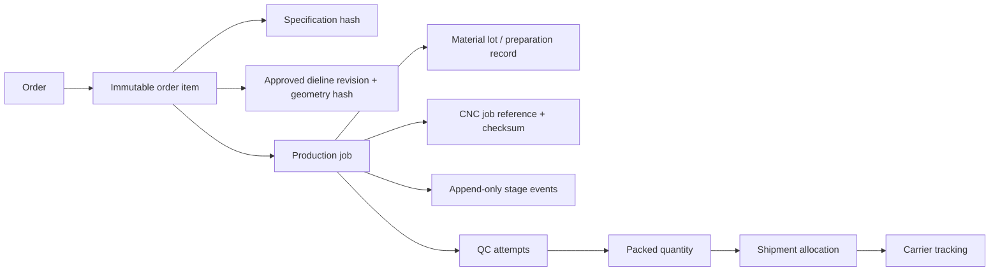
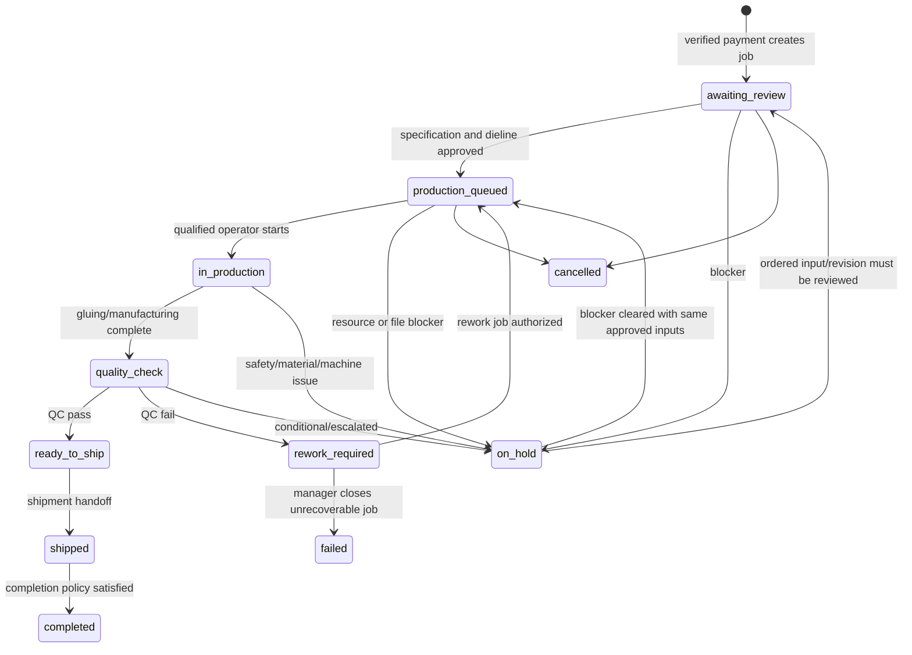
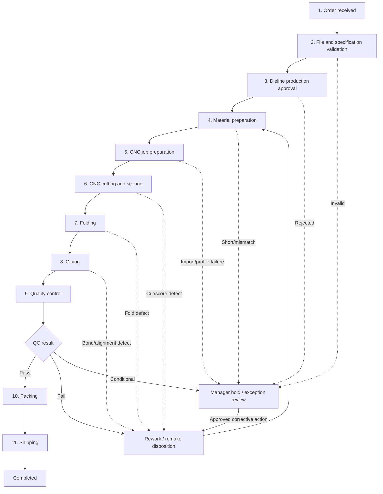
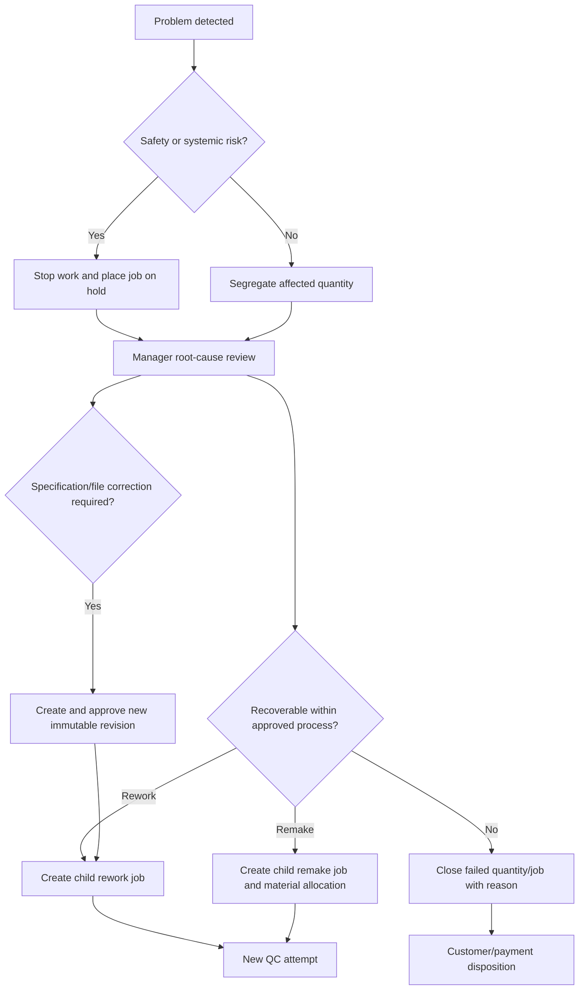

# Packerz Production Operations

**Status:** Cross-checked draft for factory validation
**Scope:** Unprinted custom-box samples, mockups, and low-volume production
**Reviewed:** 2026-07-24 against all existing documents in `/docs`
**Related documents:** `PRD.md`, `DATABASE.md`, `API.md`, `BOX_ENGINE.md`,
`ADMIN.md`, `ARCHITECTURE.md`

---

## 1. Purpose

This document defines the complete MVP manufacturing workflow from a verified
paid order through shipment.

The workflow covers:

1. order received;
2. file and specification validation;
3. dieline approval;
4. material preparation;
5. CNC job preparation;
6. CNC cutting and scoring;
7. folding;
8. gluing;
9. quality control;
10. packing;
11. shipping;
12. rework, hold, and failure handling.

Packerz is a packaging-manufacturing platform. No sticker, artwork, ink, plate,
coating, color-management, or print-production step exists in the MVP.

---

## 2. Production Principles

- Manufacture only from a paid, immutable order-item snapshot.
- Use one approved box structure and one approved glue method.
- Keep customer approval, production approval, and QC approval distinct.
- Never silently edit ordered dimensions, material, quantity, or dieline.
- Generate SVG and PDF first from one canonical geometry.
- Treat DXF as gated until actual CNC/CAD compatibility is approved.
- Keep an operator responsible for physical machine setup and start.
- Record every material transition, file revision, quantity, exception, and
  responsible actor.
- A failed check is append-only; rework does not erase the original result.
- Only QC-passed, unshipped quantity may enter packing and shipment.

---

## 3. Production Unit and Traceability

### 3.1 Commercial and manufacturing units

| Unit | Meaning |
|---|---|
| Order | Commercial transaction containing one or more order items |
| Order item | Immutable purchased box specification and quantity |
| Production job | Executable manufacturing allocation for an order item |
| Rework job | Child production job linked to the failed/source job |
| QC check | One append-only inspection attempt for a production job |
| Shipment item | Quantity of an order item allocated to a shipment |

One order item may have multiple jobs because of:

- split production;
- partial completion;
- rework;
- remake;
- approved quantity recovery.

The total produced, rejected, QC-passed, packed, and shipped quantities must be
reconciled without exceeding the ordered quantity unless an explicit overrun
policy is approved.

### 3.2 Traceability chain



### 3.3 Required immutable references

Before work starts, a job must bind to:

- order and order-item public IDs;
- order-item specification snapshot and hash;
- box/template revision;
- dimensions and dimension basis;
- material, board type, and thickness snapshot;
- fixed glue type/rule revision;
- dieline revision and canonical geometry hash;
- SVG/PDF checksums;
- manufacturing-rule version;
- Box Engine/generator version;
- quantity allocation;
- promised/target dates.

When DXF is enabled, also bind:

- machine profile and revision;
- DXF version, checksum, and exporter version;
- CNC authorization actor and time.

---

## 4. Roles and Responsibilities

### 4.1 Authorization roles

The current identity draft has these staff roles:

| Role | Production responsibility |
|---|---|
| `admin` | Oversight, exceptional authorization, configuration |
| `production_manager` | Review, approval, schedule, assignment, holds, disposition |
| `operator` | Assigned physical production and permitted stage updates |
| `support` | Read customer-safe order/shipment state; no manufacturing command |
| `system` | Verified automated events; not a human account |

### 4.2 Factory skill assignments

The following are job qualifications, not new authorization roles:

- material preparation;
- CNC setup/operation;
- folding;
- gluing;
- QC inspection;
- packing;
- shipping.

An MVP operator may hold several qualifications. Before implementation, the
owner must decide whether qualification/certification data is required in the
database or managed manually by the production manager.

### 4.3 Responsibility matrix

Legend: `A` accountable, `R` responsible, `C` consulted, `I` informed.

| Stage | System | Production manager | Qualified operator | QC inspector | Shipping operator |
|---|---:|---:|---:|---:|---:|
| Paid-order intake | R | A | I | I | I |
| File/spec validation | C | A/R | C | I | I |
| Production approval | I | A/R | C | I | I |
| Schedule/machine assignment | I | A/R | C | I | I |
| Material preparation | I | A | R | I | I |
| CNC job preparation | C | A | R | I | I |
| CNC cutting/scoring | I | A | R | I | I |
| Folding | I | A | R | I | I |
| Gluing | I | A | R | I | I |
| QC | I | A | C | R | I |
| Rework disposition | I | A/R | C | C | I |
| Packing | I | A | R | C | I |
| Shipment registration | C | A | I | I | R |

The same human should not approve an exceptional QC override without a second
review when staffing permits. The owner must approve separation-of-duty policy.

---

## 5. Canonical Status Model

Existing documents mix customer milestones, production-job states, detailed
factory steps, QC results, and shipment states. The proposed model separates
them.

### 5.1 Production job status codes

These are the proposed canonical high-level values for
`production_jobs.status`:

| Code | Meaning | Terminal |
|---|---|---:|
| `awaiting_review` | Paid job exists and awaits production review | No |
| `on_hold` | A blocking issue prevents progression | No |
| `production_queued` | Approved, ready, and waiting for schedule/start | No |
| `in_production` | One physical production stage is active | No |
| `quality_check` | Manufacturing complete and QC is pending/in progress | No |
| `rework_required` | Failed QC or production defect requires disposition | No |
| `ready_to_ship` | QC passed and packing/shipping handoff is allowed | No |
| `shipped` | Allocated job quantity has been handed to carrier | No |
| `completed` | Required quantity is fulfilled and completion policy is met | Yes |
| `cancelled` | Job was cancelled under an authorized policy | Yes |
| `failed` | Unrecoverable manufacturing failure closed by manager | Yes |

`failed` is not a substitute for a temporary error. Recoverable issues use
`on_hold` or `rework_required`.

### 5.2 Detailed stage codes

The current database lacks a stage field. The following proposed
`current_stage_code` values require a documented migration/API update:

| Stage code | Job status while active | Customer visibility |
|---|---|---|
| `order_received` | `awaiting_review` | Awaiting review |
| `file_spec_validation` | `awaiting_review` | Awaiting review |
| `dieline_approval` | `awaiting_review` | Awaiting review |
| `material_preparation` | `production_queued` or `in_production` | Preparing production |
| `cnc_job_preparation` | `production_queued` or `in_production` | Preparing production |
| `cnc_cut_score` | `in_production` | In production |
| `folding` | `in_production` | In production |
| `gluing` | `in_production` | In production |
| `qc` | `quality_check` | Quality check |
| `packing` | `ready_to_ship` | Preparing shipment |
| `shipping` | `ready_to_ship` or `shipped` | Ready to ship / Shipped |
| `closed` | `completed`, `cancelled`, or `failed` | Completed or safe exception |

Stage history belongs in append-only events even if `current_stage_code` is
stored for queue efficiency.

### 5.3 QC result codes

Use the current database values:

- `pending`
- `pass`
- `fail`
- `conditional_pass`

`conditional_pass` requires a production-manager disposition and reason. It does
not automatically mean ready to ship.

### 5.4 Hold reason codes

Recommended controlled codes:

```text
PAYMENT_RECONCILIATION
SPECIFICATION_MISMATCH
DIMENSION_MAPPING_UNRESOLVED
DIELINE_INVALID
DIELINE_APPROVAL_REQUIRED
FILE_CHECKSUM_MISMATCH
MATERIAL_UNAVAILABLE
MATERIAL_LOT_MISMATCH
MACHINE_UNAVAILABLE
MACHINE_PROFILE_MISMATCH
CNC_IMPORT_FAILED
CNC_SAFETY_CHECK_FAILED
PRODUCTION_DEFECT
QC_FAILED
QUANTITY_SHORT
PACKING_ISSUE
SHIPPING_ADDRESS_ISSUE
CUSTOMER_CONFIRMATION_REQUIRED
OTHER
```

`OTHER` always requires an explanation.

### 5.5 State transition diagram



Cancelling an `in_production` job requires a manager-defined disposition for
material, work in progress, produced quantity, and payment/refund. It must not be
a normal direct transition.

---

## 6. End-to-End Production Flow



---

## 7. Stage Requirements

Each stage below defines entry, work, required data, exit, role, and failure
branch.

### 7.1 Order received

**Entry**

- payment is confirmed by a verified provider event/server query;
- idempotent payment workflow created exactly one production allocation.

**Work**

- create production job per approved order-item allocation;
- display immutable customer, specification, quantity, price, and promise
  snapshots;
- assign initial priority and `order_received` stage.

**Required data**

- order/order-item/job IDs and numbers;
- payment ID/status/confirmed amount/time;
- product purpose;
- quantity;
- promised lead time/date;
- customer-safe delivery summary;
- specification and dieline references;
- creation idempotency key and request ID.

**Responsible**

- System: creates job.
- Production manager: owns review.

**Exit**

- transition stage to `file_spec_validation`;
- job remains `awaiting_review`.

**Failure**

- payment mismatch or duplicate allocation → hold/reconciliation, never start.

### 7.2 File and specification validation

**Entry**

- paid job with complete immutable references.

**Work**

- verify specification hash;
- verify one allowed template and one fixed glue method;
- verify dimensions, basis, material, thickness, board type, quantity, and rules;
- verify SVG/PDF object existence and checksums;
- verify geometry/generator versions;
- confirm no sticker, print, artwork, ink, or coating properties;
- confirm the order snapshot agrees with the source dieline.

**Required data**

- all immutable references in section 3.3;
- validation checklist version;
- validation result per check;
- actor/time;
- warning and blocking issue codes.

**Responsible**

- Production manager, with system checksum/rule assistance.

**Exit**

- all blocking checks pass → `dieline_approval`;
- warning acceptance requires actor and reason.

**Failure**

- mismatch/invalid file → `on_hold`;
- ordered inputs are never edited in place;
- a corrected design produces a new approved commercial/production revision
  under an owner-approved correction policy.

### 7.3 Dieline production approval

Customer approval and production approval are separate.

**Work**

- review exact geometry hash and revision;
- inspect cut and score topology;
- verify dimensions and physical scale reference;
- verify glue flap and material/thickness assumptions;
- confirm sheet/machine compatibility at the approved level;
- record production approval.

**Required data**

- customer approval actor/time, when required;
- production approver/time;
- dieline ID/revision;
- geometry hash;
- SVG/PDF checksums;
- template/rule/generator versions;
- approval checklist and notes.

**Responsible**

- Production manager.

**Exit**

- production approved → job becomes `production_queued`;
- stage becomes `material_preparation`.

**Failure**

- invalid or ambiguous geometry → `on_hold`;
- regeneration creates a new immutable dieline revision.

### 7.4 Material preparation

**Work**

- reserve/select the approved material;
- verify board type, thickness, grain/orientation when applicable;
- identify material lot/batch;
- verify available sheet size and usable quantity;
- inspect material condition;
- record waste/allowance plan;
- stage material at the approved machine.

**Required data**

- material and board codes;
- nominal and measured thickness;
- lot/batch reference;
- sheet dimensions;
- planned sheet/unit quantity;
- available quantity;
- grain direction, if applicable;
- inspection result;
- preparer and time.

**Responsible**

- Qualified operator; production manager accountable.

**Exit**

- required material prepared → `cnc_job_preparation`.

**Failure**

- unavailable/damaged/wrong material → `on_hold`;
- substitution is not allowed without a new approved specification and
  commercial policy.

### 7.5 CNC job preparation

**Work**

1. select the actual machine;
2. verify machine availability/capability;
3. choose an approved artifact path:
   - profile-bound DXF, if enabled; or
   - manually prepared CAM/CNC job from approved SVG/PDF;
4. verify millimeters and 1:1 scale;
5. map CUT and SCORE operations;
6. confirm origin, orientation, sheet bounds, tool/score setup, and margins;
7. save a controlled CNC job reference/checksum;
8. complete operator safety/setup checklist.

**Required data**

- machine identity;
- machine profile revision, when modeled;
- source dieline ID/revision and geometry hash;
- source file type/checksum;
- CAM/CNC software and version;
- derived CNC job reference/checksum;
- units, origin, orientation, layers/operations;
- sheet size;
- tools/settings approved by factory;
- preparer/authorizer and timestamps.

**Responsible**

- Qualified CNC operator prepares.
- Production manager authorizes release.

**Exit**

- CNC import/preview and setup validation pass → queue for
  `cnc_cut_score`.

**Failure**

- scale, layer, entity, profile, or import issue → `on_hold`;
- never manually “fix” geometry without producing a traceable new revision.

### 7.6 CNC cutting and scoring

**Entry**

- prepared material;
- approved CNC job;
- assigned qualified operator;
- machine safety check complete.

**Work**

- load material;
- run one first-piece cut/score;
- inspect critical reference dimensions and score placement;
- approve first piece;
- run remaining quantity;
- record produced, rejected, and remaining quantities;
- record interruption/tool/material issues.

**Required data**

- machine and CNC job reference;
- material lot;
- operator;
- start/end;
- planned/processed/accepted/rejected quantity;
- first-piece inspection;
- stop/restart events;
- defect and waste codes.

**Responsible**

- Qualified CNC operator.

**Exit**

- sufficient accepted cut/score units → `folding`;
- stage stays `in_production`.

**Failure**

- unsafe state → stop and `on_hold`;
- localized defect → segregate affected quantity and disposition;
- systemic geometry/profile defect → stop job and require review/revision.

### 7.7 Folding

**Work**

- fold along approved score lines;
- verify fold direction and sequence;
- inspect cracking, tearing, spring-back, skew, and panel alignment;
- separate rejected units.

**Required data**

- input/accepted/rejected quantity;
- operator and time;
- fold method/tool;
- sampled observations;
- defect codes/notes.

**Responsible**

- Qualified production operator.

**Exit**

- accepted folded units → `gluing`.

**Failure**

- score/fold defect → rework if safely possible, otherwise reject/remake;
- recurring issue → `on_hold` for material/score-rule review.

### 7.8 Gluing

**Work**

- use the one approved glue method;
- prepare and apply glue according to approved factory instructions;
- align seam/glue flap;
- maintain required pressure and cure/set time;
- inspect bond and contamination.

**Required data**

- glue type/rule revision;
- glue lot, if traceability is required;
- application method;
- operator;
- start/end/cure time;
- input/accepted/rejected quantity;
- bond/alignment observations.

**Responsible**

- Qualified gluing operator.

**Exit**

- manufacturing quantity complete → job status `quality_check`, stage `qc`.

**Failure**

- misalignment, weak bond, contamination, or insufficient flap → segregate and
  create rework/remake disposition.

### 7.9 Quality control

**Work**

- identify checklist revision and sampling plan;
- measure finished dimensions;
- inspect material, cut, score, fold, glue, surface, and quantity;
- attach evidence when required;
- record `pass`, `fail`, or `conditional_pass`.

**Minimum checklist**

- correct template/specification;
- correct material/board/thickness;
- length/width/height within approved tolerance;
- complete cut;
- correct score placement;
- acceptable folding;
- glue-flap alignment and bond;
- acceptable surface condition;
- quantity reconciliation.

**Required data**

- QC check number and checklist snapshot;
- inspector and time;
- sample/passed/rejected quantities;
- expected/actual measurements and units;
- item results;
- overall result;
- defect code, evidence, and notes.

**Responsible**

- Authorized QC inspector.

**Exit**

- `pass` → stage `packing`, job `ready_to_ship`;
- `fail` → `rework_required`;
- `conditional_pass` → `on_hold` until manager disposition.

**Failure**

- incomplete checklist or inconsistent quantities → reject API submission;
- inspector cannot edit a finalized QC attempt; create a corrected/additional
  attempt with an audit link.

### 7.10 Packing

**Work**

- verify QC-passed quantity;
- protect boxes from deformation/moisture as approved;
- bundle/count/label packages;
- record package count, packed quantity, and dimensions/weight when required;
- match the order/shipment preparation record.

**Required data**

- source job and QC pass references;
- packed quantity;
- rejected/damaged-during-packing quantity;
- package count;
- packaging method/material;
- package weight/dimensions when available;
- packer and time.

**Responsible**

- Qualified packing operator.

**Exit**

- packed quantity becomes eligible for shipment allocation.

**Failure**

- packing damage → segregate and rework/remake;
- shortage → hold partial shipment or use approved partial-shipment policy.

### 7.11 Shipping

**Work**

- verify address and recipient;
- allocate only packed, QC-passed, unshipped quantity;
- create shipment;
- register carrier/service/tracking;
- hand package to carrier;
- notify customer after authoritative registration.

**Required data**

- shipment number;
- order and item allocations;
- recipient/address snapshot;
- carrier/service/tracking;
- package count;
- shipped quantity;
- creator and handoff time;
- label/document reference;
- exception and delivery events.

**Responsible**

- Shipping operator; production manager accountable.

**Exit**

- carrier handoff → job/order shipping state `shipped`;
- completion occurs under the approved delivery/completion policy.

**Failure**

- invalid address, duplicate tracking, or quantity conflict → shipment blocked;
- carrier exception is recorded without rewriting the original handoff.

---

## 8. Rework, Remake, Hold, and Failure

### 8.1 Decision tree



### 8.2 Rework rules

- Never overwrite the source job.
- Use `parent_job_id` for the child job.
- Allocate exact rework/remake quantity.
- Retain original defects and QC results.
- Record reason, approver, material impact, and target date.
- Re-enter the earliest affected stage.
- Require a new QC attempt.
- Recalculate customer promise and notify only under approved communication
  policy.

### 8.3 Failure classes

| Class | Examples | Default response |
|---|---|---|
| Specification | Ambiguous dimensions, wrong revision | Hold, review, new revision |
| File | Missing/checksum/scale/import failure | Hold, regenerate or controlled CAM prep |
| Material | Wrong lot/thickness/damage/shortage | Hold, replace approved material |
| Machine | Down, profile mismatch, unsafe setup | Hold, reassign only if compatible |
| Cutting/scoring | Wrong path, incomplete cut, bad score | Stop, segregate, rework/remake |
| Folding/gluing | Crack, skew, weak bond | Segregate, rework/remake |
| QC | Measurement or workmanship failure | Rework/remake/fail disposition |
| Packing | Damage or count mismatch | Segregate and reconcile |
| Shipping | Address/tracking/carrier exception | Hold or exception workflow |

### 8.4 Commercial consequence

Production failure does not automatically cancel or refund an order. The
production disposition, customer communication, order cancellation, and payment
refund are separate authorized workflows linked by audit history.

---

## 9. Machine Queue Logic

### 9.1 Queue eligibility

A job may enter a machine queue only when:

- job is paid and production approved;
- specification and dieline checks passed;
- no active hold exists;
- material is prepared or confirmed available;
- selected machine supports sheet/material/thickness/process;
- approved source/CNC artifact is available;
- assigned operator is qualified and active;
- planned quantity and target date are present.

### 9.2 Queue ordering

Recommended deterministic sort:

1. active safety/customer-blocking escalation;
2. manager-approved priority (`1` highest);
3. promised ship/production due time;
4. material readiness;
5. machine/setup compatibility grouping;
6. scheduled start time;
7. job creation time;
8. public job ID as stable tie-breaker.

The system may recommend grouping jobs by material/tool setup, but it must not
silently reorder an urgent job past its committed date.

### 9.3 Queue states

| Queue state | Meaning |
|---|---|
| `not_ready` | One or more readiness blockers |
| `ready` | Eligible but not scheduled |
| `scheduled` | Machine/operator/time assigned |
| `setup` | Physical setup/checklist active |
| `running` | Machine operation active |
| `paused` | Temporary controlled interruption |
| `done` | Machine stage complete |
| `blocked` | Hold requiring intervention |

These are machine-queue states, not replacements for `production_jobs.status`.

### 9.4 Concurrency and safety

- One machine cannot have overlapping `running` jobs.
- Assignment uses optimistic concurrency/row locking.
- A stale browser cannot start a superseded job version.
- Only one current authorized CNC artifact is selectable.
- Pausing/stopping records actor, time, reason, and quantities.
- Software queue state is informational; physical emergency controls remain on
  the machine.

### 9.5 Initial implementation

Machines, profiles, assignments, and queue events are not yet present in
`DATABASE.md`/`API.md`. Until approved migrations exist, the MVP may use one
fixed factory machine recorded as controlled job metadata, with manual schedule
enforcement. It must not pretend a full machine queue exists.

---

## 10. Production Dashboard Requirements

### 10.1 Required views

- New paid orders awaiting review
- Validation or dieline blockers
- Ready but unscheduled jobs
- Today's schedule
- Machine queue/readiness
- Work in progress by detailed stage
- Jobs paused or on hold
- QC pending and QC failures
- Rework/remake jobs
- Packing backlog
- Ready-to-ship backlog
- Overdue jobs
- Recent audited events

### 10.2 Job list fields

- job and order number;
- current status and detailed stage;
- purpose, dimensions, material, thickness, quantity;
- produced/rejected/passed/packed/shipped quantities;
- priority and due date;
- assigned operator/machine;
- material and file readiness;
- active hold/rework indicator;
- last event and time.

### 10.3 Actions

- review and approve;
- hold/release with reason;
- assign operator/machine/schedule;
- open approved files;
- record CNC preparation;
- start/complete permitted stage;
- record quantities and notes;
- open/submit QC;
- create rework/remake;
- pack and register shipment.

Actions are role- and state-dependent. The API remains authoritative.

### 10.4 Alerts

Alert when:

- paid job is unreviewed beyond target;
- file/checksum/generation fails;
- due date is at risk;
- material is unavailable;
- machine/profile/import validation fails;
- job runs/pauses beyond expected duration;
- quantities do not reconcile;
- QC fails or remains pending;
- packed work is not shipped;
- audit or required event persistence fails.

### 10.5 Performance

On the initial `t3.small`:

- server-side pagination and filters are mandatory;
- default views use bounded date/status indexes;
- dashboard refresh is no faster than operational need;
- statistics must not block mutations;
- event timelines load separately;
- heavy exports/aggregates run asynchronously or from summaries.

---

## 11. Required Data by Stage Summary

| Stage | Identity/version data | Quantity data | Operational evidence | Actor |
|---|---|---|---|---|
| Order received | Order/item/job, payment | Ordered/planned | Idempotency, paid event | System/manager |
| File/spec validation | Spec/dieline/rule hashes | Planned | Checklist, checksum result | Manager |
| Dieline approval | Geometry/export versions | Planned | Approval checklist | Manager |
| Material preparation | Material/lot/thickness | Planned/prepared | Inspection, sheet data | Operator |
| CNC preparation | Machine/source/CNC checksum | Planned | Units, layers, setup | CNC operator/manager |
| CNC cut/score | Machine/job/material | Processed/rejected | First piece, stop events | CNC operator |
| Folding | Job/material | Input/accepted/rejected | Fold observations | Operator |
| Gluing | Glue rule/lot | Input/accepted/rejected | Bond/cure observations | Operator |
| QC | Checklist/version | Sample/pass/reject | Measurements/evidence | Inspector |
| Packing | QC/job references | Packed/damaged | Package data | Packer |
| Shipping | Shipment/order/item | Allocated/shipped | Tracking/handoff | Shipping operator |

Every record uses UTC timestamps and displays factory-local time explicitly.

---

## 12. Audit History

### 12.1 Events to retain

- job creation;
- validation result and warnings;
- customer/production dieline approval;
- hold/release;
- priority, schedule, operator, and machine assignment;
- source/CNC artifact generation, authorization, and download;
- material lot and preparation;
- every stage start, pause, resume, completion;
- quantity changes/reconciliation;
- production note;
- QC attempt and disposition;
- rework/remake child creation;
- packing;
- shipment creation/status;
- cancellation/failure/completion.

### 12.2 Event fields

- event ID/type;
- production job and related resource;
- from/to status;
- from/to detailed stage;
- actor type/ID/role;
- UTC timestamp;
- request/correlation ID;
- idempotency key where applicable;
- before/after version;
- quantities;
- reason code and note;
- customer-visible message when approved;
- metadata with file/machine/material references.

### 12.3 Integrity

- Events are append-only.
- Sensitive mutations and their audit event commit atomically where practical.
- Corrections append a new event rather than mutate history.
- Customer timelines expose only approved customer-safe messages.
- Audit exports are permissioned and logged.

---

## 13. Initial Manual Steps vs Future Automation

| Activity | Sellable MVP | Future automation |
|---|---|---|
| Paid-order intake | Automatic verified job creation | Capacity-aware routing |
| Spec validation | System checks + manager review | Rules/AI exception triage |
| Dieline generation | Automatic SVG/PDF | More structures and richer verification |
| Dieline production approval | Manual manager approval | Risk-based auto-approval |
| Material availability | Manual confirmation/lot entry | Inventory reservation/procurement |
| Machine selection | Manual fixed/approved machine | Capability/capacity optimization |
| CNC job preparation | Manual CAM from SVG/PDF unless DXF gate passes | Profile-bound DXF/CAM generation |
| Machine start | Physical operator action | Still safety-gated; no unattended start assumed |
| Cutting/scoring progress | Manual stage/quantity update | Machine telemetry/events |
| Folding/gluing | Manual operation and records | Assisted/semi-automated work cells |
| QC | Manual checklist and measurement | Vision/sensor-assisted inspection |
| Rework disposition | Manual manager decision | Suggested root cause/routing |
| Packing | Manual count/package record | Scan/weight/count integration |
| Shipping | Manual carrier/tracking registration | Carrier label/API/webhooks |
| Dashboard | Transactional queries/bounded summaries | MES analytics and forecasting |

Automation cannot weaken approval, traceability, safety, or audit requirements.

---

## 14. API and Database Impact

The current drafts support jobs, job events, QC, shipment, and audit, but not all
detailed production requirements.

### 14.1 Candidate database additions

Subject to approval:

- `production_jobs.current_stage_code`
- `production_stage_events` or richer `production_job_events.metadata_json`
- stage-specific quantity counters or a transaction ledger
- material lots and job material allocations
- machine and machine profile tables
- job-machine assignment history
- CNC artifact/authorization records
- packing records and package details
- operator qualifications
- structured holds/dispositions

### 14.2 Candidate API additions

Subject to approval:

```text
POST  /api/v1/admin/production-jobs/{jobId}/review
POST  /api/v1/admin/production-jobs/{jobId}/holds
POST  /api/v1/admin/production-jobs/{jobId}/holds/{holdId}/release
POST  /api/v1/admin/production-jobs/{jobId}/stages/{stageCode}/start
POST  /api/v1/admin/production-jobs/{jobId}/stages/{stageCode}/complete
POST  /api/v1/admin/production-jobs/{jobId}/material-preparations
POST  /api/v1/admin/production-jobs/{jobId}/cnc-preparations
POST  /api/v1/admin/production-jobs/{jobId}/rework-jobs
POST  /api/v1/admin/production-jobs/{jobId}/packing-records
GET   /api/v1/admin/machines/{machineId}/queue
PATCH /api/v1/admin/machines/{machineId}/queue
```

These are planning contracts, not implemented endpoints.

---

## 15. Production Acceptance Criteria

The workflow is ready for a sellable MVP when:

- a verified payment creates one job allocation exactly once;
- production cannot start before file/spec and dieline production approval;
- one template, material set, and glue method have signed factory rules;
- required SVG/PDF files match the canonical geometry and pass physical scale
  checks;
- the actual CNC preparation path is physically tested;
- every active stage has an authorized role, required data, and failure branch;
- quantities reconcile from ordered through shipped;
- QC uses an approved checklist/tolerance and cannot be bypassed silently;
- rework creates a traceable child cycle;
- only QC-passed packed quantity can ship;
- all sensitive transitions and file access are audited;
- the dashboard exposes blockers, work in progress, QC, and shipping queues;
- operators can complete the flow under realistic factory conditions;
- backup/restore preserves order, production, QC, and file traceability.

---

## 16. Owner Decisions Required

1. Exact initial box structure and factory-approved template drawing
2. Canonical dimension vocabulary and mapping
3. Internal/external dimension and allowance formulas
4. Approved materials, board types, thicknesses, and material lot policy
5. Fixed glue product/method, flap rule, cure time, and acceptance test
6. Cut, score, fold, glue, and finished-dimension tolerances
7. Actual CNC machine, CAD/CAM software, supported input formats, and setup
8. Whether SVG/PDF manual CAM preparation is safe for launch or DXF is required
9. DXF dialect/layers/entities/profile if DXF is required
10. Sheet orientation, grain direction, margins, kerf, and score settings
11. Low-volume quantity range and allowed production overrun/underrun
12. First-piece inspection and QC sampling plan
13. Whether `conditional_pass` is allowed and who may approve it
14. Operator qualifications and separation of QC responsibility
15. Rework, remake, scrap, cancellation, refund, and customer-notification policy
16. Partial production and partial shipment policy
17. Packing method, package data, and supported carrier
18. Exact completion event: carrier handoff, delivery, or another milestone
19. Required detailed stage persistence versus manual checklist-only operation
20. Machine downtime, maintenance, and queue-priority rules

---

## 17. Documentation Status

This document proposes the canonical production model but does not authorize
source code, database, API, infrastructure, machine, or factory-process changes.

The status codes, detailed stage model, machine queue, CNC preparation path, and
owner decisions must be approved and then synchronized into `DATABASE.md`,
`API.md`, `ADMIN.md`, `SCREENS.md`, and `ARCHITECTURE.md` before implementation.
