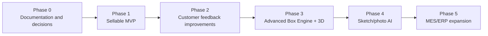
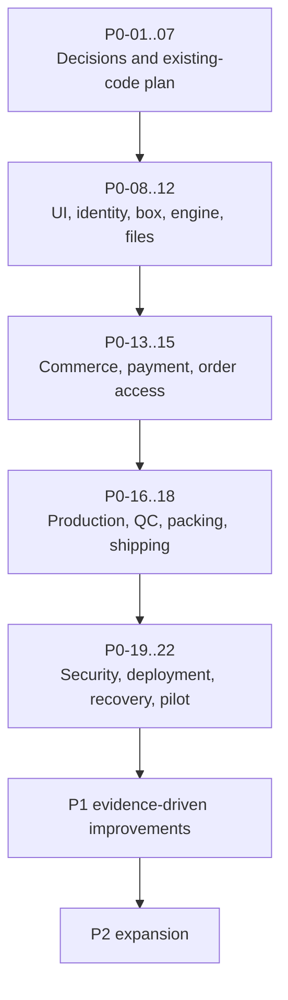

# Packerz Product and Delivery Roadmap

**Status:** Cross-checked planning draft
**Scope:** Packaging manufacturing platform; no sticker business
**Reviewed:** 2026-07-24 against all existing documents in `/docs`
**Planning rule:** A later phase must not weaken the manufacturing, security,
payment, traceability, or recovery gates established earlier.

---

## 1. Roadmap Intent

Packerz will progress from a manually controlled, sellable custom-box workflow
to a broader AI-assisted manufacturing operating system.

The roadmap deliberately begins with one unprinted box structure and one glue
method. The company must prove that it can repeatedly turn customer inputs into
a paid, physically manufacturable, quality-controlled, shipped box before it
adds more structures, freeform AI, 3D experiences, printing, or multi-factory
operations.



---

## 2. Cross-Phase Principles

- Packaging only; no sticker product.
- No printing in the sellable MVP.
- Manufacturing correctness outranks visual novelty.
- One authoritative business transaction owner.
- One canonical geometry source for every export.
- Customer, production, and shipment records remain traceable.
- Guest checkout remains a first-class supported path.
- Payment redirects are never authoritative.
- Physical factory acceptance is required for geometry/CNC changes.
- Customer-visible AI output is constrained by manufacturing rules.
- Every phase has a measurable go/no-go gate.
- Scope enters a phase only when its owner, dependencies, and acceptance tests
  are known.

---

## 3. Phase 0 — Documentation and Decisions

### Goal

Approve one internally consistent product, manufacturing, data, API,
architecture, and delivery baseline before application restructuring or feature
implementation.

### Features and work

- Finalize packaging-only product scope.
- Approve one initial box structure.
- Approve one fixed glue method.
- Approve dimension terminology and mapping.
- Validate material, thickness, score, glue-flap, and tolerance rules.
- Choose the initial CNC preparation path.
- Decide whether DXF is launch-critical or a follow-on.
- Reconcile customer, order, production, QC, and shipment status models.
- Resolve public API runtime ownership.
- Align domain routes and admin navigation.
- Select payment provider and domestic payment methods.
- Select carrier/manual shipping workflow.
- Approve JWT, guest, admin, MFA, and retention policies.
- Review the existing codebase and create a non-destructive cleanup/migration
  plan.

### Dependencies

- Owner/business decisions
- Factory manager and CNC operator input
- Actual machine/CAD/CAM compatibility data
- Payment-provider commercial/technical evaluation
- Existing code and deployment inventory
- Review of all files in `/docs`

### Deliverables

- Approved PRD and scope statement
- Approved IA, screens, and customer flows
- Approved database and REST API drafts
- Approved Box Engine specification
- Approved architecture baseline
- Approved admin and production operating procedures
- Contradiction register with disposition
- Owner-decision log
- Existing-code cleanup plan
- Prioritized implementation backlog
- Test and physical acceptance plan

### Acceptance criteria

- No document describes Packerz as a sticker business.
- The sellable MVP is explicitly unprinted packaging.
- One box structure/glue method are identified by factory-approved references.
- Dimension fields have one unambiguous API/engine/drawing mapping.
- SVG/PDF launch requirements are approved.
- The CNC path is physically plausible and has a named acceptance owner.
- Production status and detailed-stage contracts are approved.
- Next.js/PHP/MySQL/Box Engine responsibilities have one owner each.
- Payment, guest checkout, admin security, backup, and recovery decisions are
  recorded.
- Every unresolved item has an owner and blocks the relevant implementation
  task.

### Excluded scope

- Application feature implementation
- Database migration
- Production infrastructure change
- Machine integration
- Customer launch
- 3D, sketch/photo AI, MES, ERP

### Risks

- Factory formulas are assumed instead of signed off.
- Documentation grows without owner decisions.
- Existing prototype constraints drive product design accidentally.
- DXF is treated as optional even if the real machine requires it.
- API runtime ambiguity causes two competing business backends.

### Go/no-go gate

**Go** only when all P0 owner decisions needed for Phase 1 are approved, the
contradiction register has a disposition, and structural code changes receive
explicit approval.

**No-go** when dimensions, box topology, glue/score rules, payment provider, or
the safe CNC path remain unresolved.

---

## 4. Phase 1 — Sellable MVP

### Goal

Enable a guest or registered customer to configure, purchase, and receive one
physically validated unprinted custom-box product, while staff can control every
production stage from paid order to shipment.

### Features

#### Customer

- Landing and product scope
- Sample, mockup, or low-volume purpose
- One box configuration
- Internal/external dimension basis
- Three approved dimension inputs
- Limited materials/thicknesses
- Read-only fixed glue method
- Quantity within approved limits
- Manufacturability validation
- Server-authoritative quote and lead time
- Automatic versioned dieline generation
- SVG/PDF preview and export
- Customer dieline approval
- Cart and Buy Now
- Guest checkout and registered checkout
- Address/consent validation
- Payment request, verification, retry, and failure states
- Order confirmation
- Guest order lookup
- Customer-safe production/shipment tracking

#### Admin and production

- Staff authentication and role enforcement
- Dashboard, Orders, Production, QC, Machines, Shipping, Settings minimum views
- Paid-order review
- Production dieline approval
- Holds and audited status transitions
- Operator, schedule, and fixed-machine assignment
- Material preparation record
- Controlled CNC job preparation
- CNC cutting/scoring stage
- Folding and gluing stages
- QC checklist, measurement, pass/fail, and rework
- Packing record
- Shipment/tracking registration
- Customer email notifications
- Audit history

#### Platform

- Next.js customer frontend
- PHP/GnuBoard authoritative REST API/admin
- MySQL 8 schema/migrations
- Box Engine for canonical geometry and SVG/PDF
- Private S3 files with signed access
- Payment and webhook idempotency
- CloudFront/ALB/Nginx/PM2 deployment
- CloudWatch logs/metrics/alarms
- Off-host MySQL/EBS/S3 backup and tested restore

#### CNC and DXF decision

- If the approved manual process can safely preserve scale and cut/score
  semantics, controlled CAM preparation from SVG/PDF may launch first.
- If the actual machine/CAD/CAM flow cannot do this safely, profile-bound DXF
  becomes Phase 1 P0 scope.
- Customer DXF download is not required for “MVP ready for sales.”

### Dependencies

- Phase 0 go
- Approved physical box template and manufacturing formulas
- Approved material catalog and low-volume range
- Payment-provider account, contract, test environment, and webhook contract
- Factory access for physical acceptance
- Initial machine/CAD/CAM process
- Domain/DNS/AWS/SES configuration
- Legal terms/privacy/commerce decisions
- Approved source-code cleanup and migration plan

### Deliverables

- Production-ready customer web application
- Versioned PHP REST API
- GnuBoard admin/operations console
- MySQL schema and safe migrations
- Deterministic Box Engine with golden fixtures
- SVG/PDF immutable export pipeline
- Optional gated DXF pipeline if required
- Payment/guest/order integration tests
- Production/QC/shipping operational flow
- Deployment and rollback automation
- Monitoring dashboards and runbooks
- Backup/restore evidence
- Physical manufacturing acceptance report
- Launch checklist and support playbook

### Acceptance criteria

- All criteria in section 11, “Exact definition of MVP ready for sales,” pass.
- No critical or high-severity known defect remains open.
- A guest can complete purchase and later recover one order securely.
- The amount shown, charged, and stored is identical.
- Duplicate payment/webhook requests do not duplicate orders or jobs.
- Invalid or unapproved geometry cannot reach checkout/production.
- At least the approved physical test matrix is cut, scored, folded, glued, and
  QC-passed.
- Staff completes a realistic order through packing and shipment.
- Recovery drill meets approved RPO/RTO.

### Excluded scope

- Additional box structures/glue methods
- Printing/artwork/coatings
- Photorealistic or advanced 3D
- Sketch/photo interpretation
- Automatic machine start/control
- High-volume nesting/optimization
- Multi-factory routing
- Full inventory, procurement, accounting, MES, or ERP
- Coupons unless explicitly reintroduced
- International shipping/currency/tax

### Risks

- Physical tolerances fail after apparently correct geometry.
- `t3.small` memory/resource contention affects web/API/worker/MySQL.
- Payment or guest authorization has data-leak/duplication defects.
- Manual production updates become inconsistent.
- Factory staffing cannot support required approvals and QC separation.
- Manual CNC preparation introduces untraceable edits.

### Go/no-go gate

**Go to sales** only when the exact sales-readiness definition in section 11 is
signed by product, engineering, factory/quality, operations, and business owners.

**No-go** for any payment integrity, authorization, geometry, physical
manufacturing, QC, shipment, backup, or rollback failure.

---

## 5. Phase 2 — Customer Feedback Improvements

### Goal

Improve conversion, clarity, repeat ordering, and operations using measured
Phase 1 customer/factory evidence without broadening the core manufacturing
model prematurely.

### Features

- Funnel and failure analytics with privacy controls
- Improved dimension guidance and error explanations
- Better material recommendations
- Saved projects for registered customers
- Guest-to-account conversion
- Reorder from an immutable prior specification
- Quote/lead-time explanation
- Improved mobile/accessibility behavior
- Customer notifications and support self-service
- Production exception/hold communication
- Search/filter/dashboard improvements
- Carrier integration if manual registration causes material load
- Performance and reliability improvements
- Optional DXF completion if safely deferred from Phase 1

### Dependencies

- Stable Phase 1 production operation
- Enough real orders/support cases to identify priorities
- Instrumentation and feedback consent
- Measured funnel and factory bottlenecks
- Approved data-retention/analytics policy
- No unresolved critical Phase 1 manufacturing issue

### Deliverables

- Ranked customer/factory feedback report
- Updated UX flows and copy
- Saved/reorder experience
- Improved support/admin operations
- Conversion and operational metric baselines
- Performance remediation
- Updated regression and physical test suite

### Acceptance criteria

- Each shipped feature maps to a measured problem.
- Configuration abandonment and support-contact causes are measurable.
- Reorder produces the same immutable spec/geometry unless the user explicitly
  creates a revision.
- Guest conversion preserves ownership without duplicate resources.
- Performance/error targets improve without weakening validation.
- Factory defect/rework rate does not regress.

### Excluded scope

- New freeform structures
- Sketch/photo AI
- Full 3D editor
- Printing
- Multi-factory MES/ERP
- Features justified only by opinion without evidence

### Risks

- Optimizing a small/nonrepresentative sample
- Adding UX shortcuts that bypass manufacturing checks
- Reorder using obsolete material/rules without clear revalidation
- Analytics load affecting the single operational database
- Scope creep into Phase 3/4

### Go/no-go gate

**Go to Phase 3** when Phase 1 is operationally stable, top feedback issues are
addressed or accepted, physical quality metrics are within target, and the team
has capacity for geometry/3D complexity.

---

## 6. Phase 3 — Advanced Box Engine and 3D Preview

### Goal

Expand structural intelligence and provide an accurate interactive folding
preview while preserving one canonical, manufacturing-approved geometry model.

### Features

- Additional approved box structures
- Versioned template/plugin architecture
- More closure/glue methods
- Advanced material/score/allowance rules
- Profile-bound DXF support
- Machine profiles and compatibility validation
- Controlled nesting/rotation optimization
- More extensive property-based and cross-format tests
- Interactive 3D folding preview
- Collision/closure validation
- 2D-to-3D linkage by geometry hash
- Visual material approximation clearly labeled as non-print preview

### Dependencies

- Stable deterministic Box Engine v1
- Factory-approved formulas for each new structure
- Machine profile schema/API
- 3D rendering technology decision
- Expanded golden and physical fixture program
- Sufficient worker/runtime capacity beyond initial constraints
- Approved UX for structure selection

### Deliverables

- Versioned multi-template Box Engine
- Machine-profile and DXF contracts
- 3D preview service/component
- Cross-format/3D consistency tests
- Physical acceptance report per template/material/profile
- Updated pricing/lead-time models
- Updated admin catalog/rule tooling

### Acceptance criteria

- Each structure has a signed physical fixture matrix.
- SVG/PDF/DXF, when enabled, share the canonical geometry hash.
- 3D panel dimensions and fold topology derive from the same geometry.
- 3D preview never alters manufacturing values.
- Invalid collisions/closures block approval with actionable issues.
- Performance remains within approved interactive/generation budgets.

### Excluded scope

- Photorealistic product rendering
- Customer freeform vector editing
- Sketch/photo AI inference
- Printed artwork visualization
- Full MES/ERP
- Automatic machine start

### Risks

- Template abstractions hide structure-specific physical behavior.
- 3D preview appears accurate while manufacturing geometry is wrong.
- DXF compatibility differs by machine/CAM vendor.
- Nesting optimization changes grain/orientation or quality.
- Generation workload exceeds the single-host architecture.

### Go/no-go gate

**Go to Phase 4** only when every enabled structure/profile passes deterministic,
cross-format, 3D-consistency, and physical manufacturing tests.

---

## 7. Phase 4 — Sketch/Photo AI

### Goal

Let customers provide a sketch or product photo and receive explainable,
editable packaging recommendations that are converted into approved structured
inputs—not untrusted manufacturing geometry.

### Features

- Sketch/photo upload with quarantine and privacy controls
- Product/object dimension prompts and scale calibration
- AI extraction of candidate dimensions and packaging intent
- Confidence scores and uncertainty disclosure
- Suggested approved structure/material/clearance
- Human-editable structured recommendation
- Manufacturability validation after customer confirmation
- Explainable rejection/clarification questions
- Feedback/evaluation loop with consent
- Abuse, prompt-injection, and unsafe-file defenses

### Dependencies

- Multiple stable approved structures from Phase 3
- Image/AI provider and data-retention decision
- Labeled/evaluated packaging dataset with legal rights
- Upload scanning pipeline
- Privacy/consent and deletion policies
- AI quality, bias, safety, and cost evaluation
- Clear fallback to manual structured input

### Deliverables

- Secure sketch/photo intake
- AI inference/recommendation service
- Evaluation dataset and benchmark
- Confidence/clarification UX
- Human-confirmation and rule-validation boundary
- AI monitoring, cost controls, and incident runbook

### Acceptance criteria

- AI never directly creates trusted CNC geometry.
- Customer confirms all structured manufacturing inputs.
- Box Engine performs the same deterministic validation as manual entry.
- Low-confidence cases request clarification or fall back safely.
- Evaluation meets approved accuracy/unsafe-output thresholds.
- Uploaded files and model data comply with retention/consent policy.
- AI failures do not block normal manual configuration.

### Excluded scope

- Inferring real-world scale without a reliable reference
- Fully autonomous packaging engineering
- Direct generation of arbitrary CNC paths
- Training on customer content without explicit legal basis/consent
- Printed artwork generation
- Medical/safety packaging certification claims

### Risks

- Hallucinated dimensions or material recommendations
- Misleading customer confidence
- Privacy/IP issues in uploaded images
- Prompt injection or malicious files
- Model/provider drift and cost volatility
- Dataset bias toward limited product/box types

### Go/no-go gate

**Go to Phase 5** only when AI is demonstrably subordinate to structured
confirmation and deterministic manufacturing rules, and real-world error/support
rates remain within approved limits.

---

## 8. Phase 5 — MES/ERP Expansion

### Goal

Expand Packerz from a single-factory production workflow into an integrated
manufacturing and business operating platform.

### Features

- Multi-machine capability, schedule, and telemetry
- Multi-factory/partner capability registry
- Capacity planning and routing
- Material inventory, lot traceability, reservation, and procurement
- Work instructions and operator terminals
- Barcode/QR scanning
- Downtime and maintenance management
- Expanded QC/SPC and nonconformance workflows
- Packing/warehouse/dispatch integration
- Costing, margin, purchasing, invoicing, and accounting integrations
- ERP/PIM/e-commerce APIs
- SLA and supplier performance
- Analytics, forecasting, and sustainability metrics
- Enterprise roles, approvals, and audit

### Dependencies

- Stable single-factory production data
- Canonical event/status/quantity model
- Machine and inventory master data governance
- Integration contracts and customer/partner agreements
- Stronger infrastructure, queue, database, and analytics architecture
- Security/compliance assessment
- MES/ERP product ownership and support capacity

### Deliverables

- MES domain model and operator workflows
- ERP integration contracts/connectors
- Multi-factory routing/capacity system
- Inventory/procurement/lot traceability
- Machine telemetry integration where safe
- Analytics platform
- Enterprise security, audit, and disaster recovery

### Acceptance criteria

- Orders, jobs, materials, quantities, QC, packing, and shipments reconcile
  across systems.
- Integration retries are idempotent and observable.
- Machine/ERP outages have safe offline/recovery procedures.
- Factory routing respects capability, quality, capacity, and commercial rules.
- Role and tenant/factory boundaries pass security review.
- Operational analytics do not impair transactional manufacturing.

### Excluded scope

- Replacing every ERP/accounting function without validated need
- Unsafe remote machine start/control
- Unreviewed autonomous procurement or production decisions
- Multi-region active-active unless justified
- Printing unless a separate future product phase approves it

### Risks

- Integration complexity and inconsistent master data
- Factory workflow disruption
- Unsafe coupling to machines
- Overbuilding before transaction volume justifies it
- Partner data/security boundaries
- Accounting/inventory reconciliation errors

### Go/no-go gate

Expand one MES/ERP domain at a time only after process ownership, integration
authority, reconciliation tests, rollback, security, and operational support are
approved.

---

## 9. Prioritized Implementation Backlog

Priority definitions:

- **P0:** Required to sell safely or to prevent data/manufacturing loss.
- **P1:** Important for operating efficiency and early customer quality.
- **P2:** Valuable after stable sales evidence; not required for launch.

### 9.1 P0 — Sellable and safe

| ID | Backlog item | Dependency | Done when |
|---|---|---|---|
| P0-01 | Approve canonical dimension names/mapping | Owner/factory | API, DB, engine, drawing mapping signed |
| P0-02 | Approve one box template and geometry formulas | Factory | Physical golden matrix signed |
| P0-03 | Approve material/thickness/glue/score/tolerances | Factory | Versioned rules and QC limits signed |
| P0-04 | Decide safe CNC preparation path | Actual machine/CAM | Manual SVG/PDF path passes or DXF becomes required |
| P0-05 | Reconcile production/status contracts | Docs decisions | One enum/stage/transition matrix approved |
| P0-06 | Confirm architecture/API owner | Architecture | PHP authoritative runtime reflected in API plan |
| P0-07 | Existing-code inventory and cleanup plan | Read-only audit | Preserve/reuse/remove/migrate decisions reviewed |
| P0-08 | Customer IA and UI foundation | Approved docs | Accessible responsive shell and core states |
| P0-09 | Guest/customer authentication and ownership | JWT decisions | Isolation, rotation, lookup, conversion tests pass |
| P0-10 | Box/catalog/rule persistence | DB migration plan | Versioned immutable configuration works |
| P0-11 | Deterministic validation and Box Engine | Factory rules | Unit/property/golden tests pass |
| P0-12 | SVG/PDF generation and private storage | S3/engine | Hashes, signed access, 1:1 PDF verified |
| P0-13 | Quote, cart, Buy Now, checkout | Pricing/tax/shipping | Server totals and revision invalidation pass |
| P0-14 | Payment provider integration | Provider selection | Signed webhook/idempotency/reconciliation pass |
| P0-15 | Order confirmation and guest lookup | Auth/payment | Secure customer tracking works |
| P0-16 | Admin order/production console | Status/RBAC | Staff completes approved workflow |
| P0-17 | Material/CNC/cut/fold/glue records | Production contract | Required stages/quantities/audit persist |
| P0-18 | QC, rework, packing, shipping | Factory/carrier | Pass/fail/rework/ship reconciliation passes |
| P0-19 | Security hardening | Architecture decisions | Auth, CSRF, CORS, secrets, webhooks reviewed |
| P0-20 | Deployment, observability, rollback | AWS access | Production-like deployment and rollback pass |
| P0-21 | Backup and recovery | Retention/RPO/RTO | Restore drill meets approved targets |
| P0-22 | End-to-end physical pilot | All above | Paid test order ships with full traceability |

### 9.2 P1 — Early operational quality

| ID | Backlog item | Dependency | Done when |
|---|---|---|---|
| P1-01 | Saved accounts/projects and reorder | Stable ownership | Revalidation/version rules pass |
| P1-02 | Improved dimension/material guidance | Feedback | Measured error/contact reduction |
| P1-03 | Hold/customer notification workflow | SES/policy | Safe auditable communications |
| P1-04 | Machine/profile persistence | Factory schema | Versioned capability and assignment available |
| P1-05 | Profile-bound DXF | Machine approval | Actual import/cut tests pass |
| P1-06 | Carrier API/label/tracking webhook | Carrier decision | Idempotent status sync passes |
| P1-07 | Production scheduling improvements | Usage data | Conflicts/readiness clearly managed |
| P1-08 | Statistics summaries | Metric definitions | Bounded accurate dashboards |
| P1-09 | Support/contact workflow | Support ownership | Order-scoped requests traceable |
| P1-10 | Performance/accessibility improvements | Production telemetry | SLO and WCAG targets pass |

### 9.3 P2 — Evidence-driven expansion

| ID | Backlog item | Dependency | Done when |
|---|---|---|---|
| P2-01 | Additional box structures | Factory demand | Per-template physical acceptance |
| P2-02 | Additional glue/closure methods | Factory demand | Versioned formulas/QC pass |
| P2-03 | 3D folding preview | Advanced engine | Geometry-consistency tests pass |
| P2-04 | Nesting/material optimization | Machine profiles | Grain/quality/cost gates pass |
| P2-05 | Sketch/photo AI pilot | Dataset/privacy | Benchmark and safe fallback pass |
| P2-06 | Inventory/lot module | Operational demand | Quantity reconciliation pass |
| P2-07 | MES/ERP connector pilot | Partner contract | Idempotency/reconciliation/rollback pass |

### 9.4 Backlog sequencing



---

## 10. Release Gates and Evidence

| Gate | Required evidence | Approvers |
|---|---|---|
| Product scope | Approved PRD/MVP exclusions | Product/business |
| Geometry | Golden fixtures and physical measurements | Factory/engineering |
| CNC | Actual import/setup/cut record | CNC/factory |
| Commerce | Total/payment/idempotency test report | Engineering/business |
| Security | Auth/RBAC/guest/webhook review | Engineering/owner |
| Production | Full stage/QC/rework trace | Factory/operations |
| Shipping | Packing/allocation/tracking test | Operations |
| Reliability | Load/resource/rollback results | Engineering |
| Recovery | Successful isolated restore drill | Engineering/owner |
| Sales | Terms, pricing, support, fulfillment capacity | Business/operations |

A gate is evidence-based. A checkbox without an artifact, test result, or named
approver is not complete.

---

## 11. Exact Definition of “MVP Ready for Sales”

Packerz is **MVP ready for sales** only when every condition below is true.

### 11.1 Product and commercial

- The sold product is one identified unprinted custom-box structure.
- Sample, mockup, and low-volume purpose/quantity limits are published.
- One fixed glue method is disclosed.
- Approved materials, prices, lead times, shipping, tax, cancellation, refund,
  rework, and support policies exist.
- Customer terms, privacy notice, and required consent versions are live.
- No page/API/admin option sells stickers or printing.

### 11.2 Configuration and geometry

- Dimension vocabulary and basis are unambiguous.
- Server validation blocks unsupported dimensions/material/quantity.
- One factory-signed template/rule/generator version is active.
- Identical inputs produce the same canonical geometry hash.
- SVG and PDF originate from that geometry and have stored checksums.
- PDF scale and physical reference are verified at 1:1.
- Customer approval binds to the exact geometry revision.
- Production approval is separate and auditable.
- Configuration changes invalidate prior quote/approval as documented.

### 11.3 CNC and physical manufacturing

- The actual machine, operator process, material, and settings are identified.
- Either:
  - manual SVG/PDF-to-CAM preparation passes traceability, scale, operation, and
    physical tests; or
  - profile-bound DXF is implemented and passes actual import/cut tests.
- The approved test matrix is cut, scored, folded, glued, measured, and QC
  accepted.
- First-piece, tolerance, defect, rework, and quantity procedures are approved.
- Operators can stop/hold unsafe or invalid work.
- Packerz never remotely starts the machine.

### 11.4 Cart, checkout, and payment

- Cart and Buy Now use the same validations.
- Guest and registered checkout both work.
- Quotes expire/reprice safely.
- Server totals are the only payment authority.
- Duplicate submit/webhook/retry cannot duplicate charge/order/job.
- Provider signature, amount, currency, order, and state are verified.
- Failed, cancelled, pending, paid, and refund paths are tested.
- No raw card data, CVV, or payment secret is stored/logged.

### 11.5 Order access and privacy

- Guest ownership is isolated.
- Guest order lookup is rate-limited and resistant to enumeration.
- Order-scoped access exposes exactly one verified order.
- Customer/admin/guest/service tokens cannot cross audiences.
- Customer sees only customer-safe production events and authorized documents.
- PII access and retention policies are enforced.

### 11.6 Production, QC, packing, and shipping

- Verified payment creates each production job exactly once.
- Every required stage has role, entry, data, exit, and failure rules.
- Status and stage transitions reject invalid/stale commands.
- Quantities reconcile through ordered, produced, rejected, QC-passed, packed,
  and shipped.
- QC cannot be skipped; failures remain append-only.
- Rework/remake links to the source job and requires new QC.
- Only QC-passed packed quantity may ship.
- Shipment allocation cannot exceed eligible quantity.
- Customer tracking and notification match authoritative state.

### 11.7 Admin and security

- Staff authentication, RBAC, CSRF, CORS, and session revocation pass tests.
- Admin/customer origins and token audiences are separated.
- Sensitive actions require reason/recent authentication where approved.
- Critical mutations and file access are audited.
- S3 is private; signed access is short-lived.
- Secrets are absent from source, client bundles, logs, and backups.
- Dependency, GnuBoard, PHP, Ubuntu, and Node patch procedures exist.

### 11.8 Deployment, operations, and recovery

- All three domains route correctly through CloudFront/ALB/Nginx.
- Next.js, PHP-FPM, MySQL, Box Engine, PM2, and CloudWatch health are verified.
- Production build/deploy/rollback is repeatable.
- `t3.small` resource tests show acceptable headroom for expected launch load.
- Critical alarms and runbooks are active.
- MySQL full backup/binlog, S3 versioning, and EBS snapshots are configured.
- An isolated restore test meets approved RPO/RTO.
- A full realistic pilot order is paid, manufactured, QC-passed, packed,
  shipped, tracked, and recovered in audit history.

### 11.9 Sign-off

Named approval is recorded from:

- Product/Project Manager
- Business owner
- Senior engineering owner
- Factory/production owner
- QC owner
- Operations/shipping owner

If any condition is false or unverified, the product is not ready for sales.

---

## 12. Owner Decisions Required

These business/factory decisions cannot be safely assumed.

### Product and commercial

1. Exact box structure/product name and its customer-facing use cases
2. Allowed sample/mockup/low-volume quantities
3. Material options and whether customers choose thickness directly
4. Pricing, tax, shipping, lead-time, cancellation, refund, and rework policy
5. Whether coupons are disabled at launch
6. Domestic service area, supported carrier, and partial shipment policy
7. Support channels and operating hours

### Geometry and factory

8. Canonical Length/Width/Height versus Width/Depth/Height mapping
9. Internal/external dimension formulas
10. Template topology, glue-flap formula, score allowances, and tolerances
11. Board/material/thickness compatibility and grain-direction rules
12. Fixed glue material/method, cure time, and bond test
13. Quantity overrun/underrun and waste policy
14. QC checklist, sampling plan, tolerance, and conditional-pass policy

### CNC and production

15. Actual CNC machine and CAD/CAM software/version
16. Safe launch input: manual SVG/PDF CAM preparation or required DXF
17. If DXF: dialect, units, layers, entities, origin, and profile
18. Kerf/tool/score settings, sheet margins, rotation, and nesting rules
19. Operator qualifications and manager/QC separation of duty
20. Status/stage model, hold reasons, and priority rules
21. Rework/remake/scrap/customer-notification authority
22. Packing method and definition of order completion

### Platform and operations

23. PHP public API ownership confirmation and Next.js adapter policy
24. Payment provider/methods/webhook/refund contract
25. JWT signing/key custody, cookie domains, MFA, and admin access policy
26. Guest/order lookup verification method
27. AWS account/domain ownership and ALB requirement
28. Upload scanning service or decision to exclude customer uploads
29. RPO/RTO and retention periods
30. Launch volume, operational staffing, and fulfillment capacity
31. Metrics and thresholds that trigger scaling from `t3.small`
32. Final authority to approve structural code/database changes

---

## 13. Recommended Next Development Task

Do not begin feature implementation immediately.

The recommended next task is:

> Produce an existing-code inventory and cleanup/migration plan that maps every
> current route, component, API assumption, mock data source, and reusable UI
> asset to the approved Packerz MVP architecture—without changing source code.

That plan should identify:

- preserve as-is;
- reuse with refactoring;
- replace after approval;
- remove only after explicit approval;
- missing modules;
- dependency/order of structural changes;
- risk to the two pre-existing modified source files;
- smallest vertical slice for implementation.

After owner decisions and cleanup-plan approval, the first implementation slice
should be:

```text
Guest session
→ one versioned box configuration
→ server validation
→ deterministic SVG/PDF dieline
→ private S3 metadata/signed preview
```

This slice proves ownership, canonical dimensions, manufacturing validation,
geometry, versioning, and file storage before cart/payment/production complexity
is added.

---

## 14. Documentation-Only Constraint

This roadmap authorizes no source-code, database, AWS, payment, deployment, or
factory-machine changes. Implementation begins only after review, owner
decisions, and explicit structural-change approval.
