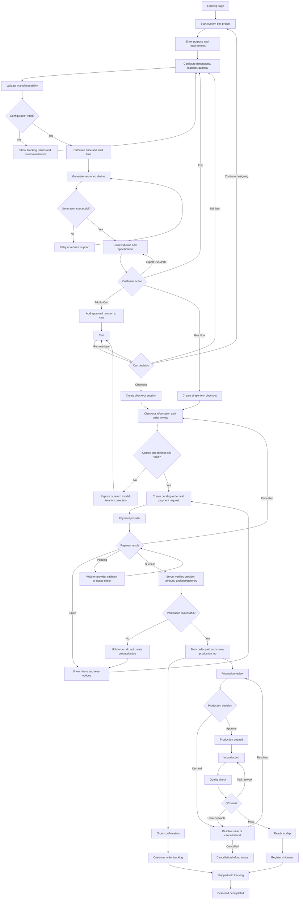
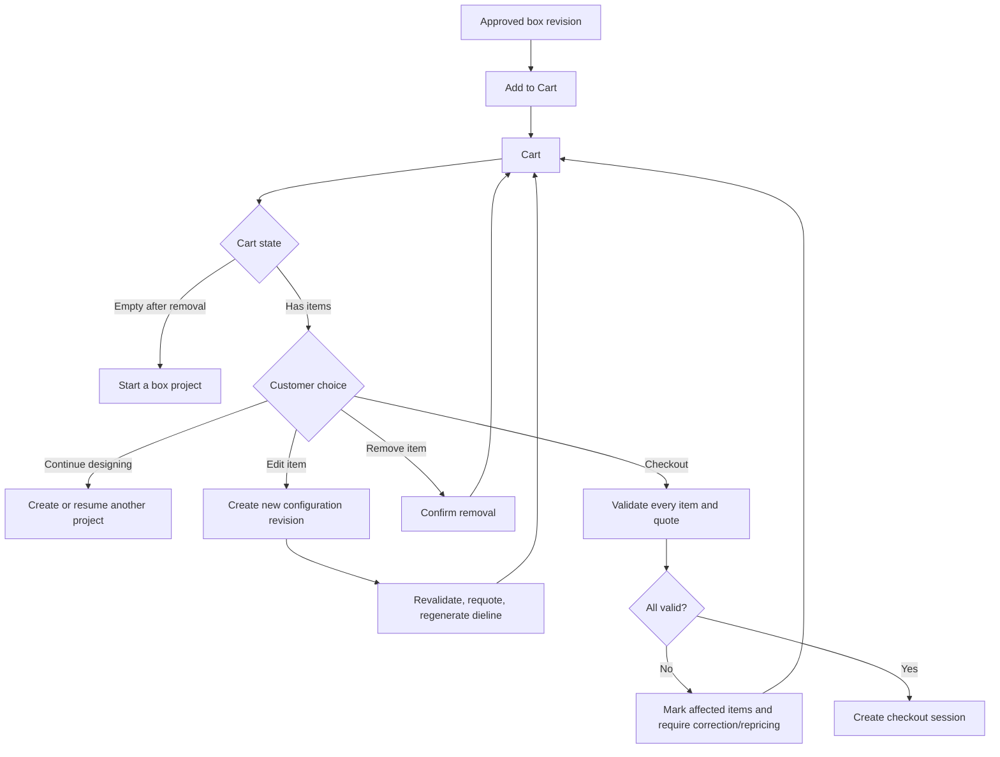
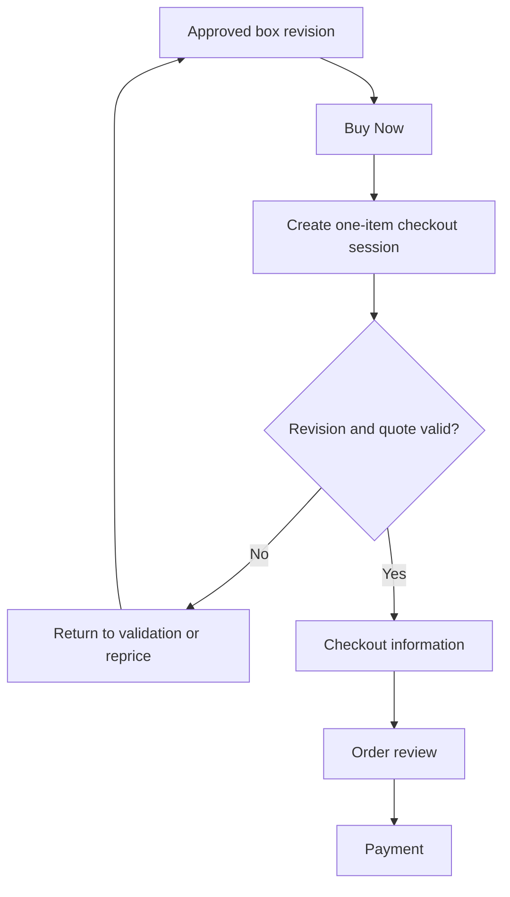
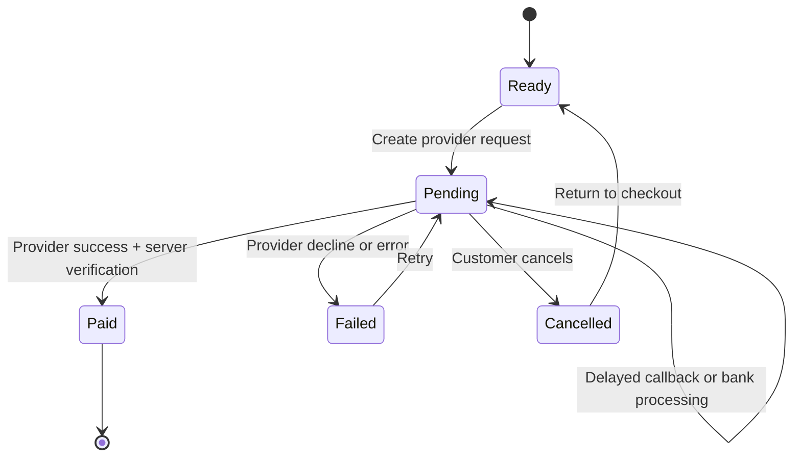
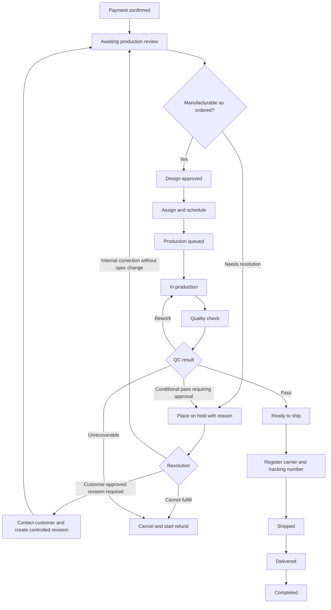

# Packerz User Flow

**Status:** Draft  
**Source:** [PRD.md](./PRD.md)  
**Scope:** Landing page through shipment for an MVP custom unprinted box

## 1. Flow Objective

The customer must be able to move from an idea to a paid, production-ready custom box without packaging-engineering expertise. The workflow must prevent an invalid or unapproved design from entering production.

The two purchase entry points, **Add to Cart** and **Buy Now**, converge before payment. Buy Now shortens navigation but does not bypass validation, dieline approval, price verification, checkout, or server-side payment confirmation.

## 2. End-to-End Customer Journey

## 3. Detailed Customer Flow

### Step 1 — Landing

**Customer goal:** Understand what Packerz makes and whether it fits the intended use.

The page communicates:

- Custom box manufacturing, not sticker printing
- Unprinted structural packaging only
- Sample, mockup, and low-volume orders
- Automatic dieline generation
- SVG and PDF export
- End-to-end ordering and production tracking

**Primary action:** Start a custom box project  
**Secondary actions:** View manufacturing guide, dimension guide, or track an order

### Step 2 — Project requirements

The customer selects:

- Sample
- Mockup
- Low-volume production

The customer may describe the product or packaging need. Packerz can return a limited recommendation, but the customer must approve all manufacturing inputs before continuing.

**Decision: Continue or leave**

- Continue → Save project draft and open Box Configuration.
- Leave → Preserve recoverable project state when a valid project/session exists.

### Step 3 — Box configuration

The customer enters:

- Dimension basis: internal or external
- Width in millimeters
- Depth in millimeters
- Height in millimeters
- Material from the approved catalog
- Quantity within the MVP range

The page displays:

- The one fixed glue method as read-only
- Material thickness and relevant constraints
- Help for measuring dimensions

**Decision: Inputs complete?**

- No → Keep the customer on the form and identify missing or malformed inputs.
- Yes → Create a configuration revision and run validation.

### Step 4 — Manufacturability validation

The server evaluates the exact configuration revision against the active manufacturing-rule version.

**Branch: Invalid**

- Show each blocking issue beside the affected input.
- Show safe alternatives or AI-assisted recommendations where available.
- Customer returns to configuration.
- A correction creates a new configuration revision.

**Branch: Valid**

- Record the successful validation result and rule version.
- Generate a price quote and lead-time estimate.
- Enable dieline generation.

Warnings that do not affect manufacturability may be acknowledged. Blocking errors may not be overridden by the customer.

### Step 5 — Dieline generation and review

The platform generates SVG and PDF outputs from the same geometry source and stores:

- Configuration revision
- Generator version
- Geometry hash
- Dieline revision
- SVG/PDF object references

**Branch: Generation failed**

- Do not enable purchase.
- Allow an idempotent retry.
- Offer support when retries cannot resolve the issue.

**Branch: Generated**

- Display the dieline preview, dimensions, material, glue method, quantity, price, and lead time.
- Allow SVG/PDF export.
- Ask the customer to continue with the exact approved revision.

**Decision: Edit, Add to Cart, or Buy Now**

- **Edit** → Return to configuration. The old quote and approval cannot be reused for changed manufacturing data.
- **Add to Cart** → Add the exact configuration, dieline, and quote revisions to the active cart.
- **Buy Now** → Create a checkout session containing only this exact item.

## 4. Cart Decision Flow

### Cart rules

- A cart item references one configuration revision, dieline revision, and price quote.
- Editing manufacturing data is not an in-place mutation of an approved revision.
- Quantity changes require validation and repricing; they may also require a new dieline approval if geometry or production rules are affected.
- Removing an item does not delete the underlying project or historical revision.
- Expired quotes are clearly marked and cannot proceed until refreshed.
- Cart totals are estimates until the checkout session validates all snapshots.

## 5. Buy Now Decision Flow

### Buy Now rules

- Buy Now is a convenience route, not a separate order model.
- It uses the same checkout, order, and payment APIs as Cart checkout.
- It does not include unrelated active-cart items.
- It does not clear or convert the customer's existing cart unless explicitly confirmed.
- It cannot bypass an expired quote, invalid dieline, or missing customer information.

## 6. Checkout Flow

### Step 1 — Customer and delivery information

Required information:

- Customer name
- Email
- Phone
- Recipient name
- Recipient phone
- Postal code
- Delivery address
- Required terms/privacy consent

### Step 2 — Final review

The customer reviews:

- Each custom-box specification
- Quantity
- Approved dieline revision
- Unit and line price
- Shipping
- Taxes, if applicable to the domestic MVP calculation
- Final payment amount
- Estimated lead time

### Checkout validation branch

- **Valid:** Create or update the pending order and proceed to payment.
- **Quote expired:** Request repricing and ask the customer to accept the new amount.
- **Item invalid/superseded:** Return the affected item to the appropriate project step.
- **Checkout expired:** Create a fresh checkout session from still-valid items.
- **Customer data invalid:** Keep entered data and show field-level errors.

## 7. Payment Decision Flow

### Payment sequence

1. Server creates a pending order from the checkout snapshot.
2. Server creates a payment record with an idempotency key.
3. Customer completes the provider flow.
4. Provider redirects the customer and/or sends a signed webhook.
5. Server verifies:
   - Provider signature or trusted confirmation response
   - Provider payment identifier
   - Expected order
   - Expected currency
   - Expected amount
   - Current payment state
6. Only a verified payment marks the order paid.
7. The paid transition creates production jobs once.

### Payment branches

**Success**

- Show a success result only after authoritative verification.
- Create production work idempotently.
- Continue to Order Confirmation.

**Pending**

- Show that payment is processing.
- Poll customer-safe payment status or wait for webhook processing.
- Do not create production work.
- Prevent duplicate payment attempts unless the current attempt is safely closed.

**Failed**

- Show a customer-safe provider message.
- Keep the checkout recoverable.
- Allow retry or a supported payment-method change.
- Create a new attempt without overwriting the failed event history.

**Cancelled**

- Return to checkout review.
- Keep the pending order non-production.
- Let the customer restart payment.

**Verification failure**

- Show a neutral pending/support state rather than a false success.
- Flag the order for staff review.
- Never create a production job from a client redirect alone.

## 8. Order Confirmation and Tracking

After confirmed payment, the customer sees:

- Order number
- Paid amount
- Customer and delivery summary
- Ordered items
- Approved dieline revision
- Estimated lead time
- Initial status: Payment confirmed / Awaiting review
- Link to order tracking

The customer can later access the order through:

- An authenticated customer order list, or
- Guest order lookup and verification

Customer-visible tracking stages:

1. Payment confirmed
2. Awaiting review
3. Design approved
4. Production queued
5. In production
6. Quality check
7. Ready to ship
8. Shipped
9. Completed

Internal notes and sensitive production details are never exposed.

## 9. Production Decision Flow

### Production review branch

**Approve**

- Lock the production work specification.
- Assign or schedule the job.
- Move it to Production Queued.

**On hold**

- Require a reason.
- Record who placed the hold and when.
- Show a customer-safe status message.
- Determine whether the issue is internal, needs customer approval, or requires cancellation.

**Cancel/refund**

- Stop production transitions.
- Start the refund process when payment has been captured.
- Keep the full order, payment, and status history.

### Quality-control branch

**Pass**

- Record the checklist and operator.
- Move the job to Ready to Ship.

**Fail with rework**

- Record the failure reason.
- Return the job to In Production.
- Require a new quality check after rework.

**Unrecoverable**

- Put the job on hold.
- Escalate to a production manager.
- Decide between remanufacture, customer-approved exception, cancellation, or refund.

## 10. Shipment Flow

1. All required production jobs for the order are ready.
2. Staff confirms recipient and delivery address.
3. Staff registers carrier and tracking number.
4. The system records shipment time and moves the order to Shipped.
5. The customer receives a shipment notification.
6. The customer views carrier tracking from the order page.
7. Delivery confirmation moves the shipment to Delivered.
8. The order moves to Completed when fulfillment rules are satisfied.

### Shipment exception branches

- **Invalid address before shipment:** Place fulfillment on hold and contact the customer.
- **Carrier registration failure:** Keep status Ready to Ship and retry.
- **Tracking delayed:** Keep Shipped and show the last known carrier state.
- **Lost or returned shipment:** Create a support exception without rewriting the original shipment history.

## 11. Cross-Flow Invariants

- A paid order references immutable item, configuration, dieline, and price snapshots.
- No client-side state is authoritative for price, payment, or production.
- Back, refresh, retry, and duplicate callbacks must not create duplicate orders, charges, or production jobs.
- Every status change records the actor, time, previous state, next state, and reason where required.
- Customer-visible messages are separated from internal notes.
- SVG and PDF exports for an order must correspond to the same approved geometry revision.
- An order on hold cannot advance until the hold is explicitly resolved.
- A cancelled or refunded order cannot return to production without a separately authorized recovery process.

